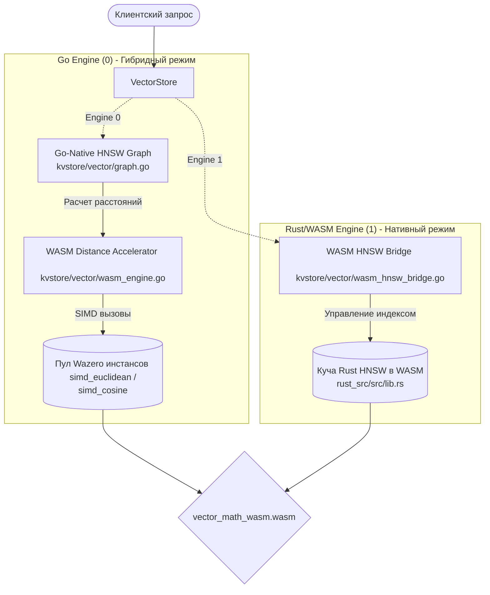

# Подробный технический аудит архитектуры: WebAssembly, Векторный Поиск HNSW и дублирование логики

Этот отчет содержит глубокий системный анализ архитектуры проекта **storage_in_memory**, детальный разбор дублирования логики в подсистемах векторного поиска и WebAssembly (WASM), анализ сборочных ошибок и финальный архитектурный вердикт.

---

## 1. Обзор глобальной архитектуры проекта

Проект представляет собой сверхвысокопроизводительную распределенную In-Memory Key-Value базу данных с поддержкой транзакций, векторного поиска, распределенной репликации и исполнения пользовательских хранимых процедур через WebAssembly.

Система построена на нескольких ключевых столпах:
1. **Ядро хранения (TCMallocStore)**: Кастомная реализация эффективного управления памятью в стиле TCMalloc с использованием потокобезопасных локальных кэшей потоков (Thread-Local Cache) и бесконтекстной синхронизацией для снижения contention на центральных блокировках. База данных поддерживает TTL (passive/active eviction) и компактное бинарное хранение.
2. **Журналирование (WAL & Compaction)**: Запись операций в Write-Ahead Log для обеспечения отказоустойчивости (Durability) с последующей фоновой очисткой и усечением устаревших записей (Compaction).
3. **Кластерный движок**: Распределенная топология на основе Gossip-протокола для обмена членством в кластере, шардирование на базе таблицы слотов и репликация в режиме Master-Replica.
4. **WASM-движок триггеров (Compute Engine)**: Высокопроизводительный рантайм на базе Wazero с поддержкой Reactor Pattern (потокобезопасный пул персистентных воркеров с обнуленным расходом аллокаций), позволяющий выполнять компилируемые триггеры на лету с жестким ограничением времени выполнения (Exec Timeout).

---

## 2. Глубокий аудит векторного поиска и WASM

Подсистема векторного поиска (пакет `kvstore/vector`) содержит две параллельно существующие, полностью независимые архитектуры, использующие одну и ту же математическую основу (HNSW-граф со связями $M=16, M0=32, ef=200$), но выполняющиеся в разных средах.



### А. Двойная имплементация графа HNSW
В проекте сосуществуют две полноценные реализации алгоритма HNSW (Hierarchical Navigable Small World):
1. **Go-Native HNSW (`kvstore/vector/graph.go`)**:
   - Написан полностью на Go.
   - Использует `sync.RWMutex` для потокобезопасности.
   - Реализует структуру переиспользуемых буферов `searchState` через `sync.Pool` и встроенную функцию `clear(map)` Go 1.21+ для достижения **Zero-Alloc на горячем пути поиска**.
   - Выполняет логику построения слоев, descent (спуск), подключение соседей и их прунинг (подрезка) непосредственно в памяти Go-рантайма.
2. **Rust-Native HNSW (`rust_src/src/lib.rs`)**:
   - Написан полностью на Rust с использованием `std::collections::{HashMap, HashSet, BinaryHeap}`.
   - Использует легковесный PCG-генератор случайных чисел для независимого расчета уровней без внешних крейтов.
   - Компилируется в WebAssembly модуль `vector_math_wasm.wasm`.
   - Содержит абсолютно ту же самую логику HNSW (генерация случайного уровня, descent-фаза, прунинг, ремонт связей при удалении).

### Б. Две роли одного WASM-файла (`vector_math_wasm.wasm`)
Компилируемый артефакт из Rust используется в Go в двух совершенно разных архитектурных сценариях:

| Критерий | Роль 1: WASM Math Accelerator (`wasm_engine.go`) | Роль 2: Full WASM Index Bridge (`wasm_hnsw_bridge.go`) |
| :--- | :--- | :--- |
| **Используемый движок** | **Go Engine (`SetEngine(0)`)** | **Rust/WASM Engine (`SetEngine(1)`)** |
| **Локация структуры графа** | Оперативная память Go (структуры `Node` и `Graph`) | Выделенная линейная память (куча) модуля WebAssembly |
| **Что делает WebAssembly** | Выполняет только низкоуровневые расчеты расстояний векторов при помощи векторных SIMD-инструкций `v128`. | Управляет всей базой данных векторов, связями в графе, вставкой, удалением и поиском внутри WASM. |
| **Параллелизм и потокобезопасность** | Истинный конкурентный расчет: `sync.Pool` содержит множество инстансов WASM-модулей, горутины не блокируют друг друга. | Конкурентный доступ сериализуется через жесткий `sync.Mutex` в `WasmGraphIndex`, что делает поиск однопоточным для WebAssembly. |
| **Передача данных (Overhead)** | Копирование сырых байт векторов в память WASM происходит при *каждом* расчете расстояния (очень частые вызовы). | Копирование происходит один раз при вставке вектора. При поиске копируется только вектор-запрос, а граф обходится локально внутри памяти WASM без переходов через границу Host-Guest. |

### В. Дублирование и избыточность файлов
1. **Бинарные WASM-файлы триггеров**:
   - В корне `kvstore/` лежат `fraud_scorer.wasm` (111 КБ) и `fraud_scorer_reactor.wasm` (12 КБ). Они скомпилированы с помощью **TinyGo** с флагом `-scheduler=none`, оптимизированы для минимального размера и используют Reactor Pattern без оверхеда стандартного Go-рантайма.
   - В папке `kvstore/examples/fraud_scorer/` лежат файлы `fraud_scorer.wasm` (1.6 МБ) и `test.wasm` (1.6 МБ). Это **тяжелые, неоптимизированные сборки** стандартного компилятора Go (`GOOS=wasip1`), которые включают в себя полноценную систему сборки мусора (GC), планировщик горутин и метаданные рефлексии. Они полностью дублируют логику оптимизированных файлов и представляют собой избыточный мусор в репозитории.

---

## 3. Критические проблемы сборки и тестирования

В ходе аудита сборочной среды проекта были выявлены две важные проблемы, которые приводят к сбою автоматического запуска тестов (`go test ./...`):

### Проблема №1: Конфликт переопределений в `kvstore/cmd/stress_test/`
В папке стресс-тестов находятся два файла, принадлежащих одному пакету `package main`:
- `main.go`
- `test_oom.go`

Оба этих файла объявляют глобальные сущности с одинаковыми именами:
1. `func main()` — точка входа переопределена в обоих файлах.
2. `func sendCommand(w *protocol.Writer, args ...string) error` — вспомогательная функция отправки бинарного протокола переопределена с абсолютно идентичной сигнатурой и телом.

> [!WARNING]  
> Это приводит к ошибке компиляции Go на этапе линковки:
> ```bash
> # kvstore/cmd/stress_test
> ./test_oom.go:11:6: sendCommand redeclared in this block
> ./main.go:68:6: other declaration of sendCommand
> ./test_oom.go:22:6: main redeclared in this block
> ./main.go:35:6: other declaration of main
> ```

### Проблема №2: Сканирование директории `/home/nikolay/storage_in_memory/tinygo`
В корне проекта находится папка `tinygo/`, содержащая локальную копию исходного кода и инструментария компилятора TinyGo (каталоги `src`, `targets`, `lib`).
При запуске стандартной команды тестирования из корня:
```bash
go test ./...
```
Утилита `go` рекурсивно обходит все папки, включая `tinygo/src/`. Компилятор пытается собрать низкоуровневые системные исходники рантайма TinyGo (которые завязаны на специфические компиляторные интринсики LLVM и ассемблерные вставки для микроконтроллеров) стандартным компилятором Go. Это вызывает лавину ошибок несовместимости типов и неопределенных символов.

---

## 4. Архитектурный вердикт Antigravity

> [!IMPORTANT]
> **ВЕРДИКТ:** Текущее состояние кодовой базы — это высококлассный полигон для сравнительного бенчмаркинга, но избыточный для промышленной эксплуатации. Наличие двух параллельных систем HNSW (Go-Native + WASM-Math против Rust/WASM Full Graph) создает колоссальный оверхед на поддержку кода.

### Сильные стороны (Что сделано идеально):
1. **Алгоритмическая эквивалентность**: Go-реализация и Rust-реализация абсолютно синхронны в плане результатов расчетов. Вызовы `VSIM.SETENGINE` работают бесшовно на лету, автоматически синхронизируя векторы из Go в Rust-память без потери точности.
2. **Zero-Alloc в Go**: Кастомные пулы в `graph.go` работают безупречно. Потребление памяти Go-движком сведено к абсолютному минимуму за счет отсутствия аллокаций слайсов на каждый шаг обхода графа.
3. **SIMD-оптимизация**: Векторные инструкции v128 в Rust-коде дают кратный прирост скорости на больших размерностях.

### Слабые стороны и архитектурные тупики:
1. **Узкое горлышко перехода границы (Boundary Overhead)**:
   - В гибридном режиме `Go Engine (0)` вызов WASM-функции расстояния происходит *сотни раз на каждый поиск* для сравнения векторов-кандидатов. Стоимость переключения контекста Wazero (Host-Guest) съедает часть выгоды от Rust-SIMD.
   - В режиме `Rust Engine (1)` весь поиск происходит внутри WASM (без Boundary Overhead), но мы вынуждены сериализовать все запросы через один глобальный `sync.Mutex` в `wasm_hnsw_bridge.go` (строка 38), что лишает систему преимуществ параллельного поиска на многоядерных процессорах.
2. **Избыточные файлы**: Присутствие скомпилированных под стандартный Go тяжелых WASM-файлов размером 1.6 МБ засоряет репозиторий.

---

## 5. Рекомендации по оптимизации и очистке (Remediation Plan)

Если вы решите провести рефакторинг кодовой базы (пока ничего не исправляем, как вы и просили!), вот пошаговый план оздоровления проекта:

### Шаг 1. Исправление ошибок тестирования и сборки
1. **Решение конфликта стресс-теста**: 
   - Вынести код `test_oom.go` во внутренний пакет или переименовать его пакет в `package main_oom` и положить в отдельную подпапку `kvstore/cmd/stress_test/oom/`. Это изолирует область видимости `main` и устранит ошибку сборки.
2. **Исключение `tinygo/` из тестов**:
   - Использовать таргетированное тестирование без рекурсивного обхода всего корня:
     ```bash
     go test ./kvstore/internal/... ./kvstore/vector/...
     ```
   - Либо добавить папку `tinygo` в исключения сборщика (например, через настройки `go.work` или перемещение ее за пределы корня проекта).

### Шаг 2. Очистка WASM-артефактов триггеров
- Удалить тяжелые файлы `fraud_scorer.wasm` и `test.wasm` из папки `kvstore/examples/fraud_scorer/`.
- Оставить исключительно сборочный скрипт на основе **TinyGo**, который собирает легковесный `fraud_scorer.wasm` (111 КБ) и помещает его в корень.

### Шаг 3. Стратегическое решение по векторным движкам
Для долгосрочного масштабирования необходимо выбрать **один** целевой векторный движок:

* **Вариант А (Рекомендуемый для простоты поддержки)**: Оставить **Go-Native HNSW** как основной. Заменить WASM-ускорение математики на **нативный Go SIMD assembly** (через ассемблер Go с поддержкой AVX2/AVX-512) или использовать обертку cgo к локальной C++ библиотеке расстояний. Это полностью уберет Wazero Boundary Overhead и сохранит Zero-Alloc параллельную структуру поиска без блокировок (`sync.RWMutex`).
* **Вариант Б (Рекомендуемый для максимальной изоляции и переносимости)**: Оставить только **Rust/WASM Engine**. Для этого необходимо переписать `wasm_hnsw_bridge.go` так, чтобы избавиться от глобального `sync.Mutex` (например, использовать пулинг инстансов полного HNSW-графа с Read-Only репликацией структуры памяти, либо перенести потокобезопасность внутрь Rust-кода через атомики, убрав Mutex с читающих операций).
