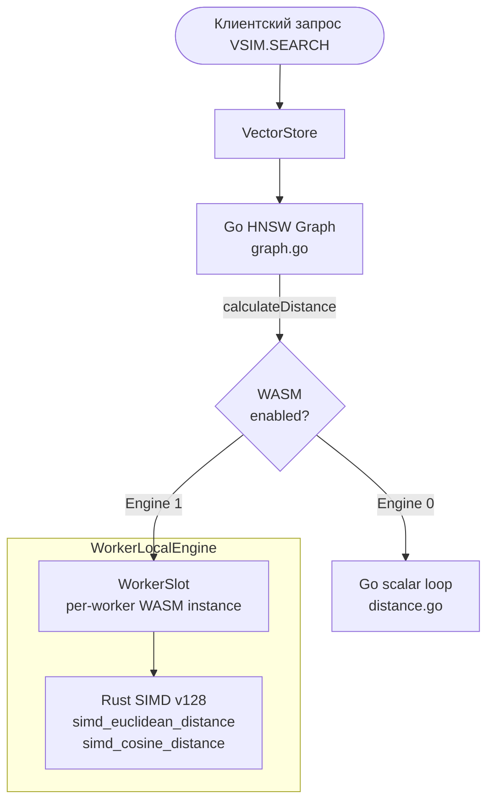

# Архитектура: WebAssembly SIMD ускорение векторного поиска

Техническое описание интеграции Go HNSW + Rust WASM SIMD в проекте **Molten KVStore**.

---

## 1. Общая архитектура

Система использует **гибридную архитектуру**: граф HNSW управляется полностью в Go (lock-free `sync.Pool`, `sync.RWMutex`), а вычисление distance делегируется Rust WASM SIMD-кернелам через `WorkerLocalEngine`.



### Ключевые свойства

| Свойство | Описание |
|----------|---------|
| **Граф** | Go-native HNSW (`graph.go`) с `sync.Pool` для zero-alloc на hot path |
| **Distance** | Rust WASM SIMD `v128` (4× float32 за такт) или Go fallback |
| **Параллелизм** | Полный: каждый воркер — свой WASM-инстанс, без мьютексов |
| **Переключение** | `VSIM.SETENGINE 0/1` на лету, без потери данных |
| **Потокобезопасность** | `sync.RWMutex` на графе, per-worker slots на WASM |

---

## 2. Memory layout: pre-allocated WASM heap буферы

### Проблема (до рефакторинга)
Раньше вектора записывались в фиксированные compute-offsets:
```
InputOffset = 16384    →  вектор A
ValueOffset = 20480    →  вектор B
Gap = 4096 bytes = 1024 floats
```
При dim > 1024 вектор A перезаписывал начало вектора B → **silent data corruption**.

### Решение (текущая архитектура)
При warmup, для каждого воркера аллоцируются **два отдельных буфера** через Rust `alloc()` в WASM heap:

```
┌─────────────────────────────────────────────────────┐
│                  WASM Linear Memory                  │
├──────────┬──────────┬───────────────────────────────┤
│ Compute  │ Compute  │      Rust Heap (alloc)        │
│ regions  │ regions  │                               │
│ 16384-   │ 20480-   │  ptrA ──→ [16KB buffer A]     │
│ 20479    │ 24575    │  ptrB ──→ [16KB buffer B]     │
│ (trigger │ (trigger │                               │
│  input)  │  value)  │  Нет пересечений с compute!   │
└──────────┴──────────┴───────────────────────────────┘
```

- `maxWasmVecDim = 4096` (покрывает OpenAI 3072, nomic 768, BERT 768)
- Каждый буфер = `4096 × 4 = 16KB`
- Два буфера на воркер = `32KB × NumCPU` = ~384KB на 12-ядерном CPU
- Буферы живут вечно (TierPinned — без рециклинга)

---

## 3. Zero-alloc hot path

### `calculateDistance` (вызывается сотни раз на один поиск)

```
1. unsafe.Slice → zero-copy cast float32[] → []byte     (0 alloc)
2. Memory.Write(buf.ptrA, aBytes)                       (memcpy, 0 alloc)
3. Memory.Write(buf.ptrB, bBytes)                       (memcpy, 0 alloc)
4. fn.CallWithStack(ctx, slot.Stack[:3])                 (0 alloc — Stack[8] на структуре)
5. math.Float32frombits(uint32(slot.Stack[0]))           (0 alloc)
```

**Итого: 0 аллокаций на горячем пути.**

### `Exec` для compute-триггеров

```
1. Memory.Write(InputOffset, key)                       (memcpy, 0 alloc)
2. fn.CallWithStack(slot.ctx, slot.Stack[:2])            (0 alloc — pre-created ctx)
3. Memory.Read(OutputOffset, resultLen)                  (0 alloc — возвращает slice в WASM memory)
```

**workerID** передаётся через `context.WithValue`, но context создаётся один раз при `createSlot` — zero-alloc на hot path.

---

## 4. Rust WASM модуль (`rust_src/src/lib.rs`)

Содержит только 94 строки — чистая математика:

| Экспорт | Назначение |
|---------|-----------|
| `alloc(size) → *mut u8` | Аллокация буфера в WASM heap |
| `dealloc(ptr, size)` | Освобождение |
| `simd_euclidean_distance(a_ptr, b_ptr, len) → f32` | SIMD v128 Euclidean distance² |
| `simd_cosine_distance(a_ptr, b_ptr, len) → f32` | SIMD v128 Cosine distance |

SIMD-кернелы обрабатывают по 4 float32 за такт через `f32x4_*` интринсики, с scalar tail для длин не кратных 4.

---

## 5. Бенчмарки

Доступные бенчмарки в `profile_test.go`:

```bash
# Одиночный поиск: Go vs WASM
go test ./kvstore/vector/ -bench 'BenchmarkSearch_Full_(Go|Wasm)$' -benchtime=5s

# Параллельный поиск: Go vs WASM (все ядра)
go test ./kvstore/vector/ -bench 'BenchmarkSearch_Full_(Go|Wasm)_Parallel$' -benchtime=5s

# CPU профилирование
go test ./kvstore/vector/ -bench BenchmarkSearch_Full -cpuprofile cpu.prof -benchtime=5s
go tool pprof -top -cum cpu.prof
```

---

## 6. Файловая структура

```
kvstore/vector/
├── graph.go          # Go HNSW: Insert, Delete, Search, searchLayer, pruneNeighbors
├── graph_test.go     # Recall тесты, структурные тесты графа
├── store.go          # VectorStore: маппинг ключей, WASM интеграция, calculateDistance
├── store_test.go     # Интеграционные тесты Go ↔ WASM parity
├── distance.go       # Go scalar distance (fallback)
└── profile_test.go   # Бенчмарки Go vs WASM (single + parallel)

rust_src/src/
└── lib.rs            # SIMD distance кернелы + alloc/dealloc (94 строки)
```
