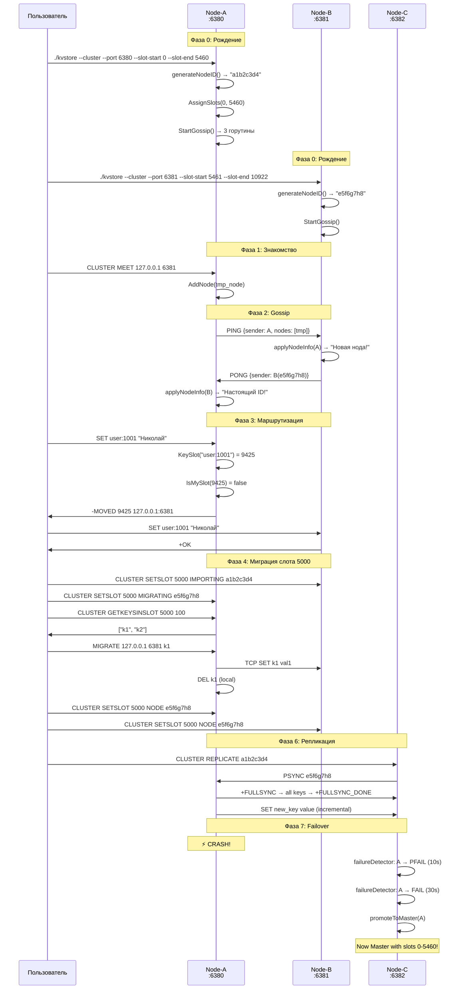

# Кластерная Механика KVStore — Полный Разбор Каждого Шага

> [!NOTE]
> Этот документ описывает ВСЁ: от момента, когда серверы ещё не знакомы друг с другом, до полностью работающего кластера с миграцией, репликацией и обнаружением сбоев. Каждый шаг привязан к конкретному коду.

---

## Оглавление

1. [Фаза 0: Рождение ноды](#фаза-0-рождение-ноды)
2. [Фаза 1: Знакомство (CLUSTER MEET)](#фаза-1-знакомство-cluster-meet)
3. [Фаза 2: Gossip — общение и сплетни](#фаза-2-gossip--общение-и-сплетни)
4. [Фаза 3: Маршрутизация ключей (слоты)](#фаза-3-маршрутизация-ключей-слоты)
5. [Фаза 4: Миграция слотов](#фаза-4-миграция-слотов)
6. [Фаза 5: Обнаружение сбоев](#фаза-5-обнаружение-сбоев)
7. [Фаза 6: Репликация](#фаза-6-репликация)
8. [Фаза 7: Автоматический Failover](#фаза-7-автоматический-failover)
9. [Полная Sequence Diagram](#полная-sequence-diagram)

---

## Фаза 0: Рождение ноды

### Что происходит при запуске `./kvstore --cluster --port 6380 --slot-start 0 --slot-end 5460`

**Шаг 0.1: Парсинг флагов** — [main.go:37-41](file:///home/nikolay/storage_in_memory/kvstore/cmd/kvstore/main.go#L37-L41)

```
port = 6380
clusterEnabled = true
clusterSlotStart = 0
clusterSlotEnd = 5460
```

**Шаг 0.2: Создание Cluster** — [main.go:117-121](file:///home/nikolay/storage_in_memory/kvstore/cmd/kvstore/main.go#L117-L121)

```go
addr := "127.0.0.1:6380"
cl = cluster.New(addr, 6381)  // gossipPort = port + 1
cl.State.Self.AssignSlots(0, 5460)
cl.State.RebuildSlotTable()
```

Внутри `cluster.New()` — [cluster.go:52-62](file:///home/nikolay/storage_in_memory/kvstore/internal/cluster/cluster.go#L52-L62):

```
1. generateNodeID()  → "a1b2c3d4"  (4 случайных байта → 8 hex-символов)
2. NewNode("a1b2c3d4", "127.0.0.1:6380", 6381)
3. NewClusterState(self)  → создаёт ClusterState с одной нодой
4. NewReplicationManager(c)
```

**Шаг 0.3: Создание Node** — [node.go:92-101](file:///home/nikolay/storage_in_memory/kvstore/internal/cluster/node.go#L92-L101)

```go
&Node{
    ID:         "a1b2c3d4",
    Addr:       "127.0.0.1:6380",
    GossipPort: 6381,
    State:      NodeOnline,         // По умолчанию — жива
    Slots:      make([]bool, 16384), // Всё false
    LastPong:   time.Now(),          // Считаем что "только ответила"
}
```

> [!IMPORTANT]
> `Slots` — это массив из **16384 булевых значений**. Каждый bool говорит: «эта нода владеет слотом с этим номером?» Это bitmap — быстрый O(1) lookup по индексу.

**Шаг 0.4: Назначение слотов** — [node.go:112-116](file:///home/nikolay/storage_in_memory/kvstore/internal/cluster/node.go#L112-L116)

```go
func (n *Node) AssignSlots(0, 5460) {
    for i := 0; i <= 5460; i++ {
        n.Slots[i] = true   // Slots[0]=true, Slots[1]=true, ..., Slots[5460]=true
    }
}
```

Теперь нода "владеет" 5461 слотом из 16384.

**Шаг 0.5: Построение SlotTable** — [node.go:225-242](file:///home/nikolay/storage_in_memory/kvstore/internal/cluster/node.go#L225-L242)

```go
func (cs *ClusterState) RebuildSlotTable() {
    // 1. Обнуляем всю таблицу
    for i := range cs.SlotTable { cs.SlotTable[i] = nil }
    
    // 2. Для каждой ноды заполняем её слоты
    for _, node := range cs.Nodes {
        for slot := 0; slot < 16384; slot++ {
            if node.Slots[slot] {
                cs.SlotTable[slot] = node  // SlotTable[0] = &node_алматы
            }
        }
    }
}
```

`SlotTable` — это массив из 16384 указателей на Node. Определяет маршрутизацию:

```
SlotTable[0]    = *Node("a1b2c3d4")  ← наша нода
SlotTable[1]    = *Node("a1b2c3d4")
...
SlotTable[5460] = *Node("a1b2c3d4")
SlotTable[5461] = nil                ← никому не назначен
...
SlotTable[16383] = nil
```

**Шаг 0.6: Подключение callback-функций** — [main.go:124-144](file:///home/nikolay/storage_in_memory/kvstore/cmd/kvstore/main.go#L124-L144)

```go
cl.GetKeysInSlotFunc = func(slot uint16, count int) []string {
    return s.GetKeysInSlot(slot, count, cluster.KeySlot)
}
cl.MigrateGetFunc = func(key string) ([]byte, bool) { return s.Get(key) }
cl.MigrateDelFunc = func(key string) { s.Del(key); ttl.OnDelete(key) }
```

> [!TIP]
> Кластер **не знает** о Store напрямую. Вместо этого он получает **callback-функции**. Это чистая архитектура — кластер зависит от интерфейсов, а не от конкретных реализаций. Если завтра заменить ArenaStore на другой движок, кластерный код не изменится.

**Шаг 0.7: Запуск Gossip** — [main.go:147-150](file:///home/nikolay/storage_in_memory/kvstore/cmd/kvstore/main.go#L147-L150)

```go
cl.StartGossip()
```

Это запускает **3 горутины** — [gossip.go:139-182](file:///home/nikolay/storage_in_memory/kvstore/internal/cluster/gossip.go#L139-L182):

| # | Горутина | Что делает | Интервал |
|---|---------|-----------|----------|
| 1 | Accept loop | Слушает `:6381`, принимает входящие PING от других нод | Непрерывно |
| 2 | Gossip ticker | Каждые 2 сек шлёт PING случайной ноде | 2 сек |
| 3 | Failure detector | Проверяет LastPong всех нод | 5 сек |

### Состояние после Фазы 0 (одна нода, никого не знает):

```
┌─────────────────────────────────────┐
│  Node-A  ("a1b2c3d4")              │
│  Addr: 127.0.0.1:6380              │
│  Gossip: :6381 (слушает)            │
│  Slots: 0-5460 ✓                   │
│  Estado: ONLINE                    │
│  Known nodes: [только я]            │
│                                     │
│  Горутины:                          │
│  ├─ acceptLoop() — ждёт входящие    │
│  ├─ gossipTicker() — спит (некому   │
│  │  слать, candidates = [])         │
│  └─ failureDetector() — спит        │
└─────────────────────────────────────┘
```

---

## Фаза 1: Знакомство (CLUSTER MEET)

### Сценарий: Пользователь запускает вторую ноду и знакомит их

**Шаг 1.0: Запуск Node-B на другом порту**

```bash
./kvstore --cluster --port 6381 --slot-start 5461 --slot-end 10922
```

Node-B рождается точно так же как Node-A:
- ID: `"e5f6g7h8"` (случайный)
- Addr: `127.0.0.1:6381`
- GossipPort: `6382` (port + 1)
- Slots: `5461-10922`

> [!WARNING]
> Сейчас Node-A и Node-B **ничего не знают друг о друге**. Они как два человека в разных комнатах. Gossip ticker у обоих крутится, но `candidates = []` → `pingRandomNode()` сразу возвращается.

**Шаг 1.1: Команда CLUSTER MEET**

Пользователь подключается к Node-A через redis-cli и вводит:

```
redis-cli -p 6380
> CLUSTER MEET 127.0.0.1 6381
```

**Шаг 1.2: Обработка CLUSTER MEET** — [cluster.go:447-490](file:///home/nikolay/storage_in_memory/kvstore/internal/cluster/cluster.go#L447-L490)

```go
func (c *Cluster) clusterMeet(args []protocol.Value) protocol.Value {
    host = "127.0.0.1"
    port = 6381
    addr = "127.0.0.1:6381"
    
    // 1. Проверяем: может, уже знаем эту ноду?
    for _, node := range c.State.Nodes {
        if node.Addr == "127.0.0.1:6381" {
            return OK  // Уже знакомы — ничего не делаем
        }
    }
    
    // 2. НЕ знаем → создаём "заглушку" ноды
    newNode := NewNode(
        generateNodeID(),  // ВРЕМЕННЫЙ ID — "tmp123456"
        "127.0.0.1:6381",
        6382,              // port + 1 = gossipPort
    )
    
    // 3. Если переданы слоты — назначаем
    // CLUSTER MEET 127.0.0.1 6381 5461 10922
    newNode.AssignSlots(5461, 10922)
    
    // 4. Добавляем в Nodes + RebuildSlotTable
    c.State.AddNode(newNode)
}
```

> [!IMPORTANT]
> **Ключевой нюанс:** Node-A создаёт ноду с **ВРЕМЕННЫМ ID** (`tmp123456`). Она ещё НЕ знает настоящий ID Node-B. Настоящий ID (`e5f6g7h8`) станет известен только когда Node-B ответит на PING через Gossip.

### Состояние после CLUSTER MEET:

```
Node-A знает:                    Node-B знает:
┌────────────────────┐           ┌────────────────────┐
│ Nodes:             │           │ Nodes:             │
│  "a1b2c3d4" (я)    │           │  "e5f6g7h8" (я)    │
│  "tmp123456" (B?)  │←── НЕ настоящий ID!            │
│                    │           │  (Node-A не знает!) │
│ SlotTable:         │           │ SlotTable:         │
│  0-5460 → a1b2c3d4 │           │  5461-10922 → я    │
│  5461-10922 → tmp  │           │                    │
└────────────────────┘           └────────────────────┘
```

Node-B **до сих пор не знает** о Node-A! Знакомство — **одностороннее**.

---

## Фаза 2: Gossip — общение и сплетни

### Шаг 2.1: Первый PING (Node-A → Node-B)

Через 2 секунды после MEET сработает `gossipTicker()` на Node-A.

**`pingRandomNode()`** — [gossip.go:276-337](file:///home/nikolay/storage_in_memory/kvstore/internal/cluster/gossip.go#L276-L337):

```go
func (c *Cluster) pingRandomNode() {
    // 1. Собираем кандидатов (все кроме себя)
    candidates = [&Node{"tmp123456", "127.0.0.1:6381", ...}]
    
    // 2. Выбираем случайную (одна — она и есть)
    target = candidates[0]
    
    // 3. Подключаемся к gossip-порту Node-B
    addr = "127.0.0.1:6382"           // extractHost("127.0.0.1:6381") + ":" + 6382
    conn = net.DialTimeout("tcp", addr, 2s)
    
    // 4. Формируем PING
    ping = c.buildMessage("PING")
    
    // 5. Отправляем JSON
    encoder.Encode(ping)
    
    // 6. Читаем PONG
    decoder.Decode(&pong)
    
    // 7. Обновляем данные
    c.State.applyNodeInfo(pong.Sender)
}
```

**`buildMessage("PING")`** — [gossip.go:352-369](file:///home/nikolay/storage_in_memory/kvstore/internal/cluster/gossip.go#L352-L369) формирует JSON:

```json
{
  "type": "PING",
  "sender": {
    "id": "a1b2c3d4",
    "addr": "127.0.0.1:6380",
    "gossip_port": 6381,
    "state": "online",
    "slots": [[0, 5460]]
  },
  "nodes": [
    {
      "id": "tmp123456",
      "addr": "127.0.0.1:6381",
      "gossip_port": 6382,
      "state": "online",
      "slots": [[5461, 10922]]
    }
  ]
}
```

> [!TIP]
> Обрати внимание на `"nodes"` — Node-A включает информацию о ВСЕХ известных ей нодах (кроме себя). Это и есть **механизм сплетен**: если бы Node-A знала про Node-C, она бы включила и её. Так информация распространяется экспоненциально.

### Шаг 2.2: Node-B принимает PING

На Node-B горутина `acceptLoop` принимает соединение → `handleGossipConn()` — [gossip.go:205-242](file:///home/nikolay/storage_in_memory/kvstore/internal/cluster/gossip.go#L205-L242):

```go
func (c *Cluster) handleGossipConn(conn net.Conn) {
    // 1. Читаем PING (JSON)
    decoder.Decode(&msg)
    // msg.Sender = {ID:"a1b2c3d4", Addr:"127.0.0.1:6380", Slots:[[0,5460]]}
    // msg.Nodes = [{ID:"tmp123456", Addr:"127.0.0.1:6381", ...}]
    
    // 2. applyNodeInfo(msg.Sender)  — "О! Новая нода a1b2c3d4!"
    c.State.applyNodeInfo(msg.Sender)
    
    // 3. Обновляем LastPong отправителя
    node.LastPong = time.Now()
    
    // 4. Обрабатываем сплетни
    for _, nodeInfo := range msg.Nodes {
        c.State.applyNodeInfo(nodeInfo)
        // nodeInfo.ID = "tmp123456", nodeInfo.Addr = "127.0.0.1:6381"
        // Это... я сам? applyNodeInfo проверит!
    }
    
    // 5. Формируем PONG и отправляем
    pong = c.buildMessage("PONG")
    encoder.Encode(pong)
}
```

### Шаг 2.3: applyNodeInfo — ядро распространения

**`applyNodeInfo()`** — [gossip.go:76-121](file:///home/nikolay/storage_in_memory/kvstore/internal/cluster/gossip.go#L76-L121):

```go
func (cs *ClusterState) applyNodeInfo(info NodeInfo) bool {
    // ЗАЩИТА 1: Не обновляем информацию о себе
    if info.ID == cs.Self.ID {
        return false  // "Это я, пропускаем"
    }
    
    // ЗАЩИТА 2: Игнорируем фантомные ноды с нашим адресом
    if info.Addr == cs.Self.Addr {
        return false  // "Это tmp-нода от CLUSTER MEET, игнорим"
    }
    
    node, exists := cs.Nodes[info.ID]
    if !exists {
        // НОВАЯ НОДА!
        node = NewNode(info.ID, info.Addr, info.GossipPort)
        cs.Nodes[info.ID] = node
        log.Printf("[gossip] Discovered new node: %s (%s)", info.ID, info.Addr)
    }
    
    // Обновляем поля
    node.Addr = info.Addr
    node.GossipPort = info.GossipPort
    
    // Обновляем слоты: сначала сбрасываем все, потом ставим из info
    for i := range node.Slots { node.Slots[i] = false }
    for _, pair := range info.Slots {
        for i := pair[0]; i <= pair[1]; i++ {
            node.Slots[i] = true
        }
    }
    
    // Обновляем SlotTable (маршрутизацию)
    for slot := 0; slot < TotalSlots; slot++ {
        if node.Slots[slot] {
            cs.SlotTable[slot] = node
        }
    }
    
    return !exists
}
```

> [!IMPORTANT]
> **Защита от фантомов** (строка 87-89): Когда Node-A делает `CLUSTER MEET`, она создаёт ноду с ВРЕМЕННЫМ ID и адресом Node-B. Потом Node-A сплетничает об этой tmp-ноде. Когда Node-B получает сплетню о **себе самой** (но с чужим ID и своим Addr), она должна **игнорировать** это, иначе создаст дубликат. Фильтр `info.Addr == cs.Self.Addr` именно для этого.

### Что происходит на Node-B при получении PING:

1. **`applyNodeInfo(msg.Sender)`** — sender={ID:"a1b2c3d4"} → **Новая нода!** Node-B теперь знает Node-A
2. **`applyNodeInfo({ID:"tmp123456", Addr:"127.0.0.1:6381"})`** → Addr совпадает с моим → **Игнорируем** (защита от фантома)

### Шаг 2.4: Node-A получает PONG

Node-A получает PONG от Node-B:

```json
{
  "type": "PONG",
  "sender": {
    "id": "e5f6g7h8",          // ← НАСТОЯЩИЙ ID Node-B!
    "addr": "127.0.0.1:6381",
    "gossip_port": 6382,
    "state": "online",
    "slots": [[5461, 10922]]
  },
  "nodes": []                   // Node-B пока не сплетничает (знает только A)
}
```

Node-A вызывает `applyNodeInfo({ID:"e5f6g7h8", Addr:"127.0.0.1:6381"})`:

```
Проверка: ID "e5f6g7h8" != Self.ID "a1b2c3d4" ✓
Проверка: Addr "127.0.0.1:6381" != Self.Addr "127.0.0.1:6380" ✓
Уже есть? cs.Nodes["e5f6g7h8"] → нет → НОВАЯ НОДА!

Создаём Node("e5f6g7h8", "127.0.0.1:6381", 6382)
Устанавливаем слоты 5461-10922
Обновляем SlotTable
```

> [!WARNING]
> После этого в Nodes у Node-A будет **три** записи: `"a1b2c3d4"` (я), `"tmp123456"` (фантом от MEET), `"e5f6g7h8"` (настоящий Node-B). Фантом `"tmp123456"` останется, но будет бесполезным — его слоты перезапишутся настоящими данными от `"e5f6g7h8"` через SlotTable.

### Состояние после первого PING-PONG:

```
Node-A знает:                    Node-B знает:
┌────────────────────────┐       ┌────────────────────────┐
│ Nodes:                 │       │ Nodes:                 │
│  "a1b2c3d4" (я)        │       │  "e5f6g7h8" (я)        │
│  "tmp123456" (фантом)  │       │  "a1b2c3d4" (Node-A!) │
│  "e5f6g7h8" (Node-B!)  │       │                        │
│                        │       │                        │
│ SlotTable:             │       │ SlotTable:             │
│  0-5460 → я            │       │  0-5460 → a1b2c3d4    │
│  5461-10922 → e5f6g7h8 │       │  5461-10922 → я        │
│  10923-16383 → nil     │       │  10923-16383 → nil     │
└────────────────────────┘       └────────────────────────┘
     ✅ Знает B                       ✅ Знает A
```

### Шаг 2.5: Распространение сплетен (3 ноды)

Допустим, есть **Node-C** (`127.0.0.1:6382`, слоты `10923-16383`).

Пользователь делает на Node-A:
```
CLUSTER MEET 127.0.0.1 6382
```

Теперь Node-A знает про C, но **Node-B НЕ знает про C**.

**Магия gossip:** На следующем тике Node-A шлёт PING → Node-B:

```json
{
  "type": "PING",
  "sender": {"id":"a1b2c3d4", "slots":[[0,5460]]},
  "nodes": [
    {"id":"tmp_C", "addr":"127.0.0.1:6382", "slots":[[10923,16383]]},
    {"id":"e5f6g7h8", "addr":"127.0.0.1:6381", "slots":[[5461,10922]]}
  ]
}
```

Node-B получает → `applyNodeInfo({id:"tmp_C", addr:"127.0.0.1:6382"})` → **новая нода!**

Потом Node-C отвечает на PING от Node-A → Node-A узнаёт НАСТОЯЩИЙ ID Node-C → распространяет его дальше.

**Скорость распространения:**

```
T=0:    A знает B,C.  B знает A.      C знает -.
T=2s:   A→PING→B      (B узнаёт C!)   A→PING→C (C узнаёт A!)
T=4s:   B→PING→C      (C узнаёт B!)   C→PING→A (ничего нового)
T=6s:   ✅ ВСЕ ЗНАЮТ ВСЕХ
```

С N нодами время = O(log N) раундов — **экспоненциальное распространение**.

---

## Фаза 3: Маршрутизация ключей (слоты)

### Шаг 3.1: Как ключ превращается в слот

**CRC16 + модуль** — [slots.go](file:///home/nikolay/storage_in_memory/kvstore/internal/cluster/slots.go):

```go
// При старте программы — предвычисление таблицы
func init() {
    for i := 0; i < 256; i++ {
        crc := uint16(i) << 8
        for j := 0; j < 8; j++ {
            if crc & 0x8000 != 0 {
                crc = (crc << 1) ^ 0x1021   // Полином CRC-CCITT
            } else {
                crc = crc << 1
            }
        }
        crc16Table[i] = crc
    }
}

func KeySlot(key string) uint16 {
    return CRC16(key) % 16384
}
```

Примеры:
```
KeySlot("user:1001")  = CRC16("user:1001") % 16384 = 9425
KeySlot("order:42")   = CRC16("order:42") % 16384 = 3784
KeySlot("session:abc")= CRC16("session:abc") % 16384 = 12847
```

> [!TIP]
> Предвычисленная таблица `crc16Table[256]` — классическая оптимизация. Вместо 8 сдвигов и XOR на каждый байт, мы делаем один lookup по таблице. Таблица строится **один раз** в `init()` при старте программы.

### Шаг 3.2: CheckKey — «мой ли слот?»

Клиент подключился к Node-A (`127.0.0.1:6380`) и делает `SET user:1001 Николай`:

**`CheckKey("user:1001")`** — [cluster.go:102-137](file:///home/nikolay/storage_in_memory/kvstore/internal/cluster/cluster.go#L102-L137):

```go
func (c *Cluster) CheckKey(key string) *protocol.Value {
    slot := KeySlot("user:1001")  // = 9425
    
    // Проверка: слот 9425 — мой?
    if c.State.IsMySlot(9425) {
        // IsMySlot: SlotTable[9425] == Self?
        // SlotTable[9425] = *Node("e5f6g7h8") ← Node-B!
        // false!
        ...
    }
    
    // Не мой → ищем владельца
    owner := c.State.LookupSlot(9425)
    // owner = &Node{ID:"e5f6g7h8", Addr:"127.0.0.1:6381"}
    
    // Формируем MOVED
    moved := "MOVED 9425 127.0.0.1:6381"
    return &protocol.Value{Typ: '-', Str: moved}
}
```

Клиент получает:
```
-MOVED 9425 127.0.0.1:6381
```

### Шаг 3.3: Как клиент обрабатывает MOVED

```
Шаг 1: Клиент → Node-A: SET user:1001 Николай
Шаг 2: Node-A → Клиент: -MOVED 9425 127.0.0.1:6381
Шаг 3: Клиент парсит: slot=9425, target=127.0.0.1:6381
Шаг 4: Клиент ПЕРЕПОДКЛЮЧАЕТСЯ к Node-B (127.0.0.1:6381)
Шаг 5: Клиент → Node-B: SET user:1001 Николай
Шаг 6: Node-B: CheckKey("user:1001") → slot 9425 → IsMySlot → true!
Шаг 7: Node-B: выполняет SET → +OK
```

> [!NOTE]
> Умный клиент (как Go-клиент `go-redis/redis`) кеширует маршруты: «слот 9425 = Node-B». При следующем запросе на ключ из этого слота — сразу идёт на Node-B, без лишнего MOVED.

### Шаг 3.4: Что если слот никому не назначен?

```go
owner := c.State.LookupSlot(slot)
if owner == nil {
    // SlotTable[slot] = nil → никто не владеет
    return "CLUSTERDOWN Hash slot 15000 is not served"
}
```

Это происходит когда не все 16384 слота распределены. `CLUSTER INFO` покажет:
```
cluster_state:fail       ← потому что assigned < 16384
cluster_slots_assigned:10922
```

---

## Фаза 4: Миграция слотов

### Зачем миграция?

Добавили 4-ю ноду → нужно перебалансировать слоты. Или нужно вывести ноду на обслуживание.

### Шаг 4.1: Протокол миграции (5 шагов)

Мигрируем слот `5000` с Node-A → Node-B:

```
Шаг 1: На Node-B:  CLUSTER SETSLOT 5000 IMPORTING a1b2c3d4
Шаг 2: На Node-A:  CLUSTER SETSLOT 5000 MIGRATING e5f6g7h8
Шаг 3: На Node-A:  CLUSTER GETKEYSINSLOT 5000 100
Шаг 4: Для каждого ключа: MIGRATE 127.0.0.1 6381 <key>
Шаг 5: На обеих:   CLUSTER SETSLOT 5000 NODE e5f6g7h8
```

### Шаг 4.2: SETSLOT IMPORTING

На Node-B: `CLUSTER SETSLOT 5000 IMPORTING a1b2c3d4`

[migration.go:48-62](file:///home/nikolay/storage_in_memory/kvstore/internal/cluster/migration.go#L48-L62):

```go
case "IMPORTING":
    sourceID = "a1b2c3d4"
    
    // Проверяем что знаем эту ноду
    if _, ok := c.State.Nodes["a1b2c3d4"]; !ok {
        return ERR "unknown node"
    }
    
    // Записываем: "я ПРИНИМАЮ слот 5000 от ноды a1b2c3d4"
    c.State.Importing[5000] = "a1b2c3d4"
    return OK
```

`Importing` — это map: `slot → sourceNodeID`. Означает: «я готов принимать ключи для этого слота».

### Шаг 4.3: SETSLOT MIGRATING

На Node-A: `CLUSTER SETSLOT 5000 MIGRATING e5f6g7h8`

[migration.go:28-46](file:///home/nikolay/storage_in_memory/kvstore/internal/cluster/migration.go#L28-L46):

```go
case "MIGRATING":
    targetID = "e5f6g7h8"
    
    // Проверяем: я ВЛАДЕЛЕЦ этого слота?
    if c.State.SlotTable[5000] != c.State.Self {
        return ERR "I'm not the owner"
    }
    
    // Проверяем что знаем целевую ноду
    if _, ok := c.State.Nodes["e5f6g7h8"]; !ok {
        return ERR "unknown node"
    }
    
    // Записываем: "я ОТДАЮ слот 5000 ноде e5f6g7h8"
    c.State.Migrating[5000] = "e5f6g7h8"
    return OK
```

### Шаг 4.4: GETKEYSINSLOT — какие ключи в слоте?

На Node-A: `CLUSTER GETKEYSINSLOT 5000 100`

[migration.go:98-120](file:///home/nikolay/storage_in_memory/kvstore/internal/cluster/migration.go#L98-L120):

```go
func (c *Cluster) clusterGetKeysInSlot(args) protocol.Value {
    slot = 5000
    count = 100
    
    // Вызывает callback из main.go
    keys = c.GetKeysInSlotFunc(5000, 100)
    // Внутри: s.GetKeysInSlot(5000, 100, cluster.KeySlot)
    // Перебирает все ключи в Store, вычисляет KeySlot(key),
    // если == 5000 → добавляет в результат
    
    return ["user:500", "session:xyz", ...]
}
```

### Шаг 4.5: MIGRATE — перенос ключа

Для каждого ключа: `MIGRATE 127.0.0.1 6381 user:500`

Обработчик в [main.go:303-317](file:///home/nikolay/storage_in_memory/kvstore/cmd/kvstore/main.go#L303-L317) → вызывает `cl.MigrateKey()`:

[migration.go:122-144](file:///home/nikolay/storage_in_memory/kvstore/internal/cluster/migration.go#L122-L144):

```go
func (c *Cluster) MigrateKey(host string, port int, key string) protocol.Value {
    // 1. Читаем значение из НАШЕГО Store
    value, ok = c.MigrateGetFunc("user:500")   // → []byte("Николай")
    
    // 2. Отправляем SET на Node-B через TCP
    addr = "127.0.0.1:6381"
    c.MigrateSetRemoteFunc(addr, "user:500", []byte("Николай"))
    
    // 3. Удаляем из НАШЕГО Store
    c.MigrateDelFunc("user:500")
    
    return OK
}
```

**`SendSetToNode()`** — [migration.go:147-175](file:///home/nikolay/storage_in_memory/kvstore/internal/cluster/migration.go#L147-L175):

```go
func SendSetToNode(addr, key string, value []byte) error {
    // 1. TCP подключение к Node-B (клиентский порт!)
    conn = net.DialTimeout("tcp", "127.0.0.1:6381", 2s)
    
    // 2. Отправляем RESP-формат:
    // *3\r\n$3\r\nSET\r\n$8\r\nuser:500\r\n$14\r\nНиколай\r\n
    cmd = fmt.Sprintf("*3\r\n$3\r\nSET\r\n$%d\r\n%s\r\n$%d\r\n%s\r\n",
        len(key), key, len(value), string(value))
    conn.Write([]byte(cmd))
    
    // 3. Читаем ответ "+OK\r\n"
    n = conn.Read(buf)
    if !strings.HasPrefix(resp, "+OK") {
        return error
    }
    return nil
}
```

> [!IMPORTANT]
> `SendSetToNode` отправляет SET **как обычный RESP-клиент** на клиентский порт Node-B. Node-B обрабатывает его как обычный SET. Но благодаря `IMPORTING` на Node-B, `CheckKey` пропускает ключи для импортируемых слотов.

### Шаг 4.6: Как CheckKey работает во время миграции

Когда слот 5000 в состоянии MIGRATING на Node-A:

[cluster.go:102-137](file:///home/nikolay/storage_in_memory/kvstore/internal/cluster/cluster.go#L102-L137):

```go
func (c *Cluster) CheckKey(key string) *protocol.Value {
    slot = KeySlot(key)  // = 5000
    
    // IsMySlot(5000) → true! (мы ещё владеем, пока миграция не завершена)
    if c.State.IsMySlot(slot) {
        _, migrating := c.State.Migrating[slot]  // → true (мы мигрируем!)
        if migrating {
            // Пока ничего не делаем — пусть сначала поищет в Store
        }
        return nil  // → выполнять команду
    }
```

Потом, если GET не нашёл ключ (уже мигрировал), вызывается **CheckKeyAsk**:

[cluster.go:143-160](file:///home/nikolay/storage_in_memory/kvstore/internal/cluster/cluster.go#L143-L160) (вызов из [main.go:392-396](file:///home/nikolay/storage_in_memory/kvstore/cmd/kvstore/main.go#L392-L396)):

```go
func (c *Cluster) CheckKeyAsk(key string) *protocol.Value {
    slot = KeySlot(key)  // 5000
    targetID, migrating := c.State.Migrating[slot]  // "e5f6g7h8", true
    
    target := c.State.Nodes["e5f6g7h8"]
    return "-ASK 5000 127.0.0.1:6381"
}
```

Клиент получает **ASK** (не MOVED!):
- **MOVED** = «слот переехал навсегда, обновите кеш»
- **ASK** = «один раз попробуйте там, но в следующий раз приходите ко мне»

Когда слот 5000 в состоянии IMPORTING на Node-B:

```go
// CheckKey на Node-B:
if c.State.IsMySlot(5000) {
    // SlotTable[5000] = Node-A (мы ещё НЕ владеем)
    // false → идём дальше
}

_, importing := c.State.Importing[slot]  // → true!
if importing {
    return nil  // → разрешаем выполнить команду!
}
```

### Шаг 4.7: Завершение миграции (SETSLOT NODE)

На обеих нодах: `CLUSTER SETSLOT 5000 NODE e5f6g7h8`

[migration.go:64-91](file:///home/nikolay/storage_in_memory/kvstore/internal/cluster/migration.go#L64-L91):

```go
case "NODE":
    nodeID = "e5f6g7h8"
    node = c.State.Nodes["e5f6g7h8"]
    
    // 1. Забираем слот у ВСЕХ нод
    for _, n := range c.State.Nodes {
        n.Slots[5000] = false
    }
    
    // 2. Назначаем новому владельцу
    node.Slots[5000] = true
    c.State.SlotTable[5000] = node   // Node-B теперь хозяин
    
    // 3. Очищаем состояние миграции
    delete(c.State.Migrating, 5000)
    delete(c.State.Importing, 5000)
```

### Полная визуализация миграции слота 5000:

```
          Node-A (source)                    Node-B (target)
          ═══════════════                    ═══════════════
    
Шаг 1:                                     SETSLOT 5000 IMPORTING a1b2c3d4
          ┌───────────────┐                 ┌───────────────────┐
          │ Owner: slot 5K│                 │ Importing[5000]=A │
          └───────────────┘                 └───────────────────┘
    
Шаг 2:    SETSLOT 5000 MIGRATING e5f6g7h8
          ┌───────────────────┐             ┌───────────────────┐
          │ Migrating[5000]=B │             │ Importing[5000]=A │
          └───────────────────┘             └───────────────────┘
    
Шаг 3:    GETKEYSINSLOT 5000 100
          → ["k1", "k2", "k3"]
    
Шаг 4:    MIGRATE 127.0.0.1 6381 k1    ──TCP SET──▶  k1 сохранён
          MIGRATE 127.0.0.1 6381 k2    ──TCP SET──▶  k2 сохранён
          MIGRATE 127.0.0.1 6381 k3    ──TCP SET──▶  k3 сохранён
          (k1,k2,k3 удалены локально)
    
Шаг 5:    SETSLOT 5000 NODE e5f6g7h8       SETSLOT 5000 NODE e5f6g7h8
          ┌───────────────────┐             ┌───────────────────┐
          │ SlotTable[5000]=B │             │ SlotTable[5000]=B │
          │ Migrating: пусто  │             │ Importing: пусто  │
          └───────────────────┘             └───────────────────┘
    
                        ✅ Миграция завершена!
```

---

## Фаза 5: Обнаружение сбоев (Failure Detection)

### Шаг 5.1: Три состояния ноды

[node.go:19-25](file:///home/nikolay/storage_in_memory/kvstore/internal/cluster/node.go#L19-L25):

```
ONLINE  ──(10 сек без ответа)──▶  PFAIL  ──(30 сек без ответа)──▶  FAIL
   ▲                                                                   │
   └────────────────(нода ответила на PING)────────────────────────────┘
```

| Состояние | Значение | Порог |
|-----------|---------|-------|
| **ONLINE** | Нода жива, отвечает на PING | LastPong < 10 сек назад |
| **PFAIL** | Подозрение: **одна** нода потеряла связь | LastPong > 10 сек |
| **FAIL** | Факт: нода точно мертва | LastPong > 30 сек |

### Шаг 5.2: failureDetector() — тикер проверки

[gossip.go:391-435](file:///home/nikolay/storage_in_memory/kvstore/internal/cluster/gossip.go#L391-L435):

```go
func (c *Cluster) failureDetector() {
    ticker := time.NewTicker(5 * time.Second)  // Каждые 5 сек
    for {
        select {
        case <-c.stopCh: return
        case <-ticker.C: c.checkNodeHealth()
        }
    }
}

func (c *Cluster) checkNodeHealth() {
    now := time.Now()
    
    for _, node := range c.State.Nodes {
        if node == c.State.Self { continue }  // Себя не проверяем
        
        since := now.Sub(node.LastPong)
        
        switch {
        case since > 30s && node.State != NodeFail:
            // 30+ секунд → FAIL
            log.Printf("Node %s → FAIL (no pong for %v)", node.ID, since)
            node.State = NodeFail
            
            // Если я реплика этого мастера → FAILOVER!
            if c.State.Self.Role == RoleReplica && 
               c.State.Self.MasterID == node.ID {
                c.promoteToMaster(node)
            }
            
        case since > 10s && node.State == NodeOnline:
            // 10+ секунд → PFAIL (подозрение)
            log.Printf("Node %s → PFAIL (no pong for %v)", node.ID, since)
            node.State = NodePFail
        }
    }
}
```

### Шаг 5.3: Восстановление ноды

Если нода вернулась (ответила на PING), она автоматически становится ONLINE.

В `handleGossipConn()` ([gossip.go:220-229](file:///home/nikolay/storage_in_memory/kvstore/internal/cluster/gossip.go#L220-L229)):

```go
if node.State != NodeOnline {
    log.Printf("[gossip] Node %s is back ONLINE", node.ID)
    node.State = NodeOnline
}
```

То же самое в `pingRandomNode()` ([gossip.go:324-330](file:///home/nikolay/storage_in_memory/kvstore/internal/cluster/gossip.go#L324-L330)).

### Временная шкала обнаружения сбоя:

```
T=0:      Node-B отвечает на PING. LastPong = T=0.
T=2s:     Node-A → PING → Node-B → PONG. LastPong = T=2s. ✅ ONLINE
T=4s:     Node-A → PING → Node-B → PONG. LastPong = T=4s. ✅ ONLINE
T=6s:     ⚡ Node-B ПАДАЕТ (kill -9)
T=8s:     Node-A → PING → Node-B → timeout (connect refused)
T=10s:    То же.
T=12s:    То же.
T=14s:    failureDetector: since = 14s - 4s = 10s → PFAIL! ⚠️
T=16s:    PING fail...
...
T=34s:    failureDetector: since = 34s - 4s = 30s → FAIL! ❌
          Если я реплика B → promoteToMaster()!
```

---

## Фаза 6: Репликация

### Шаг 6.1: Настройка реплики

```
# На Node-C (будет репликой Node-A):
redis-cli -p 6382
> CLUSTER REPLICATE a1b2c3d4
```

[cluster.go:224-249](file:///home/nikolay/storage_in_memory/kvstore/internal/cluster/cluster.go#L224-L249):

```go
func (c *Cluster) clusterReplicate(args) protocol.Value {
    masterID = "a1b2c3d4"
    master = c.State.Nodes["a1b2c3d4"]
    
    // 1. Меняем роль
    c.State.Self.Role = RoleReplica       // Была master → теперь replica
    c.State.Self.MasterID = "a1b2c3d4"
    
    // 2. Подключаемся к мастеру (в горутине)
    go c.Repl.ConnectToMaster("127.0.0.1:6380")
}
```

### Шаг 6.2: ConnectToMaster — полная синхронизация

[replication.go:84-129](file:///home/nikolay/storage_in_memory/kvstore/internal/cluster/replication.go#L84-L129):

```go
func (rm *ReplicationManager) ConnectToMaster(masterAddr string) {
    // 1. TCP подключение к мастеру (клиентский порт!)
    conn = net.DialTimeout("tcp", "127.0.0.1:6380", 5s)
    
    // 2. Шлём PSYNC с нашим ID
    // RESP: *2\r\n$5\r\nPSYNC\r\n$8\r\ne5f6g7h8\r\n
    fmt.Fprintf(conn, "*2\r\n$5\r\nPSYNC\r\n$%d\r\n%s\r\n", len(selfID), selfID)
    
    // 3. Читаем поток данных...
    scanner := bufio.NewScanner(conn)
    for scanner.Scan() {
        line = scanner.Text()
        
        if line == "+FULLSYNC" {
            // Начало полной синхронизации
            continue
        }
        if line == "+FULLSYNC_DONE" {
            // Полная синхронизация завершена → переходим к инкрементальной
            fullSyncDone = true
            continue
        }
        
        // Парсим: "SET user:1001 Николай" или "DEL user:1001"
        rm.applyReplicationCommand(line, fullSyncDone)
    }
}
```

### Шаг 6.3: HandlePsync — мастер отвечает реплике

На мастере (Node-A) приходит команда PSYNC → [main.go:319-328](file:///home/nikolay/storage_in_memory/kvstore/cmd/kvstore/main.go#L319-L328):

```go
case "PSYNC":
    replicaID = "e5f6g7h8"
    cl.Repl.HandlePsync(conn, replicaID)
```

[replication.go:43-65](file:///home/nikolay/storage_in_memory/kvstore/internal/cluster/replication.go#L43-L65):

```go
func (rm *ReplicationManager) HandlePsync(conn net.Conn, replicaID string) {
    // 1. Начало
    fmt.Fprintf(conn, "+FULLSYNC\r\n")
    
    // 2. Отправляем ВСЕ данные
    rm.StoreForEach(func(key string, value []byte) {
        fmt.Fprintf(conn, "SET %s %s\r\n", key, string(value))
    })
    
    // 3. Конец
    fmt.Fprintf(conn, "+FULLSYNC_DONE\r\n")
    
    // 4. Сохраняем соединение для инкрементальной репликации
    rm.replicas[replicaID] = conn
}
```

### Шаг 6.4: Инкрементальная репликация

После FULLSYNC_DONE **соединение остаётся открытым**. Каждый SET/DEL на мастере пересылается:

[replication.go:69-80](file:///home/nikolay/storage_in_memory/kvstore/internal/cluster/replication.go#L69-L80):

```go
func (rm *ReplicationManager) ForwardWrite(command string) {
    for id, conn := range rm.replicas {
        fmt.Fprintf(conn, "%s\r\n", command)
        // Пример: "SET user:2000 Алматы\r\n"
    }
}
```

Вызывается из SET и DEL в [main.go:349-351](file:///home/nikolay/storage_in_memory/kvstore/cmd/kvstore/main.go#L349-L351):

```go
if cl != nil && cl.Repl != nil {
    cl.Repl.ForwardWrite(fmt.Sprintf("SET %s %s", key, string(value)))
}
```

### Поток данных репликации:

```
Мастер (Node-A)                          Реплика (Node-C)
═══════════════                          ═════════════════
   ← PSYNC e5f6g7h8                     ConnectToMaster() →
   
   "+FULLSYNC\r\n"                    →  "Начинаю sync..."
   "SET key1 val1\r\n"                →  StoreSet("key1", "val1")
   "SET key2 val2\r\n"                →  StoreSet("key2", "val2")
   ...10000 ключей...
   "+FULLSYNC_DONE\r\n"               →  "Sync done! Incremental mode."
   
   ─── нить остаётся открытой ───
   
   Клиент → SET user:new hello       
   ForwardWrite("SET user:new hello") →  StoreSet("user:new", "hello")
   Клиент → DEL old_key              
   ForwardWrite("DEL old_key")        →  StoreDel("old_key")
```

### Шаг 6.5: GET на реплике — read-only

[main.go:378-383](file:///home/nikolay/storage_in_memory/kvstore/cmd/kvstore/main.go#L378-L383):

```go
case "GET":
    // Реплики отдают GET напрямую, без MOVED
    if cl != nil && cl.State.Self.Role != cluster.RoleReplica {
        if moved := cl.CheckKey(key); moved != nil { ... }
    }
    // Реплика: RoleReplica → пропускаем CheckKey → читаем из Store
```

> [!TIP]
> Реплика **не проверяет** слоты для GET. Она просто отдаёт данные из своего Store — даже если формально слот принадлежит мастеру. Это позволяет масштабировать чтения: 1 мастер + N реплик → чтения распределяются.

---

## Фаза 7: Автоматический Failover

### Сценарий: Мастер (Node-A) падает

```
T=0:     Node-A (мастер) жива
T=1s:    ⚡ Node-A crashes
T=14s:   Node-C (реплика A): failureDetector → Node-A PFAIL
T=34s:   Node-C (реплика A): failureDetector → Node-A FAIL
         → promoteToMaster(deadMaster)!
```

### promoteToMaster — автоматическое повышение

[gossip.go:440-465](file:///home/nikolay/storage_in_memory/kvstore/internal/cluster/gossip.go#L440-L465):

```go
func (c *Cluster) promoteToMaster(deadMaster *Node) {
    log.Printf("[election] Master %s is FAIL — promoting self!", deadMaster.ID)
    
    // 1. Меняем роль: реплика → мастер
    c.State.Self.Role = RoleMaster
    c.State.Self.MasterID = ""
    
    // 2. Забираем слоты мёртвого мастера
    for slot := 0; slot < TotalSlots; slot++ {
        if deadMaster.Slots[slot] {
            deadMaster.Slots[slot] = false        // У мертвеца забираем
            c.State.Self.Slots[slot] = true       // Себе назначаем
            c.State.SlotTable[slot] = c.State.Self // Маршрутизацию на себя
        }
    }
    
    // 3. Логируем
    count := /* подсчёт слотов */
    log.Printf("[election] Promoted! Now master with %d slots", count)
}
```

### Что происходит после повышения:

1. **Node-C** теперь **мастер** со слотами 0-5460 (бывшие слоты Node-A)
2. **Gossip** распространяет изменение: следующие PING/PONG расскажут всем нодам
3. **Node-B** через gossip узнаёт: «SlotTable[0-5460] теперь = Node-C»
4. **Клиенты** получат **MOVED** с новым адресом: `MOVED 1234 127.0.0.1:6382`

### Визуализация failover:

```
    До:                                После:
    ═══                                ═════
    
    Node-A (мастер)                    Node-A ❌ FAIL
    ├─ Slots: 0-5460                   ├─ Slots: (забрали)
    └─ Реплика: Node-C                 └─ 
                                       
    Node-B (мастер)                    Node-B (мастер)
    ├─ Slots: 5461-10922               ├─ Slots: 5461-10922
                                       
    Node-C (реплика A)                 Node-C (мастер!) ✅ PROMOTED
    ├─ Slots: -                        ├─ Slots: 0-5460 (забрал у A!)
    ├─ Role: replica                   ├─ Role: master
    └─ MasterID: a1b2c3d4              └─ MasterID: ""
```

---

## Полная Sequence Diagram



---

## Ключевые Структуры Данных — Сводка

| Структура | Тип | Размер | Назначение |
|-----------|-----|--------|-----------|
| `Node.Slots` | `[]bool` | 16384 | Bitmap: какие слоты принадлежат ноде |
| `ClusterState.SlotTable` | `[16384]*Node` | 16384 указателей | Маршрутизация: слот → нода (O(1) lookup) |
| `ClusterState.Nodes` | `map[string]*Node` | N нод | Все известные ноды по ID |
| `ClusterState.Migrating` | `map[uint16]string` | M слотов | Слоты, которые мы **отдаём** |
| `ClusterState.Importing` | `map[uint16]string` | M слотов | Слоты, которые мы **принимаем** |
| `Node.LastPong` | `time.Time` | 8 байт | Время последнего ответа (для failure detection) |
| `crc16Table` | `[256]uint16` | 512 байт | Предвычисленная таблица CRC-CCITT |

---

## Горутины Кластера — Полный Список

| # | Горутина | Файл | Тикер | Задача |
|---|---------|------|-------|--------|
| 1 | Gossip Accept Loop | gossip.go:154-165 | Непрерывно | Принимает входящие TCP (PING) |
| 2 | Gossip Ticker | gossip.go:261-273 | 2 сек | Шлёт PING случайной ноде |
| 3 | Failure Detector | gossip.go:391-403 | 5 сек | Проверяет LastPong всех нод |
| 4 | Replication Reader | replication.go:84-129 | Непрерывно | Читает поток от мастера (только реплика) |

> [!CAUTION]
> **Фантомные ноды от CLUSTER MEET** — текущая реализация создаёт временные ноды с фейковым ID, которые остаются в `Nodes` даже после того, как приходит реальная нода. Это не вызывает ошибок (фантом просто теряет слоты), но засоряет map. В будущем стоит добавить механизм очистки: когда `applyNodeInfo` видит ноду с тем же Addr но другим ID, удалять старую.
