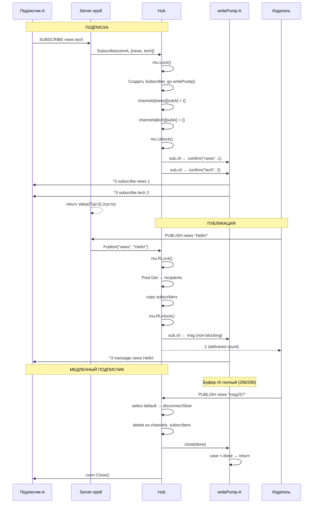

# Pub/Sub — Полный Разбор Каждого Шага

> [!NOTE]
> Этот документ описывает ВСЁ: от момента `SUBSCRIBE news`, через `PUBLISH news "Breaking!"`, до отключения медленного клиента. Включая два параллельных IO-пути, sync.Pool, back-pressure и идемпотентный disconnect.

---

## Оглавление

1. [Зачем Pub/Sub?](#1-зачем-pubsub)
2. [Фаза 0: Hub — центральный диспетчер](#2-фаза-0-hub)
3. [Фаза 1: SUBSCRIBE — подписка](#3-фаза-1-subscribe)
4. [Фаза 2: writePump — горутина подписчика](#4-фаза-2-writepump)
5. [Фаза 3: PUBLISH — публикация](#5-фаза-3-publish)
6. [Фаза 4: Back-pressure и disconnectSlow](#6-фаза-4-back-pressure)
7. [Фаза 5: UNSUBSCRIBE и очистка](#7-фаза-5-unsubscribe)
8. [Фаза 6: Два параллельных IO-пути](#8-фаза-6-два-io-пути)
9. [Полная Sequence Diagram](#9-sequence-diagram)

---

## 1. Зачем Pub/Sub?

**Обычные команды** — это «запрос-ответ»:
```
Клиент → SET key val → Сервер
Клиент ← +OK         ← Сервер
```

**Pub/Sub** — это «радио». Один вещает → все подписанные слышат:
```
Подписчик-A: SUBSCRIBE news       → ждёт...
Подписчик-B: SUBSCRIBE news       → ждёт...
Подписчик-C: SUBSCRIBE sports     → ждёт...

Издатель:   PUBLISH news "Breaking!"
                    │
                    ├──→ Подписчик-A получает "Breaking!"  ✅
                    ├──→ Подписчик-B получает "Breaking!"  ✅
                    └──✗ Подписчик-C НЕ получает (другой канал)
```

**Ключевые свойства:**
- **Fire-and-forget** — нет хранения, нет гарантий доставки
- **Нет истории** — если подписчик отключился в момент PUBLISH, сообщение потеряно
- **Fan-out** — одно сообщение → N подписчиков за один PUBLISH

---

## 2. Фаза 0: Hub — центральный диспетчер

### Структура Hub

[pubsub.go:23-28](https://github.com/Nikolay1994Kaz/storage_in_memory/blob/master/kvstore/internal/pubsub/pubsub.go#L23-L28):

```go
type Hub struct {
    mu          sync.RWMutex
    channels    map[string]map[*Subscriber]struct{}   // канал → подписчики
    subscribers map[net.Conn]*Subscriber               // соединение → подписчик
}
```

Две карты (map) с двусторонней связью:

```
channels:                                subscribers:
┌─────────┬──────────────────────┐      ┌────────────┬──────────┐
│ "news"  │ {*SubA, *SubB}       │      │ connA      │ *SubA    │
│ "sports"│ {*SubC}              │      │ connB      │ *SubB    │
│ "tech"  │ {*SubA, *SubC}       │      │ connC      │ *SubC    │
└─────────┴──────────────────────┘      └────────────┴──────────┘
     ↑ "по каналу найди подписчиков"         ↑ "по соединению найди подписчика"
     Используется в PUBLISH                   Используется в SUBSCRIBE/UNSUBSCRIBE
```

> [!IMPORTANT]
> **Зачем `map[*Subscriber]struct{}`?** Это idiom Go для **множества** (set). `struct{}` занимает 0 байт. Мы используем map только для O(1) lookup/delete, значение не нужно. Альтернатива — слайс `[]*Subscriber`, но тогда delete = O(N) перебор.

### Структура Subscriber

[pubsub.go:16-21](https://github.com/Nikolay1994Kaz/storage_in_memory/blob/master/kvstore/internal/pubsub/pubsub.go#L16-L21):

```go
type Subscriber struct {
    ch       chan protocol.Value       // буферизованный канал (256 сообщений)
    conn     net.Conn                  // TCP-соединение клиента
    done     chan struct{}             // сигнал "умри" для writePump
    channels map[string]struct{}       // на что подписан (O(1) lookup)
}
```

```
Subscriber:
┌──────────────────────────────────────────────────────┐
│  ch ──────── chan protocol.Value (буфер 256)          │
│              [msg][msg][msg][░░░░░░░░░░░░░░░░░░░░]   │
│               ← writePump читает    Publish пишет → │
│                                                      │
│  conn ────── net.Conn (TCP-сокет клиента)            │
│              writePump → conn.Write(RESP)             │
│                                                      │
│  done ────── chan struct{} (закрыт = "горутина стоп") │
│                                                      │
│  channels ── map{"news":{}, "tech":{}}               │
│              на какие каналы подписан                 │
└──────────────────────────────────────────────────────┘
```

### Создание Hub

[main.go:113](https://github.com/Nikolay1994Kaz/storage_in_memory/blob/master/kvstore/cmd/kvstore/main.go#L113):
```go
hub := pubsub.NewHub()
```

Hub — **синглтон**. Один на весь процесс. Все epoll-воркеры шарят один Hub через его RWMutex.

---

## 3. Фаза 1: SUBSCRIBE — подписка

### Сценарий: Клиент A подключается и подписывается

```
redis-cli -p 6380
> SUBSCRIBE news tech
```

### Путь через стек:

```
redis-cli → TCP → epoll → handleConn → executeCommand
                                              │
                                        case "SUBSCRIBE":
                                              │
                                        hub.Subscribe(conn, ["news", "tech"])
```

[main.go:494-504](https://github.com/Nikolay1994Kaz/storage_in_memory/blob/master/kvstore/cmd/kvstore/main.go#L494-L504):
```go
case "SUBSCRIBE":
    channels := make([]string, len(args))
    for i, arg := range args {
        channels[i] = arg.Str     // ["news", "tech"]
    }
    hub.Subscribe(conn, channels)
    return protocol.Value{Typ: 0}  // ← ПУСТОЙ ответ! Почему? Читай ниже.
```

> [!IMPORTANT]
> `Typ: 0` = пустой ответ. Server **не отправляет ничего** через обычный handleConn путь. Подтверждения отправляет **writePump** через отдельный канал. Зачем? Потому что после SUBSCRIBE это соединение переходит в «push-режим» — все сообщения отправляет writePump, а не handleConn.

### hub.Subscribe() — пошагово

[pubsub.go:38-90](https://github.com/Nikolay1994Kaz/storage_in_memory/blob/master/kvstore/internal/pubsub/pubsub.go#L38-L90):

```go
func (h *Hub) Subscribe(conn net.Conn, channels []string) *Subscriber {
    h.mu.Lock()   // ← ЭКСКЛЮЗИВНЫЙ лок (пишем в channels и subscribers)
    
    // ШАГ 1: Найти или создать Subscriber
    sub, exists := h.subscribers[conn]
    if !exists {
        // Первая подписка для этого conn → создаём Subscriber
        sub = &Subscriber{
            ch:       make(chan protocol.Value, 256),  // буфер 256 сообщений
            conn:     conn,
            done:     make(chan struct{}),
            channels: make(map[string]struct{}),
        }
        h.subscribers[conn] = sub
        
        go sub.writePump()   // ← ЗАПУСКАЕМ ГОРУТИНУ-ПИСАТЕЛЯ!
    }
    
    // ШАГ 2: Подготовить подтверждения (ПОД ЛОКОМ — нужен len(sub.channels))
    confirmations := make([]protocol.Value, 0, len(channels))
    
    for _, channel := range channels {
        // Создать канал если не существует
        if h.channels[channel] == nil {
            h.channels[channel] = make(map[*Subscriber]struct{})
        }
        
        // Добавить подписчика в канал
        h.channels[channel][sub] = struct{}{}
        // Добавить канал в подписчика
        sub.channels[channel] = struct{}{}
        
        // Сформировать подтверждение Redis-формата
        confirmations = append(confirmations, protocol.Value{
            Typ: '*',
            Array: []protocol.Value{
                {Typ: '$', Str: "subscribe"},
                {Typ: '$', Str: channel},
                {Typ: ':', Num: len(sub.channels)},  // ← порядковый номер
            },
        })
    }
    
    h.mu.Unlock()  // ← СНИМАЕМ ЛОК ПЕРЕД отправкой!
    
    // ШАГ 3: Отправить подтверждения через канал (ВНЕ лока!)
    for _, msg := range confirmations {
        select {
        case sub.ch <- msg:       // → writePump заберёт и отправит клиенту
        default:
            // Буфер полон (256 сообщений!) — клиент мёртв
            h.disconnectSlow(sub)
            return sub
        }
    }
    
    return sub
}
```

> [!WARNING]
> **Подтверждения отправляются ВНЕ лока!** Если бы мы делали `sub.ch <- msg` под `mu.Lock()`, а буфер `ch` полон, горутина заблокируется НА select default — но это non-blocking. Однако `disconnectSlow()` берёт свой `mu.Lock()`, и если мы уже под `mu.Lock()` → **DEADLOCK**! Поэтому: формируем под Lock, отправляем после Unlock.

### Что видит клиент после SUBSCRIBE:

```
redis-cli:
> SUBSCRIBE news tech

1) "subscribe"    ← подтверждение канала "news"
2) "news"
3) (integer) 1    ← ты подписан на 1 канал

1) "subscribe"    ← подтверждение канала "tech"
2) "tech"
3) (integer) 2    ← ты подписан на 2 канала

(ожидание сообщений...)
```

### Состояние после подписки:

```
Hub.channels:
┌─────────┬────────────┐
│ "news"  │ {*SubA}    │
│ "tech"  │ {*SubA}    │
└─────────┴────────────┘

Hub.subscribers:
┌────────────┬────────┐
│ connA      │ *SubA  │
└────────────┴────────┘

SubA:
├─ ch:       chan (буфер 256, сейчас пустой — подтверждения уже обработаны)
├─ conn:     connA
├─ done:     открыт
├─ channels: {"news", "tech"}
└─ writePump: горутина крутится, ждёт msg из ch
```

---

## 4. Фаза 2: writePump — горутина подписчика

### Зачем отдельная горутина?

Без writePump: Hub.Publish() → напрямую Write в conn → если клиент медленный → Publish **заблокирован** → ВСЕ подписчики ждут → весь Hub стоит.

С writePump: Hub.Publish() → `ch <- msg` (наносекунды) → writePump в своей горутине → Write в conn → если медленный → блокируется ТОЛЬКО ЕГО горутина.

### writePump — код

[pubsub.go:207-220](https://github.com/Nikolay1994Kaz/storage_in_memory/blob/master/kvstore/internal/pubsub/pubsub.go#L207-L220):

```go
func (s *Subscriber) writePump() {
    writer := protocol.NewWriter(s.conn)  // RESP-сериализатор
    
    for {
        select {
        case msg := <-s.ch:   // Ждём сообщение из канала
            if err := writer.Write(msg); err != nil {
                return  // Ошибка записи → соединение мертво → выходим
            }
        case <-s.done:        // Hub сказал "умри"
            return
        }
    }
}
```

```
writePump:

    ┌──────────────────────────────────────────────┐
    │  for {                                        │
    │    select {                                   │
    │    case msg := <-s.ch:                        │
    │      │                                        │
    │      │  msg = protocol.Value{                 │
    │      │    Typ: '*',                           │
    │      │    Array: ["message", "news", "Hello"] │
    │      │  }                                     │
    │      │                                        │
    │      ▼                                        │
    │      writer.Write(msg)                        │
    │      │                                        │
    │      ▼                                        │
    │      msg.Marshal() → bytes                    │
    │      │  *3\r\n                                │
    │      │  $7\r\nmessage\r\n                     │
    │      │  $4\r\nnews\r\n                        │
    │      │  $5\r\nHello\r\n                       │
    │      │                                        │
    │      ▼                                        │
    │      conn.Write(bytes)  → TCP → клиент        │
    │                                               │
    │    case <-s.done:                              │
    │      return  // Hub закрыл done → выходим      │
    │    }                                           │
    │  }                                             │
    └──────────────────────────────────────────────┘
```

> [!TIP]
> `protocol.NewWriter(s.conn)` создаётся **один раз** при старте writePump. Каждое сообщение → `v.Marshal()` → `conn.Write()`. Marshal формирует RESP-байты, а conn.Write отправляет их по TCP.

---

## 5. Фаза 3: PUBLISH — публикация

### Сценарий: Издатель шлёт `PUBLISH news "Hello!"`

Издатель — это **обычный клиент** (не подписчик). Он подключён к тому же серверу.

[main.go:514-519](https://github.com/Nikolay1994Kaz/storage_in_memory/blob/master/kvstore/cmd/kvstore/main.go#L514-L519):
```go
case "PUBLISH":
    count := hub.Publish(args[0].Str, args[1].Str)
    return protocol.Value{Typ: ':', Num: count}  // Кол-во получивших
```

### hub.Publish() — пошагово

[pubsub.go:141-189](https://github.com/Nikolay1994Kaz/storage_in_memory/blob/master/kvstore/internal/pubsub/pubsub.go#L141-L189):

```go
func (h *Hub) Publish(channel string, message string) int {
    // ШАГ 1: RLock — читаем подписчиков канала
    h.mu.RLock()
    subs, exists := h.channels["news"]
    if !exists {
        h.mu.RUnlock()
        return 0  // Никого нет в канале
    }
    
    // ШАГ 2: Копируем подписчиков в слайс из sync.Pool
    ptr := subscriberSlicePool.Get().(*[]*Subscriber)
    recipients := *ptr
    // recipients = [] (пустой, но cap=64 — без аллокации!)
    
    for sub := range subs {
        recipients = append(recipients, sub)
    }
    h.mu.RUnlock()  // ← Снимаем RLock СРАЗУ после копирования!
    
    // ШАГ 3: Формируем RESP-сообщение (вне лока!)
    msg := protocol.Value{
        Typ: '*',
        Array: []protocol.Value{
            {Typ: '$', Str: "message"},   // тип
            {Typ: '$', Str: "news"},      // канал
            {Typ: '$', Str: "Hello!"},    // содержимое
        },
    }
    
    // ШАГ 4: Отправляем каждому подписчику (NON-BLOCKING!)
    delivered := 0
    for _, sub := range recipients {
        select {
        case sub.ch <- msg:   // Есть место в буфере → отправлено
            delivered++
        default:              // Буфер полон → медленный клиент!
            log.Printf("Pub/Sub: slow subscriber disconnected")
            h.disconnectSlow(sub)
        }
    }
    
    // ШАГ 5: Очистка и возврат слайса в Pool
    for i := range recipients {
        recipients[i] = nil       // Обнулить указатели (GC может освободить)
    }
    recipients = recipients[:0]   // Сбросить длину (cap сохранён)
    
    if cap(recipients) <= 1024 {  // Защита от spike'ов
        *ptr = recipients
        subscriberSlicePool.Put(ptr)  // Вернуть в Pool
    }
    // Если cap > 1024 → НЕ возвращаем (пусть GC заберёт гигантский слайс)
    
    return delivered
}
```

### Зачем sync.Pool?

[pubsub.go:133-138](https://github.com/Nikolay1994Kaz/storage_in_memory/blob/master/kvstore/internal/pubsub/pubsub.go#L133-L138):

```go
var subscriberSlicePool = sync.Pool{
    New: func() any {
        s := make([]*Subscriber, 0, 64)
        return &s   // ← указатель на слайс!
    },
}
```

**Без Pool:** каждый PUBLISH → `make([]*Subscriber, 0, N)` → аллокация → GC давление.

**С Pool:** первый PUBLISH → создать слайс. Второй PUBLISH → взять из Pool (0 аллокаций). Тысячный PUBLISH → 0 аллокаций на горячем пути.

```
Publish #1: Pool пуст → New() → make(cap=64) → используем → Put() в Pool
Publish #2: Pool.Get() → тот же слайс → используем → Put()
Publish #3: Pool.Get() → тот же слайс → используем → Put()
...
Publish #1M: Pool.Get() → тот же слайс → 0 аллокаций! 🎉
```

> [!IMPORTANT]
> **Зачем `&s` (указатель на слайс)?** Потому что `sync.Pool` хранит `interface{}`. Если положить слайс напрямую, Go будет аллоцировать interface header при каждом Get/Put. Указатель на слайс — одна аллокация при `New()`, дальше zero-alloc.

### Зачем обнулять указатели?

```go
for i := range recipients {
    recipients[i] = nil  // ← ЗАЧЕМ?
}
```

Без обнуления: слайс в Pool содержит живые указатели `*Subscriber`. GC считает их «используемыми» и НЕ может освободить память подписчиков, даже если они давно отключились.

С обнулением: все указатели = nil → GC свободен собрать неиспользуемых подписчиков.

### Зачем cap guard ≤ 1024?

```go
if cap(recipients) <= 1024 {
    subscriberSlicePool.Put(ptr)  // Возвращаем
}
// Если > 1024 → НЕ возвращаем
```

Сценарий: однажды на канал подписались 10,000 клиентов → слайс вырос до cap=10000 → все отписались. Без guard'а этот гигантский слайс останется в Pool навсегда, занимая 80KB памяти (10000 × 8 байт указатель). Guard: если слайс слишком большой — выбрасываем, пусть GC заберёт.

---

## 6. Фаза 4: Back-pressure и disconnectSlow

### Проблема: медленный подписчик

```
Publisher:     PUBLISH news "msg1" → PUBLISH news "msg2" → ... → PUBLISH news "msg300"
                                                                         ↓
SubA (быстрый): ch буфер: [░░░░░░░░░░░░░] (пустой, writePump успевает)    ✅
SubB (медленный): ch буфер: [████████████████████████████] (ПОЛНЫЙ! 256/256) ❌
```

SubB не читает из `ch` → буфер 256 сообщений заполнен → `select default` → **disconnectSlow**.

### disconnectSlow — идемпотентное отключение

[pubsub.go:224-246](https://github.com/Nikolay1994Kaz/storage_in_memory/blob/master/kvstore/internal/pubsub/pubsub.go#L224-L246):

```go
func (h *Hub) disconnectSlow(sub *Subscriber) {
    h.mu.Lock()
    defer h.mu.Unlock()
    
    // ПРОВЕРКА: не отключили ли уже?
    if _, exists := h.subscribers[sub.conn]; !exists {
        return  // Уже отключен другой горутиной → ничего не делаем
    }
    
    // 1. Убираем из ВСЕХ каналов
    for channel := range sub.channels {
        if subs, ok := h.channels[channel]; ok {
            delete(subs, sub)          // Удаляем подписчика из канала
            if len(subs) == 0 {
                delete(h.channels, channel)  // Канал пуст → удаляем канал
            }
        }
    }
    
    // 2. Останавливаем writePump
    close(sub.done)         // → writePump: case <-s.done → return
    
    // 3. Закрываем TCP-соединение
    sub.conn.Close()
    
    // 4. Удаляем из subscribers map
    delete(h.subscribers, sub.conn)
}
```

> [!IMPORTANT]
> **Идемпотентность** — проверка `if _, exists := h.subscribers[sub.conn]; !exists`. Зачем? Два PUBLISH'а могут одновременно обнаружить полный буфер SubB. Оба вызовут `disconnectSlow(SubB)`. Первый — отключит. Второй — увидит `!exists` → просто выйдет. Без этой проверки: двойной `close(sub.done)` → **PANIC**!

### Non-blocking send — ключевой паттерн

```go
select {
case sub.ch <- msg:   // Попытка отправить
    delivered++       // ✅ Успех
default:              // Буфер полон
    disconnectSlow()  // ❌ Мгновенное отключение
}
```

**Без `default`:** `sub.ch <- msg` блокируется пока кто-то не прочитает. Если 1000 подписчиков и один медленный — Publish блокируется и все 999 быстрых ждут. **Катастрофа.**

**С `default`:** если буфер полон — мгновенно отключаем медленного. Publish НИКОГДА не блокируется. Hub всегда отзывчив.

```
Аналогия:
- Без default: ты стоишь у двери и ждёшь пока откроют (может час)
- С default: постучал → не открыли за 0 секунд → ушёл к следующему
```

---

## 7. Фаза 5: UNSUBSCRIBE и очистка

### Явная отписка: `UNSUBSCRIBE news`

[pubsub.go:93-131](https://github.com/Nikolay1994Kaz/storage_in_memory/blob/master/kvstore/internal/pubsub/pubsub.go#L93-L131):

```go
func (h *Hub) Unsubscribe(conn net.Conn, channels []string) {
    h.mu.Lock()
    defer h.mu.Unlock()
    
    sub, exists := h.subscribers[conn]
    if !exists { return }
    
    if len(channels) == 0 {
        // UNSUBSCRIBE (без аргументов) → отписка от ВСЕХ
        for channel := range sub.channels {
            if subs, ok := h.channels[channel]; ok {
                delete(subs, sub)
                if len(subs) == 0 {
                    delete(h.channels, channel)
                }
            }
        }
        clear(sub.channels)  // Go 1.21+ zero-alloc очистка map
    } else {
        // Отписка от конкретных каналов
        for _, channel := range channels {
            //... delete из h.channels и sub.channels
        }
    }
    
    // Если подписок не осталось → закрываем горутину
    if len(sub.channels) == 0 {
        close(sub.done)              // writePump → return
        delete(h.subscribers, conn)
    }
}
```

> [!TIP]
> `clear(sub.channels)` — Go 1.21+ встроенная функция. Очищает map за O(N) **без аллокации новой map**. До Go 1.21 пришлось бы `sub.channels = make(map[string]struct{})` — это аллокация.

### Очистка при disconnect (TCP разрыв)

Когда клиент просто закрывает соединение (Ctrl+C), сервер видит ошибку чтения. Нужен `RemoveConn`:

[pubsub.go:192-194](https://github.com/Nikolay1994Kaz/storage_in_memory/blob/master/kvstore/internal/pubsub/pubsub.go#L192-L194):
```go
func (h *Hub) RemoveConn(conn net.Conn) {
    h.Unsubscribe(conn, nil)  // nil = отписка от всех
}
```

---

## 8. Фаза 6: Два параллельных IO-пути

### Главный архитектурный нюанс всего проекта

На одном TCP-соединении работают **два независимых пути записи**:

```
┌─────────────────────────────────────────────────────────┐
│                TCP СОЕДИНЕНИЕ (net.Conn)                  │
│                                                          │
│  ПУТЬ 1 (обычные команды):     ПУТЬ 2 (Pub/Sub push):   │
│  ┌──────────────────────┐     ┌──────────────────────┐  │
│  │ epoll → handleConn   │     │ Hub → sub.ch         │  │
│  │ → cs.Writer.Write()  │     │ → writePump()        │  │
│  │ → conn.Write(RESP)   │     │ → writer.Write(msg)  │  │
│  │                      │     │ → conn.Write(RESP)   │  │
│  └──────────┬───────────┘     └──────────┬───────────┘  │
│             │                            │               │
│             └────────────┬───────────────┘               │
│                          │                               │
│                    conn.Write()                           │
│                          │                               │
│                     ┌────▼────┐                          │
│                     │ TCP buf │ → Сеть → Клиент          │
│                     └─────────┘                          │
└─────────────────────────────────────────────────────────┘
```

> [!CAUTION]
> Оба пути пишут в **один** `net.Conn`. Go гарантирует потокобезопасность `Write()`, но RESP-сообщения **могут перемешаться**. Пример:
>
> ```
> Путь 1 (handleConn):  шлёт "+OK\r\n"
> Путь 2 (writePump):   шлёт "*3\r\n$7\r\nmessage\r\n..."
> Клиент получает:      "+OK\r\n*3\r\n$7\r\nmessage\r\n..." — ЧТО ЭТО?
> ```
>
> Поэтому Redis (и наш проект) **запрещает** обычные команды в подписанном соединении. После SUBSCRIBE через этот conn можно только SUBSCRIBE/UNSUBSCRIBE/PING.

### Как это работает на уровне горутин:

```
┌─ Epoll Worker #0 ──────────────────────────────────────┐
│                                                         │
│  eventLoop() {                                          │
│    states = epoll.Wait()     // Ждём события            │
│    for _, cs := range states {                          │
│      handleConn(cs) {                                   │
│        value = cs.Reader.Read()                         │
│        result = handler(cs, value.Array)                │
│        cs.Writer.Write(result)    ← Путь 1: ОТВЕТ      │
│      }                                                  │
│    }                                                    │
│  }                                                      │
│                                                         │
│  Если cmd == "SUBSCRIBE":                               │
│    handler внутри: hub.Subscribe(conn, channels)        │
│    return Value{Typ: 0}  ← ПУСТОЙ (Путь 1 молчит!)     │
│                                                         │
│  Если cmd == "PUBLISH":                                 │
│    handler: hub.Publish(ch, msg)                        │
│    return Value{Typ: ':', Num: count}  ← Путь 1: ":2"  │
└─────────────────────────────────────────────────────────┘

┌─ writePump горутина SubA ──────────────────────────────┐
│                                                         │
│  for {                                                  │
│    select {                                             │
│    case msg := <-sub.ch:                                │
│      writer.Write(msg)       ← Путь 2: PUSH-сообщение │
│    case <-sub.done:                                     │
│      return                                             │
│    }                                                    │
│  }                                                      │
└─────────────────────────────────────────────────────────┘
```

---

## 9. Sequence Diagram



---

## Ключевые Структуры — Сводка

| Структура | Тип | Назначение |
|-----------|-----|-----------|
| `Hub.channels` | `map[string]map[*Subscriber]struct{}` | Канал → множество подписчиков |
| `Hub.subscribers` | `map[net.Conn]*Subscriber` | Соединение → подписчик |
| `Hub.mu` | `sync.RWMutex` | RLock для Publish, Lock для Subscribe |
| `Subscriber.ch` | `chan protocol.Value` (буфер 256) | Очередь сообщений для writePump |
| `Subscriber.done` | `chan struct{}` | Сигнал остановки writePump |
| `Subscriber.channels` | `map[string]struct{}` | Подписки этого клиента |
| `subscriberSlicePool` | `sync.Pool` | Переиспользование слайсов в Publish |

---

## Блокировки в Pub/Sub

```
🔒 mu.Lock() (эксклюзивный — ЗАПИСЬ):
──────────────────────────────────────
Subscribe()      │ Создать Subscriber + добавить в channels
Unsubscribe()    │ Убрать из channels + удалить Subscriber
disconnectSlow() │ Очистка + close(done) + conn.Close()

🔓 mu.RLock() (shared — ЧТЕНИЕ):
──────────────────────────────────────
Publish()        │ Прочитать channels[ch] → скопировать → RUnlock
IsSubscriber()   │ Проверить subscribers[conn]
```

> [!TIP]
> **Publish — горячий путь (RLock).** PUBLISH может вызываться тысячи раз в секунду. RLock позволяет нескольким Publish'ам работать одновременно. Lock берётся только при Subscribe/Unsubscribe (редкие операции).

---

## Горутины Pub/Sub

| # | Горутина | Жизненный цикл | Задача |
|---|---------|---------------|--------|
| 1 | `writePump()` × N | Создаётся при SUBSCRIBE, умирает при close(done) | Читает ch → Write в conn |
| — | Hub **НЕ** создаёт своих горутин | — | Всё работает в горутинах вызывающего кода и writePump |

---

## Мнемоника Pub/Sub

```
🏢 Hub         = РАДИОСТАНЦИЯ (один на всех, знает все каналы)
📻 Subscriber  = РАДИОПРИЁМНИК (один на клиента, буфер 256 сообщений)
📡 writePump   = АНТЕННА (горутина: берёт из буфера → шлёт клиенту)
📢 Publish     = ДИДЖЕЙ (кладёт сообщение в буфер каждого приёмника)
🔇 disconnectSlow = ОТКЛЮЧИТЬ (буфер полон → клиент мёртв → выкинуть)
```

**Три ключевых правила:**
```
1. Publish НИКОГДА не блокируется (non-blocking send + default)
2. Подтверждения SUBSCRIBE отправляются ВНЕ лока (иначе deadlock)
3. disconnectSlow — ИДЕМПОТЕНТНА (проверка exists перед close)
```
