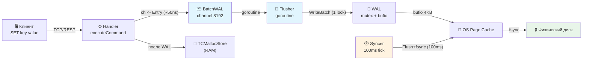
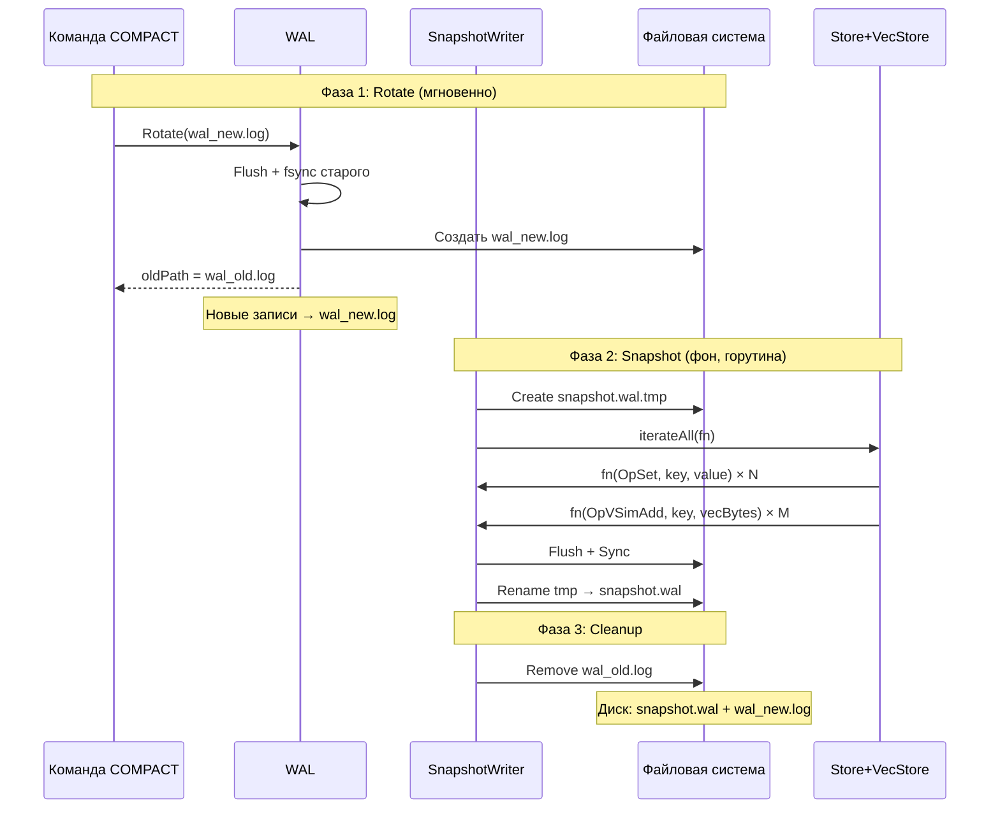
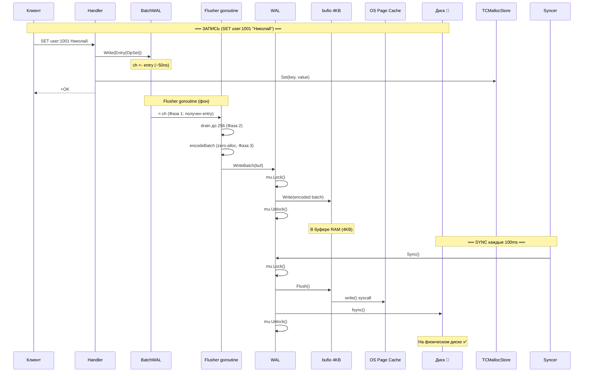
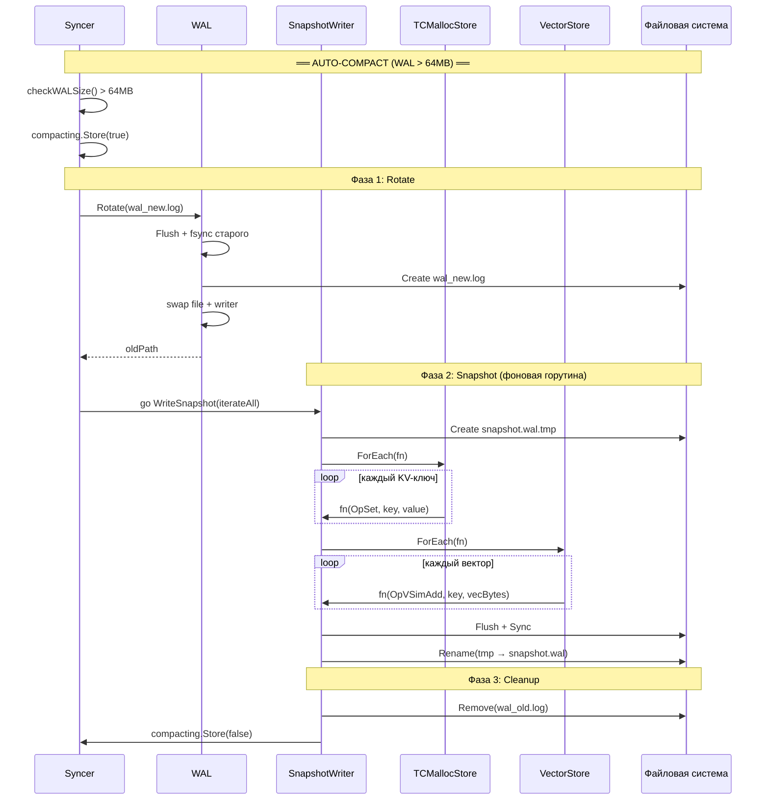
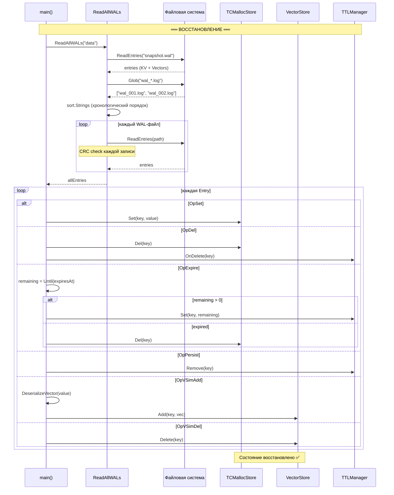

# WAL (Write-Ahead Log) — Полный Разбор

> [!NOTE]
> Этот документ — **самодостаточный справочник** по подсистеме Write-Ahead Log хранилища `storage_in_memory`.
> Он описывает **всё**: от момента, когда клиент набирает `SET key value`, до того, как данные
> переживают крэш сервера и восстанавливаются при перезагрузке. Включая вектора, TTL, батчинг,
> синхронизацию, снэпшоты и компактизацию.
>
> После прочтения разработчик сможет полностью понять WAL-систему **без чтения исходного кода**.

---

## Оглавление

1. [Зачем WAL?](#1-зачем-wal)
2. [Архитектура — полная картина](#2-архитектура--полная-картина)
3. [Бинарный формат на диске](#3-бинарный-формат-на-диске)
4. [WAL.Write — прямая запись (холодный путь)](#4-walwrite--прямая-запись-холодный-путь)
5. [BatchWAL — батч-запись (горячий путь)](#5-batchwal--батч-запись-горячий-путь)
6. [Syncer — периодический fsync](#6-syncer--периодический-fsync)
7. [Snapshot и Компактизация](#7-snapshot-и-компактизация)
8. [Recovery — восстановление при старте](#8-recovery--восстановление-при-старте)
9. [Все типы операций — примеры](#9-все-типы-операций--примеры)
10. [Конкурентность и Safety](#10-конкурентность-и-safety)
11. [Производительность](#11-производительность)
12. [Полная Sequence Diagram](#12-полная-sequence-diagram)

---

## 1. Зачем WAL?

Наши данные живут **в памяти** (TCMallocStore). Память — это RAM. RAM теряет всё при выключении.

**Проблема:**

```
T=0:   SET user:1001 "Николай"  → TCMallocStore (в RAM)    ✅ Работает
T=1:   SET user:1002 "Алматы"   → TCMallocStore (в RAM)    ✅ Работает
T=2:   ⚡ СЕРВЕР УПАЛ (kill -9, отключили свет)
T=3:   Рестарт → RAM пуста → ВСЕ ДАННЫЕ ПОТЕРЯНЫ           ❌
```

**Решение — WAL (Write-Ahead Log):**

```
T=0:   SET user:1001 "Николай"
       Шаг 1: Записать в WAL-файл на ДИСКЕ     ← СНАЧАЛА на диск!
       Шаг 2: Записать в TCMallocStore в ПАМЯТИ ← Потом в память

T=2:   ⚡ СЕРВЕР УПАЛ
T=3:   Рестарт → Читаем WAL-файл → Повторяем все операции → ДАННЫЕ ВОССТАНОВЛЕНЫ ✅
```

> [!IMPORTANT]
> **Write-AHEAD** = «запись ЗАРАНЕЕ». Сначала на диск, потом в память. Если крэш произойдёт между шагами 1 и 2 — при рестарте данные восстановятся из файла. Если крэш произойдёт ДО шага 1 — клиент вообще не получил `+OK`, значит данные не были подтверждены.

### Аналогия с Redis AOF

Redis использует Append-Only File (AOF) — ту же идею: каждая операция дописывается в конец файла. Redis предоставляет три режима `appendfsync`:

| Режим | Когда fsync | Потери при crash |
|-------|-------------|-----------------|
| `always` | На каждую команду | 0 | Очень медленно |
| `everysec` | Раз в секунду | ≤1 сек |
| `no` | Решает ОС | До 30 сек |

Наш подход — аналог `everysec`, но **в 10 раз чаще**: fsync каждые **100ms**. Это осознанный trade-off:

```
Наш trade-off: fire-and-forget (окно потери ≤100ms)
───────────────────────────────────────────────────
BatchWAL.Write() отправляет запись в канал и НЕМЕДЛЕННО возвращает
управление. Данные попадают на физический диск асинхронно:
  flusher goroutine → WAL.WriteBatch → bufio → Syncer fsync каждые 100ms

Для in-memory KV store это приемлемый компромисс:
  максимальный throughput (~7M ops/sec на ядро)
  ценой теоретической потери последних ~100ms данных.
```

---

## 2. Архитектура — полная картина

### 2.1 Полный стек от клиента до диска



### 2.2 Компоненты WAL-подсистемы

| Компонент | Файл | Ответственность |
|-----------|------|-----------------|
| **WAL** | [wal.go](file:///home/nikolay/storage_in_memory/kvstore/internal/wal/wal.go) | Ядро: Open, Write, WriteBatch, Sync, Rotate, Close. Бинарный формат, CRC32. |
| **BatchWAL** | [batch.go](file:///home/nikolay/storage_in_memory/kvstore/internal/wal/batch.go) | Обёртка: channel + flusher goroutine. Группирует N записей в 1 WriteBatch. |
| **Syncer** | [syncer.go](file:///home/nikolay/storage_in_memory/kvstore/internal/wal/syncer.go) | Периодический fsync (100ms). Auto-compact при WAL > 64MB. |
| **SnapshotWriter** | [snapshot.go](file:///home/nikolay/storage_in_memory/kvstore/internal/wal/snapshot.go) | Snapshot: полный дамп KV + Vectors. BackgroundCompact: Rotate → Snapshot → Cleanup. |
| **main.go (bootstrap)** | [main.go:118-143](file:///home/nikolay/storage_in_memory/kvstore/cmd/kvstore/main.go#L118-L143) | Инициализация: Open WAL → NewBatchWAL → NewSyncer(iterateAll). |
| **main.go (handler)** | [main.go:484-527](file:///home/nikolay/storage_in_memory/kvstore/cmd/kvstore/main.go#L484-L527) | SET: `bw.Write(Entry{OpSet})` → `s.Set()`. |

### 2.3 Два пути записи

```
┌─────────────────────────────────────────────────────────────────┐
│                     ГОРЯЧИЙ ПУТЬ (Hot Path)                      │
│                                                                  │
│  Все клиентские операции: SET, DEL, EXPIRE, VSIM.ADD, ...       │
│                                                                  │
│  Worker goroutine → BatchWAL.Write(entry)  ← ~50ns, channel    │
│       └─→ ch <- entry  (lock-free send)                          │
│            └─→ flusher goroutine читает до 256 entries           │
│                 └─→ encodeBatch (zero-alloc, pre-allocated buf)  │
│                      └─→ WAL.WriteBatch(buf)  ← 1 mutex lock    │
│                                                                  │
│  Стоимость: ~137ns/op (0 allocs, 0 B/op)                        │
└─────────────────────────────────────────────────────────────────┘

┌─────────────────────────────────────────────────────────────────┐
│                     ХОЛОДНЫЙ ПУТЬ (Cold Path)                    │
│                                                                  │
│  Используется только в Snapshot (WriteSnapshot)                  │
│                                                                  │
│  Snapshot → напрямую кодирует в bufio.Writer (256KB буфер)       │
│  Нет промежуточного WAL.Write() — нет mutex lock на каждый ключ │
│                                                                  │
│  Стоимость: ~348ns/op (2 allocs, 40 B/op)                       │
└─────────────────────────────────────────────────────────────────┘
```

---

## 3. Бинарный формат на диске

### 3.1 Формат одной записи

Каждая запись в WAL-файле имеет фиксированную структуру:

```
┌──────────────────────────────────────────────────────────────────────────┐
│                          ОДНА ЗАПИСЬ В WAL                                │
├───────────┬───────────┬────────┬───────────┬───────────┬─────────────────┤
│  CRC32    │ PayloadLen│   Op   │  KeyLen   │   Key     │    Value        │
│  4 байта  │  4 байта  │ 1 байт │  4 байта  │  N байт   │    M байт      │
├───────────┼───────────┼────────┼───────────┼───────────┼─────────────────┤
│ A3B4C5D6  │ 1C000000  │   01   │ 09000000  │ user:     │    Николай      │
│           │   (=28)   │ (SET)  │   (=9)    │ 1001      │    (UTF-8)      │
└───────────┴───────────┴────────┴───────────┴───────────┴─────────────────┘
 ◄── header (8B) ──►   ◄─────────────── payload (28 байт) ───────────────►
```

**Header** (8 байт) записывается отдельно от payload, но CRC32 считается **только по payload**. Это позволяет обнаружить повреждение данных при crash recovery.

### 3.2 Little-Endian — почему?

```
Число 28 (десятичное) = 0x0000001C

Big-Endian:    [00] [00] [00] [1C]  — старший байт первый (сетевой порядок)
Little-Endian: [1C] [00] [00] [00]  — младший байт первый ← МЫ ИСПОЛЬЗУЕМ

Почему? x86/AMD64 процессоры — Little-Endian (нативный порядок байтов).
binary.LittleEndian = нативный = нет перестановки байтов = быстрее.
```

Используется `binary.LittleEndian.PutUint32` / `binary.LittleEndian.Uint32` — [wal.go:89-90](file:///home/nikolay/storage_in_memory/kvstore/internal/wal/wal.go#L89-L90).

### 3.3 Все Op-коды

[wal.go:18-25](file:///home/nikolay/storage_in_memory/kvstore/internal/wal/wal.go#L18-L25):

```go
const (
    OpSet     byte = 1   // SET key value — запись KV-пары
    OpDel     byte = 2   // DEL key — удаление ключа
    OpExpire  byte = 3   // EXPIRE/SET EX — абсолютное время смерти (8 байт unix nano)
    OpPersist byte = 4   // PERSIST — убрать TTL (Value пустой)
    OpVSimAdd byte = 5   // VSIM.ADD — вектор добавлен в HNSW
    OpVSimDel byte = 6   // VSIM.DEL — вектор удалён из HNSW
)
```

| Op-код | Байт | Команда | Value | Пример Value на диске |
|--------|------|---------|-------|----------------------|
| `OpSet` | `0x01` | `SET` | Произвольные байты (UTF-8 строка) | `"Николай"` (14 байт UTF-8) |
| `OpDel` | `0x02` | `DEL` | *(пусто, 0 байт)* | — |
| `OpExpire` | `0x03` | `EXPIRE` / `SET EX` | 8 байт — абсолютный unix nano (Big-Endian!) | `[00 05 A7 3B 8C 2E 00 00]` |
| `OpPersist` | `0x04` | `PERSIST` | *(пусто, 0 байт)* | — |
| `OpVSimAdd` | `0x05` | `VSIM.ADD` | N×4 байт — массив float32 (Little-Endian) | `[CD CC CC 3D 33 33 33 3F]` |
| `OpVSimDel` | `0x06` | `VSIM.DEL` | *(пусто, 0 байт)* | — |

> [!TIP]
> Обратите внимание: `OpExpire` использует **Big-Endian** для timestamp (`binary.BigEndian.PutUint64`), а все остальные числа в WAL — **Little-Endian**. Это исторически сложившееся решение, но функционально не влияет, т.к. encode/decode симметричны.

### 3.4 Примеры бинарного представления

**Пример 1: SET user:1001 "hi"**

```
Payload = [Op=0x01][KeyLen=09 00 00 00]["user:1001"]["hi"]
        = 01 | 09 00 00 00 | 75 73 65 72 3A 31 30 30 31 | 68 69
        = 16 байт

CRC32(payload) = 0xABCD1234  (пример)

На диске:
[34 12 CD AB] [10 00 00 00] [01] [09 00 00 00] [75 73 65 72 3A 31 30 30 31] [68 69]
 ^^^CRC32^^^   ^^^Len=16^^^  ^Op  ^^^KeyLen=9^^  ^^^^^^^^^^^^Key^^^^^^^^^^^^  ^Value^
```

**Пример 2: DEL user:1001**

```
Payload = [Op=0x02][KeyLen=09 00 00 00]["user:1001"]
        = 14 байт (Value пустой!)

На диске:
[XX XX XX XX] [0E 00 00 00] [02] [09 00 00 00] [75 73 65 72 3A 31 30 30 31]
 ^^^CRC32^^^   ^^^Len=14^^^  ^Op  ^^^KeyLen=9^^  ^^^^^^^^^^^^Key^^^^^^^^^^^^
```

**Пример 3: VSIM.ADD shoes 0.1 0.7**

```
float32(0.1) → math.Float32bits → 0x3DCCCCCD → [CD CC CC 3D]  (Little-Endian)
float32(0.7) → math.Float32bits → 0x3F333333 → [33 33 33 3F]

Payload = [Op=0x05][KeyLen=05 00 00 00]["shoes"][CD CC CC 3D 33 33 33 3F]
        = 1 + 4 + 5 + 8 = 18 байт

На диске:
[XX XX XX XX] [12 00 00 00] [05] [05 00 00 00] [73 68 6F 65 73] [CD CC CC 3D 33 33 33 3F]
 ^^^CRC32^^^   ^^^Len=18^^^  ^Op  ^^^KeyLen=5^^  ^^^^^^Key^^^^^   ^^^^^^^^float32[]^^^^^^^^
```

### 3.5 Несколько записей подряд в файле

```
WAL-файл (записи «склеены» — без разделителей):
┌─────────────────────────┬─────────────────────────┬─────────────────┐
│ CRC│Len│Op│KL│Key│Value │ CRC│Len│Op│KL│Key│Value │ CRC│Len│Op│... │
│       ЗАПИСЬ 1          │       ЗАПИСЬ 2          │    ЗАПИСЬ 3     │
└─────────────────────────┴─────────────────────────┴─────────────────┘

Длина (PayloadLen) позволяет точно знать, где начинается следующая запись.
Нет JSON, нет переносов строк — чистый бинарный протокол.
```

### 3.6 CRC32 — зачем и как работает при повреждении

```
Сценарий: свет погас ПОСЕРЕДИНЕ записи данных на диск

WAL-файл после crash:
┌──────────────────────────┬────────────────────┐
│ ЗАПИСЬ 1 (целая)    ✅   │ ЗАПИСЬ 2 (обрезана │
│ CRC совпадает            │ — половина payload │
│                          │ CRC НЕ совпадает!  │
└──────────────────────────┴────────────────────┘

При чтении (ReadEntries):
  Запись 1: CRC32(payload) == stored_crc → ✅ берём
  Запись 2: payload обрезан → CRC32 ≠ stored_crc → ❌ break
  Или:      header обрезан → io.ErrUnexpectedEOF → ❌ break

Результат: потерялась ТОЛЬКО одна частично записанная операция.
Все предыдущие данные в безопасности.
```

CRC32 использует полином IEEE (`crc32.ChecksumIEEE`) — стандартный, аппаратно ускоряемый на x86 через инструкцию `CRC32C`. Стоимость: ~1ns на 64 байта.

---

## 4. WAL.Write — прямая запись (холодный путь)

### 4.1 Код

[wal.go:76-103](file:///home/nikolay/storage_in_memory/kvstore/internal/wal/wal.go#L76-L103):

```go
// Write записывает одну операцию в WAL.
// Формат: [CRC32 4B][TotalLen 4B][Op 1B][KeyLen 4B][Key][Value]
func (w *WAL) Write(entry Entry) error {
    w.mu.Lock()                    // ← Один писатель за раз!
    defer w.mu.Unlock()

    // 1. Кодируем Entry в байты (payload)
    payload := encodeEntry(entry)
    // payload = [0x01][0x00 0x00 0x00 0x09]"user:1001"[UTF-8 bytes]
    //            ^Op    ^KeyLen (9)          ^Key        ^Value

    // 2. CRC32 контрольная сумма по payload
    checksum := crc32.ChecksumIEEE(payload)

    // 3. Header на СТЕКЕ (8 байт — zero-alloc, не уходит в heap!)
    var header [8]byte
    binary.LittleEndian.PutUint32(header[0:4], checksum)             // CRC32
    binary.LittleEndian.PutUint32(header[4:8], uint32(len(payload))) // PayloadLen

    // 4. Пишем header в bufio буфер (НЕ на диск!)
    if _, err := w.writer.Write(header[:]); err != nil {
        return fmt.Errorf("wal write header: %w", err)
    }

    // 5. Пишем payload в bufio буфер (НЕ на диск!)
    if _, err := w.writer.Write(payload); err != nil {
        return fmt.Errorf("wal write payload: %w", err)
    }

    return nil
}
```

### 4.2 encodeEntry — кодирование в байты

[wal.go:179-199](file:///home/nikolay/storage_in_memory/kvstore/internal/wal/wal.go#L179-L199):

```go
func encodeEntry(e Entry) []byte {
    size := 1 + 4 + len(e.Key) + len(e.Value)  // Op + KeyLen + Key + Value
    buf := make([]byte, size)

    offset := 0
    buf[offset] = e.Op             // buf[0] = 0x01 (OpSet)
    offset++                       // offset = 1

    binary.LittleEndian.PutUint32(buf[offset:], uint32(len(e.Key)))
    // buf[1..4] = [0x09, 0x00, 0x00, 0x00]  — длина ключа = 9
    offset += 4                    // offset = 5

    // copy из string напрямую — без промежуточного []byte(e.Key).
    // Go позволяет copy(dst []byte, src string) без аллокации.
    copy(buf[offset:], e.Key)      // buf[5..13] = "user:1001"
    offset += len(e.Key)           // offset = 14

    if len(e.Value) > 0 {
        copy(buf[offset:], e.Value)  // buf[14..27] = "Николай" (UTF-8)
    }

    return buf
}
```

> [!WARNING]
> После `WAL.Write()` данные находятся в **буфере bufio** (4KB в RAM), а **НЕ на физическом диске!** Они попадут на диск когда:
> 1. Буфер bufio заполнится (4096 байт) → автоматический `Flush()` в OS page cache
> 2. Syncer вызовет `Flush() + file.Sync()` (каждые 100ms)
> 3. Сервер штатно завершится (`defer bw.Close()`)
>
> Если `kill -9` прямо сейчас — последние ~100ms записей могут потеряться.

### 4.3 WriteBatch — запись pre-encoded batch

[wal.go:361-374](file:///home/nikolay/storage_in_memory/kvstore/internal/wal/wal.go#L361-L374):

```go
// WriteBatch записывает pre-encoded batch за одну блокировку.
// buf уже содержит все entries в формате [CRC32][Len][Payload]...
// Вызывается из BatchWAL.flushBatch — один раз на batch.
//
// Стоимость: 1 mutex lock + 1 bufio write.
// Сравни с Write(): 1 mutex lock + encode + CRC + 2 writes PER ENTRY.
func (w *WAL) WriteBatch(buf []byte) error {
    if len(buf) == 0 {
        return nil
    }

    w.mu.Lock()
    _, err := w.writer.Write(buf)
    w.mu.Unlock()

    if err != nil {
        return fmt.Errorf("wal write batch: %w", err)
    }
    return nil
}
```

> [!TIP]
> `WriteBatch` использует **ручной** `Lock/Unlock` вместо `defer` — это осознанная оптимизация. `defer` добавляет ~10ns overhead. На горячем пути это существенно. Ошибка обрабатывается **после** Unlock — лок удерживается минимальное время.

---

## 5. BatchWAL — батч-запись (горячий путь)

### 5.1 Архитектура

```
  ┌─── Worker 0 ────┐
  │  ch <- entry     │ ← lock-free send (~50ns)
  └──────────────────┘
  ┌─── Worker 1 ────┐
  │  ch <- entry     │
  └──────────────────┘
         ...
  ┌─── Worker N ────┐
  │  ch <- entry     │
  └──────────────────┘
          │
          ▼
┌──── ch (буфер 8192) ────────────────────┐
│  Lock-free FIFO очередь                  │
│  ~1MB памяти (8192 × ~128B/entry)        │
│  Backpressure: worker блокируется если   │
│  канал полон — лучше замедлить, чем      │
│  потерять данные!                         │
└──────────────────────────────────────────┘
          │
          ▼
┌──── Flusher goroutine ──────────────────┐
│                                          │
│  Фаза 1: select { ch / timer }          │
│     ← ждём первый entry (parking)       │
│                                          │
│  Фаза 2: drain до batchSize=256         │
│     ← жадное чтение: забираем всё       │
│     ← default → канал пуст → flush      │
│                                          │
│  Фаза 3: flushBatch(batch)              │
│     ← encode в pre-allocated buf        │
│     ← WAL.WriteBatch (1 mutex lock)     │
│     ← timer.Reset(1ms)                  │
│                                          │
└──────────────────────────────────────────┘
```

### 5.2 Константы

[batch.go:11-40](file:///home/nikolay/storage_in_memory/kvstore/internal/wal/batch.go#L11-L40):

| Константа | Значение | Назначение |
|-----------|----------|------------|
| `batchSize` | 256 | Макс. записей в batch. При 12 workers × 100K ops/sec = 1.2M → ~4700 flush/sec вместо 1.2M mutex locks. |
| `flushInterval` | 1ms | Макс. ожидание перед flush. Без таймера: 10 RPS → batch из 256 ждал бы 25 секунд! |
| `channelSize` | 8192 | Размер буферизованного канала. ~1MB RAM. Backpressure при переполнении. |

### 5.3 BatchWAL.Write — горячий путь клиентов

[batch.go:118-120](file:///home/nikolay/storage_in_memory/kvstore/internal/wal/batch.go#L118-L120):

```go
// Write отправляет entry в канал (вызывается workers).
// Это ГОРЯЧИЙ ПУТЬ. Стоимость: ~50ns (channel send).
// Сравни с WAL.Write: ~200ns (mutex + encode + CRC + bufio).
//
// ВАЖНО: fire-and-forget. Ошибки записи на диск логируются,
// но НЕ возвращаются вызывающему. Это осознанный trade-off.
func (bw *BatchWAL) Write(entry Entry) {
    bw.ch <- entry  // Блокируется ТОЛЬКО если канал полон (backpressure)
}
```

> [!IMPORTANT]
> **Fire-and-forget**: `Write()` не возвращает `error`. Если диск полный или файл повреждён — ошибка логируется в `flushBatch`, но клиент уже получил `+OK`. Это аналог Redis AOF: throughput важнее strict durability. Для 100% durability планируется group commit (аналог PostgreSQL).

### 5.4 Flusher goroutine — три фазы

[batch.go:155-228](file:///home/nikolay/storage_in_memory/kvstore/internal/wal/batch.go#L155-L228):

```go
func (bw *BatchWAL) flusher() {
    defer bw.wg.Done()

    batch := make([]Entry, 0, batchSize)       // переиспользуется (capacity сохраняется)
    timer := time.NewTimer(flushInterval)       // 1ms timer
    defer timer.Stop()

    for {
        // ─── Фаза 1: ждём первый entry ───────────────────────
        // select блокируется — goroutine ПАРКУЕТСЯ (не busy-wait).
        select {
        case entry, ok := <-bw.ch:
            if !ok {
                // Канал закрыт → flush остатки и выход
                if len(batch) > 0 { bw.flushBatch(batch) }
                return
            }
            batch = append(batch, entry)

        case <-timer.C:
            // Таймер сработал — flush то что есть (даже если < 256)
            if len(batch) == 0 {
                timer.Reset(flushInterval)
                continue
            }
            bw.flushBatch(batch)
            batch = batch[:0]          // reuse capacity
            timer.Reset(flushInterval)
            continue
        }

        // ─── Фаза 2: жадное чтение (drain) ──────────────────
        // Ключ: default в select.
        // Канал пуст → default мгновенно → идём flush.
        // Канал не пуст → читаем ещё.
    drain:
        for len(batch) < batchSize {
            select {
            case entry, ok := <-bw.ch:
                if !ok {
                    bw.flushBatch(batch)
                    return
                }
                batch = append(batch, entry)
            default:
                break drain  // Канал пуст → всё забрали
            }
        }

        // ─── Фаза 3: flush ──────────────────────────────────
        bw.flushBatch(batch)
        batch = batch[:0]              // reuse capacity ([:0] НЕ освобождает память)
        timer.Reset(flushInterval)
    }
}
```

**Два триггера для flush:**

```
Триггер 1: batch заполнен (256 записей)
  → Для высокой нагрузки: максимальный throughput
  → При 1.2M ops/sec → batch заполняется за ~0.2ms

Триггер 2: таймер 1ms истёк
  → Для низкой нагрузки: bounded latency
  → При 10 ops/sec → flush каждую 1ms (даже если batch = 1 entry)
```

### 5.5 flushBatch — zero-alloc кодирование

[batch.go:237-284](file:///home/nikolay/storage_in_memory/kvstore/internal/wal/batch.go#L237-L284):

```go
func (bw *BatchWAL) flushBatch(batch []Entry) {
    // Сбрасываем буфер (переиспользуем underlying array — ZERO ALLOC!)
    bw.encodeBuf = bw.encodeBuf[:0]

    for i := range batch {
        e := &batch[i]  // pointer, не копия — avoid copy overhead

        payloadSize := 1 + 4 + len(e.Key) + len(e.Value)
        headerStart := len(bw.encodeBuf)
        needed := 8 + payloadSize

        // Расширяем буфер: если capacity хватает — zero-alloc
        bw.encodeBuf = grow(bw.encodeBuf, needed)

        // Заполняем payload ПРЯМО В БУФЕР (после header placeholder)
        payloadStart := headerStart + 8
        off := payloadStart

        bw.encodeBuf[off] = e.Op
        off++

        binary.LittleEndian.PutUint32(bw.encodeBuf[off:], uint32(len(e.Key)))
        off += 4

        copy(bw.encodeBuf[off:], e.Key)
        off += len(e.Key)

        if len(e.Value) > 0 {
            copy(bw.encodeBuf[off:], e.Value)
        }

        // CRC32 по уже записанному payload
        payload := bw.encodeBuf[payloadStart : headerStart+8+payloadSize]
        checksum := crc32.ChecksumIEEE(payload)

        // Записываем header: [CRC32][PayloadLen]
        binary.LittleEndian.PutUint32(bw.encodeBuf[headerStart:], checksum)
        binary.LittleEndian.PutUint32(bw.encodeBuf[headerStart+4:], uint32(payloadSize))
    }

    // Одна запись в WAL — один mutex lock на ВЕСЬ batch!
    if err := bw.wal.WriteBatch(bw.encodeBuf); err != nil {
        log.Printf("WAL batch write failed (%d entries lost): %v", len(batch), err)
    }
}
```

**Почему zero-alloc?**

```
Обычный подход:  for each entry → encodeEntry() → []byte → append → GC pressure
Наш подход:      encodeBuf[:0] → grow → fill in-place → 1 write

encodeBuf = make([]byte, 0, 64*1024)  ← аллоцирован 1 раз при создании BatchWAL
bw.encodeBuf = bw.encodeBuf[:0]       ← сбрасываем len, но capacity = 64KB остаётся

grow():  если capacity хватает → buf[:l+n] → zero-alloc (просто сдвигаем len)
         если не хватает → x2 capacity → одна аллокация на весь batch
```

### 5.6 Backpressure при переполнении канала

```
Канал ch имеет ёмкость 8192 записей.

Нормальная работа (99.99% времени):
  Worker → ch <- entry  (~50ns, не блокируется)

Burst > 8192 entries:
  Worker → ch <- entry  ← БЛОКИРУЕТСЯ (канал полон)
  Worker ждёт, пока flusher не прочитает entries из канала

Это ХОРОШО: лучше замедлить worker (backpressure), чем:
  - Терять записи (unbounded drop)
  - Выделять бесконечно памяти (OOM)
  - Крэшнуться
```

---

## 6. Syncer — периодический fsync

### 6.1 Три уровня буферизации

```
Запись данных проходит через ТРИ буфера, прежде чем оказаться на физическом диске:

┌─────────────────────────────────────────────────────────────────────┐
│  Уровень 1: bufio.Writer                                           │
│  ┌──────────────────────────────────────────────────────────┐      │
│  │ Буфер в Go-процессе (4096 байт, user-space)              │      │
│  │ Заполняется через Write(). Автоматически сбрасывается    │      │
│  │ когда полон, или принудительно через Flush().             │      │
│  └──────────────────────────────────────────────────────────┘      │
│                           │ writer.Flush()                         │
│                           ▼                                        │
│  Уровень 2: OS Page Cache                                         │
│  ┌──────────────────────────────────────────────────────────┐      │
│  │ Буфер ядра ОС (Linux page cache, kernel-space)           │      │
│  │ write() syscall переносит данные сюда.                    │      │
│  │ ОС может держать данные тут до 30 секунд (dirty pages).  │      │
│  │ При crash ОС (kernel panic) — данные ПОТЕРЯНЫ!           │      │
│  └──────────────────────────────────────────────────────────┘      │
│                           │ file.Sync() = fsync()                  │
│                           ▼                                        │
│  Уровень 3: Физический диск                                       │
│  ┌──────────────────────────────────────────────────────────┐      │
│  │ SSD flash-ячейки / HDD пластины                          │      │
│  │ fsync() гарантирует: данные на физическом носителе.       │      │
│  │ Выживает crash ОС, отключение питания (с батарейкой).    │      │
│  └──────────────────────────────────────────────────────────┘      │
└─────────────────────────────────────────────────────────────────────┘
```

> [!CAUTION]
> **`Flush()` ≠ `file.Sync()`!** Это критически важное различие:
> - `writer.Flush()` = из bufio → в OS page cache (ядро ОС, всё ещё RAM!)
> - `file.Sync()` (fsync) = из ядра → на **физический диск** (flash/пластины)
>
> Без `file.Sync()` данные могут «жить» в page cache до 30 секунд. Если ОС крэшнется (kernel panic, потеря питания) — эти данные **будут потеряны**, даже если `Flush()` был вызван.

### 6.2 WAL.Sync()

[wal.go:106-114](file:///home/nikolay/storage_in_memory/kvstore/internal/wal/wal.go#L106-L114):

```go
// Sync сбрасывает буфер на диск (fsync).
func (w *WAL) Sync() error {
    w.mu.Lock()
    defer w.mu.Unlock()

    // Шаг 1: bufio.Writer → OS page cache
    if err := w.writer.Flush(); err != nil {
        return err
    }
    // Шаг 2: OS page cache → физический диск
    return w.file.Sync()
}
```

### 6.3 Syncer.run() — тикер

[syncer.go:45-74](file:///home/nikolay/storage_in_memory/kvstore/internal/wal/syncer.go#L45-L74):

```go
func (s *Syncer) run() {
    defer s.wg.Done()
    defer close(s.done)

    ticker := time.NewTicker(s.interval)  // каждые 100ms
    defer ticker.Stop()

    sizeCheckCounter := 0

    for {
        select {
        case <-ticker.C:
            // 1. fsync — данные на диск
            if err := s.wal.Sync(); err != nil {
                log.Printf("WAL sync error: %v", err)
            }

            // 2. Проверяем размер WAL РЕЖЕ (каждые 50 тиков = 5 сек)
            // os.Stat — syscall, нет смысла дёргать каждые 100ms
            sizeCheckCounter++
            if sizeCheckCounter >= sizeCheckEvery {  // sizeCheckEvery = 50
                sizeCheckCounter = 0
                if !s.compacting.Load() {
                    s.checkWALSize()
                }
            }

        case <-s.stop:
            s.wal.Sync()  // Последний fsync при остановке
            return
        }
    }
}
```

### 6.4 Интервал 100ms и окно потери данных

```
SET в T=0ms     → в bufio буфере
SET в T=50ms    → в bufio буфере
SET в T=90ms    → в bufio буфере
Syncer tick T=100ms → Flush + fsync → ВСЕ ТРИ на диске ✅

SET в T=110ms   → в bufio буфере
⚡ КРЭШ в T=150ms → SET из T=110ms ПОТЕРЯН ❌
                     (три предыдущих SET в безопасности ✅)
```

**Сравнение с Redis:**

| Параметр | Redis (`everysec`) | Наш WAL |
|----------|--------------------|---------|
| Интервал fsync | 1 секунда | 100ms |
| Окно потери | ≤1 сек | ≤100ms |
| Надёжность | Стандарт | В 10× надёжнее |
| Производительность | Высокая | Чуть ниже (больше fsync) |

### 6.5 Auto-compact: проверка размера WAL

[syncer.go:77-101](file:///home/nikolay/storage_in_memory/kvstore/internal/wal/syncer.go#L77-L101):

```go
const MaxWALSize = 64 * 1024 * 1024  // 64MB

func (s *Syncer) checkWALSize() {
    path := s.wal.Path()
    info, err := os.Stat(path)       // syscall — поэтому вызываем раз в 5 сек
    if err != nil {
        return
    }

    if info.Size() > MaxWALSize {
        log.Printf("WAL size %.1f MB > %.1f MB limit — starting auto-compact",
            float64(info.Size())/(1024*1024),
            float64(MaxWALSize)/(1024*1024))

        s.compacting.Store(true)      // atomic: не начинай вторую!
        go func() {
            // defer гарантирует сброс флага даже при panic —
            // без этого auto-compact навсегда отключится.
            defer s.compacting.Store(false)
            defer func() {
                if r := recover(); r != nil {
                    log.Printf("WAL compact panic: %v", r)
                }
            }()
            BackgroundCompact(s.wal, s.dir, s.iterate)
        }()
    }
}
```

**Тайминг проверок:**

```
syncInterval = 100ms
sizeCheckEvery = 50 тиков

Проверка размера WAL = каждые 100ms × 50 = каждые 5 секунд.
os.Stat — это syscall (~1μs). Вызывать его каждые 100ms — избыточно.
Раз в 5 сек — разумный компромисс.
```

---

## 7. Snapshot и Компактизация

### 7.1 Проблема: WAL растёт бесконечно

```
День 1: SET 10,000 ключей              → WAL = 500 KB
День 2: SET 10,000 + DEL 5,000         → WAL = 1.2 MB
День 3: Обновили все 10K ключей 3 раза → WAL = 3.5 MB
...
День 100: WAL = 150 MB ← но реально в Store всего 10K ключей!
```

WAL хранит **ВСЮ ИСТОРИЮ**: каждый SET, DEL, EXPIRE — всё. Если ключ обновляли 100 раз, в WAL 100 записей SET для этого ключа, но актуальна только последняя.

### 7.2 BackgroundCompact — три фазы

[snapshot.go:121-154](file:///home/nikolay/storage_in_memory/kvstore/internal/wal/snapshot.go#L121-L154):



```go
func BackgroundCompact(w *WAL, dir string, iterate func(fn func(op byte, key string, value []byte)), saveVectors func() error) {
    // 1. ROTATE: переключаем WAL на новый файл (наносекунды!)
    now := time.Now()
    newWALPath := filepath.Join(dir, fmt.Sprintf("wal_%s_%09d.log",
        now.Format("20060102_150405"), now.Nanosecond()))

    oldPath, err := w.Rotate(newWALPath)
    // → Новые записи идут в wal_new.log
    // → Старый wal_old.log закрыт и fsync'нут

    // 2. SNAPSHOT: в отдельной горутине (не блокирует клиентов!)
    go func() {
        sw := NewSnapshotWriter(dir)
        if err := sw.WriteSnapshot(iterate); err != nil {
            // НЕ удаляем старые WAL — snapshot не прошёл,
            // старые WAL нужны для recovery!
            return
        }

        // Сохранение бинарного снапшота HNSW-графа
        if saveVectors != nil {
            if err := saveVectors(); err != nil {
                log.Printf("Vector snapshot failed: %v", err)
                return
            }
        }

        // 3. CLEANUP: удаляем старые WAL ТОЛЬКО после успешного snapshot
        CleanupOldWALs(dir, newWALPath)
    }()
}
```

### 7.3 WriteSnapshot — полный дамп состояния (KV + Vectors!)

> [!IMPORTANT]
> **Snapshot включает И KV-данные (OpSet), И вектора (OpVSimAdd)**. Функция `iterate` принимает op-код: `fn func(op byte, key string, value []byte)`. Без сохранения векторов в snapshot, после компактизации (CleanupOldWALs) вектора из удалённых WAL-файлов были бы **безвозвратно потеряны**.

[snapshot.go:31-119](file:///home/nikolay/storage_in_memory/kvstore/internal/wal/snapshot.go#L31-L119):

```go
func (sw *SnapshotWriter) WriteSnapshot(
    iterate func(fn func(op byte, key string, value []byte)),
) error {
    tmpPath := filepath.Join(sw.dir, "snapshot.wal.tmp")
    finalPath := filepath.Join(sw.dir, "snapshot.wal")

    // 1. Пишем во ВРЕМЕННЫЙ файл (атомарность!)
    file, err := os.Create(tmpPath)
    writer := bufio.NewWriterSize(file, 256*1024)  // 256KB буфер (vs 4KB у WAL)
    encodeBuf := make([]byte, 0, 64*1024)          // pre-allocated encode buffer

    count := 0
    var writeErr error

    // 2. Обходим ВСЕ данные: KV + Vectors
    iterate(func(op byte, key string, value []byte) {
        if writeErr != nil { return }

        // Кодируем entry прямо в encodeBuf (zero-alloc)
        payloadSize := 1 + 4 + len(key) + len(value)
        totalSize := 8 + payloadSize
        // ... encode + CRC32 + write ...
        count++
    })

    // 3. Flush + Sync → гарантируем данные на диске
    writer.Flush()
    file.Sync()
    file.Close()

    // 4. АТОМАРНАЯ замена: tmp → snapshot.wal
    os.Rename(tmpPath, finalPath)
}
```

**Как `iterateAll` объединяет KV и Vectors:**

[main.go:132-141](file:///home/nikolay/storage_in_memory/kvstore/cmd/kvstore/main.go#L132-L141):

```go
// iterateAll — объединённый обход KV + Vectors для snapshot.
// Snapshot должен содержать ОБА типа данных, иначе после компактизации
// (CleanupOldWALs) вектора из удалённых WAL-файлов будут потеряны.
iterateAll := func(fn func(op byte, key string, value []byte)) {
    // KV данные → OpSet
    s.ForEach(func(key string, value []byte) {
        fn(wal.OpSet, key, value)
    })
    // Вектора → OpVSimAdd (сериализуются в []byte)
    vecStore.ForEach(func(key string, vec []float32) {
        fn(wal.OpVSimAdd, key, vector.SerializeVector(vec))
    })
}
```

### 7.4 Атомарная замена: tmp → rename

```
Сценарий: crash ПОСЕРЕДИНЕ записи snapshot

БЕЗ tmp-файла:
  snapshot.wal = наполовину записан = БИТЫЙ
  Старые WAL уже удалены → ПОТЕРЯ ДАННЫХ 💀

С tmp-файлом (наш подход):
  snapshot.wal.tmp = наполовину записан = битый
  snapshot.wal = СТАРЫЙ, но ЦЕЛЫЙ ✅
  Старые WAL ещё НЕ удалены (cleanup только ПОСЛЕ успешного rename)

os.Rename — атомарная операция ядра Linux:
  Либо файл полностью переименован, либо ничего не произошло.
  Нет промежуточного состояния.
```

### 7.5 Визуализация компактизации

```
      БЫЛО                     ПОСЛЕ ROTATE           ПОСЛЕ SNAPSHOT
      ════                     ════════════            ══════════════

  data/                        data/                   data/
  ├─ wal_001.log               ├─ wal_001.log          ├─ snapshot.wal
  │  SET a=1                   │  (закрыт, fsync)      │  SET a=1      (OpSet)
  │  SET b=2                   │                       │  SET c=3      (OpSet)
  │  DEL a                     ├─ wal_002.log          │  VSIM.ADD p1  (OpVSimAdd)
  │  SET c=3                   │  (← новые записи)     │  (только актуальные!)
  │  SET b=5                   │                       │
  │  DEL b                     │                       ├─ wal_002.log (текущий)
  │  VSIM.ADD p1 [0.1,0.2]    │                       │
  │  (60 MB «мусора»)         │                       wal_001.log ← УДАЛЁН!
  │                            │
  Размер: 60 MB               60 MB + пустой            500 KB!
```

### 7.6 WAL.Rotate — мгновенное переключение

[wal.go:124-156](file:///home/nikolay/storage_in_memory/kvstore/internal/wal/wal.go#L124-L156):

```go
func (w *WAL) Rotate(newPath string) (oldPath string, err error) {
    // ТЯЖЁЛУЮ работу делаем ДО блокировки!
    // os.OpenFile — syscall, может занять миллисекунды.
    newFile, err := os.OpenFile(newPath, os.O_CREATE|os.O_RDWR|os.O_APPEND, 0644)

    w.mu.Lock()
    defer w.mu.Unlock()

    // ─── Критическая секция (наносекунды!) ───
    w.writer.Flush()         // Сбросить буфер старого файла
    w.file.Sync()            // fsync старого файла
    oldPath = w.file.Name()  // Запомнить путь к старому
    w.file.Close()           // Закрыть старый

    w.file = newFile                      // Переключить!
    w.writer = bufio.NewWriter(newFile)   // Новый буфер!
    // ─── Конец критической секции ───

    return oldPath, nil
}
```

> [!TIP]
> **Создание файла — ДО блокировки!** `os.OpenFile` — системный вызов, может занять миллисекунды на загруженном диске. Если бы мы создавали файл под мьютексом, все горутины-писатели ждали бы. Создаём файл заранее → лок на наносекунды → переключаем указатели → готово!

### 7.7 CleanupOldWALs — безопасная очистка

[wal.go:340-352](file:///home/nikolay/storage_in_memory/kvstore/internal/wal/wal.go#L340-L352):

```go
func CleanupOldWALs(dir string, keepPath string) error {
    matches, _ := filepath.Glob(filepath.Join(dir, "wal_*.log"))
    for _, path := range matches {
        if path == keepPath {
            continue  // не удаляем текущий WAL
        }
        // Удаляем только БОЛЕЕ СТАРЫЕ файлы (лексикографически < текущего)
        if strings.Compare(filepath.Base(path), filepath.Base(keepPath)) < 0 {
            os.Remove(path)
        }
    }
    return nil
}
```

### 7.8 Высокопроизводительный бинарный снапшот HNSW-графа (`graph.bin`)

Для исключения экспоненциального роста времени восстановления HNSW-графа ($O(N \log N)$ на последовательных операциях `Insert()`), векторное хранилище использует **плоский бинарный снапшот**, сохраняемый в файл `data/graph.bin`.

#### Структура бинарного формата `graph.bin`:
Файл разбит на 6 независимых версионированных секций, защищённых сигнатурой и контрольной суммой:
1. **Сигнатурный Заголовок (Magic Header)**: `HNSW` (4 байта) + Версия формата `0x0001` (2 байта).
2. **Секция 1: Метаданные (Metadata)**: Конфигурация HNSW (M, M0, dim, nodeCount, entryPointID и т.д.).
3. **Секция 2: Вершины графа (Nodes)**: Непрерывный массив компактных структур `Node` (ID, VectorOffset, NeighborsOffset, Level, Alive).
4. **Секция 3: Координаты векторов (Vectors)**: Непрерывный массив `float32` значений всех векторов.
5. **Секция 4: Ребра смежности (Neighbors)**: Плоский массив `uint32` смежных связей для быстрого обхода графа.
6. **Секция 5: Стек свободных ID (Free IDs)**: Массив `uint32` для быстрого повторного использования освободившихся ячеек после удалений.
7. **Секция 6: Карта строковых ключей (Key-to-ID Map)**: Маппинг `string` ключей в числовые ID.
8. **Контрольная Сумма (CRC32 Checksum)**: Глобальная контрольная сумма IEEE (4 байта) в конце файла, рассчитываемая по всему телу данных для обнаружения повреждений/сбоев диска.

#### Оптимизация `unsafe.Slice` (Zero-Copy I/O):
Вместо побайтовой записи в циклах или дорогостоящей сериализации структур данных, Go-код использует пакет `unsafe`:
```go
// Запись плоского среза в файл без аллокаций
sizeInBytes := count * 4
byteSlice := unsafe.Slice((*byte)(unsafe.Pointer(&list[0])), sizeInBytes)
writer.Write(byteSlice)
```
Это позволяет передавать управление операционной системе для прямого блочного ввода-вывода (прямая запись оперативной памяти на диск), что даёт запредельные скорости (> 500 MB/сек), упирающиеся в физическую скорость шины SSD.
```

---

## 8. Recovery — восстановление при старте

### 8.1 ReadAllWALs: порядок чтения

[wal.go:312-336](file:///home/nikolay/storage_in_memory/kvstore/internal/wal/wal.go#L312-L336):

```go
func ReadAllWALs(dir string) ([]Entry, error) {
    var allEntries []Entry

    // 1. Сначала snapshot (самое старое состояние — полный дамп)
    snapshotPath := filepath.Join(dir, "snapshot.wal")
    if entries, err := ReadEntries(snapshotPath); err != nil {
        return nil, fmt.Errorf("read snapshot: %w", err)
    } else if entries != nil {
        allEntries = append(allEntries, entries...)
    }

    // 2. Потом ВСЕ WAL-файлы ПО ПОРЯДКУ (от старых к новым)
    matches, _ := filepath.Glob(filepath.Join(dir, "wal_*.log"))
    sort.Strings(matches)
    // ["data/wal_20260418_120000.log", "data/wal_20260419_144800.log"]
    //  ← более старый                  ← более новый

    for _, path := range matches {
        entries, err := ReadEntries(path)
        allEntries = append(allEntries, entries...)
    }

    return allEntries, nil  // ВСЕ записи из ВСЕХ файлов, по порядку
}
```

> [!IMPORTANT]
> **Порядок файлов критичен!** `sort.Strings` работает потому что имена файлов содержат timestamp: `wal_20260418_120000` < `wal_20260419_144800`. Лексикографический порядок совпадает с хронологическим. Это **design decision**, а не совпадение.

### 8.2 ReadEntries: CRC-проверка каждой записи

[wal.go:209-281](file:///home/nikolay/storage_in_memory/kvstore/internal/wal/wal.go#L209-L281):

```go
func ReadEntries(path string) ([]Entry, error) {
    file, err := os.Open(path)
    if err != nil {
        if os.IsNotExist(err) {
            return nil, nil  // Файл не существует — OK (первый запуск)
        }
        return nil, fmt.Errorf("wal read: %w", err)
    }
    defer file.Close()

    reader := bufio.NewReader(file)
    var entries []Entry
    baseName := filepath.Base(path)

    for {
        // 1. Читаем header: [CRC32 4B][Length 4B]
        var header [8]byte
        _, err := io.ReadFull(reader, header[:])
        if err != nil {
            if err == io.EOF {
                break  // Нормальный конец файла
            }
            if err == io.ErrUnexpectedEOF {
                // Truncated header — ожидаемо после crash
                log.Printf("WAL %s: truncated header at entry %d", baseName, len(entries))
                break
            }
            return entries, fmt.Errorf("wal read header: %w", err)
        }

        checksum := binary.LittleEndian.Uint32(header[0:4])
        length := binary.LittleEndian.Uint32(header[4:8])

        // Защита от мусорных данных: length > 64MB = corruption
        if length > maxEntrySize {
            log.Printf("WAL %s: suspicious entry length %d, stopping", baseName, length)
            break
        }

        // 2. Читаем payload
        payload := make([]byte, length)
        _, err = io.ReadFull(reader, payload)
        if err != nil {
            if err == io.EOF || err == io.ErrUnexpectedEOF {
                // Truncated payload — crash recovery
                break
            }
            return entries, fmt.Errorf("wal read payload: %w", err)
        }

        // 3. CRC проверка
        if crc32.ChecksumIEEE(payload) != checksum {
            log.Printf("WAL %s: CRC mismatch at entry %d, stopping", baseName, len(entries))
            break  // Bit rot или partial write → stop
        }

        // 4. Декодируем
        entry, err := decodeEntry(payload)
        if err != nil {
            break
        }
        entries = append(entries, entry)
    }

    return entries, nil
}
```

### 8.3 Стратегия graceful degradation

```
Стратегия recovery (аналог PostgreSQL):

┌──────────────────────────────────────────────────────────────────┐
│  Ситуация              │ Действие                │ Результат    │
├────────────────────────┼──────────────────────────┼──────────────┤
│ io.EOF                 │ break                    │ Конец файла  │
│ io.ErrUnexpectedEOF    │ log + break              │ Crash recov. │
│ CRC mismatch           │ log + break              │ Corruption   │
│ length > 64MB          │ log + break              │ Мусор        │
│ decode error           │ log + break              │ Битые данные │
│ Реальная I/O ошибка    │ return entries + error   │ Disk failure │
└──────────────────────────────────────────────────────────────────┘

Правило: всё что прочитано ДО ошибки — валидные записи.
Одна битая запись НЕ уничтожает предыдущие.
```

### 8.4 Быстрая загрузка графа HNSW и Replay

При запуске сервера процедура восстановления происходит в два этапа:

1. **Предзагрузка векторного графа (`graph.bin`)**:
   Сервер проверяет наличие бинарного снапшота `data/graph.bin`. Если файл существует, его содержимое загружается в `VectorStore` методом `LoadBinary`.
   - Граф восстанавливается в памяти в готовом к работе виде за несколько **миллисекунд**.
   - При успешной загрузке выставляется флаг `graphLoaded = true`.

2. **Replay операций с пропуском дубликатов**:
   Затем проигрываются все записи WAL (из `snapshot.wal` и активных логов `wal_*.log`). При проигрывании векторных операций из `snapshot.wal` (которые уже включены в бинарный снапшот) их вставка игнорируется, предотвращая перегрузку CPU. Операции из инкрементальных файлов `wal_*.log` проигрываются нормально:

```go
// applyEntry осуществляет применение операций при восстановлении
applyEntry := func(entry wal.Entry, isFromSnapshot bool) {
    switch entry.Op {

    case wal.OpSet:     // SET key value
        s.Set(0, entry.Key, entry.Value)

    case wal.OpDel:     // DEL key
        s.Del(0, entry.Key)
        ttl.OnDelete(entry.Key)

    case wal.OpExpire:  // EXPIRE key (абсолютное время)
        if len(entry.Value) == 8 {
            expiresAt := time.Unix(0, int64(binary.BigEndian.Uint64(entry.Value)))
            remaining := time.Until(expiresAt)
            if remaining > 0 {
                ttl.Set(entry.Key, remaining)  // ещё жив → ставим TTL
            } else {
                s.Del(0, entry.Key)            // уже умер → удаляем!
                ttl.OnDelete(entry.Key)
            }
        }

    case wal.OpPersist:  // PERSIST key (убрать TTL)
        ttl.Remove(entry.Key)

    case wal.OpVSimAdd:  // VSIM.ADD key vector
        // Если граф успешно загружен из graph.bin, мы пропускаем векторные операции из snapshot.wal
        if isFromSnapshot && graphLoaded {
            return
        }
        vec := vector.DeserializeVector(entry.Value)
        vecStore.Add(entry.Key, vec)

    case wal.OpVSimDel:  // VSIM.DEL key
        if isFromSnapshot && graphLoaded {
            return
        }
        vecStore.Delete(entry.Key)
    }
}
```

### 8.5 Визуализация: пример восстановления

```
WAL-файл на диске (6 записей):
┌─────────────────────────────────────────────────────────────────────┐
│ #1  Op=SET    Key="user:1001"  Value="Николай"                      │
│ #2  Op=SET    Key="user:1002"  Value="Алматы"                       │
│ #3  Op=VSIM   Key="shoes"      Value=[0.1, 0.7, 0.3]  (float32[]) │
│ #4  Op=SET    Key="user:1003"  Value="Астана"                       │
│ #5  Op=EXP    Key="user:1001"  Value=14:55:00 (unix nano)          │
│ #6  Op=DEL    Key="user:1002"                                       │
└─────────────────────────────────────────────────────────────────────┘

Проигрывание (сейчас 14:52:00):              Состояние после:
─────────────────────────────────────────────────────────────────────
#1  SET user:1001 "Николай"           → Store: {user:1001: "Николай"}
#2  SET user:1002 "Алматы"            → Store: {user:1001, user:1002}
#3  VSIM.ADD shoes [0.1, 0.7, 0.3]   → VecStore: {shoes}
#4  SET user:1003 "Астана"            → Store: {1001, 1002, 1003}
#5  EXPIRE user:1001 → 14:55:00      → TTL: {user:1001 → remaining=3min}
                                         (14:55 - 14:52 = 3 мин — жив!)
#6  DEL user:1002                     → Store: {1001, 1003}  ← 1002 удалён!

ИТОГО:
  Store    = {user:1001 (TTL 3min), user:1003}
  VecStore = {shoes: [0.1, 0.7, 0.3]}
  Точно как было до крэша! ✅
```

---

## 9. Все типы операций — примеры

### 9.1 Полная таблица

| Op-код | Команда | Кто пишет в WAL | Кто восстанавливает | Key | Value format |
|--------|---------|-----------------|--------------------|----|-------------|
| `OpSet` (1) | `SET key value` | [main.go:505](file:///home/nikolay/storage_in_memory/kvstore/cmd/kvstore/main.go#L505) | [main.go:80](file:///home/nikolay/storage_in_memory/kvstore/cmd/kvstore/main.go#L80) | Любая строка | Произвольные байты |
| `OpDel` (2) | `DEL key` | [main.go:570](file:///home/nikolay/storage_in_memory/kvstore/cmd/kvstore/main.go#L570) | [main.go:82-84](file:///home/nikolay/storage_in_memory/kvstore/cmd/kvstore/main.go#L82-L84) | Любая строка | *(пусто)* |
| `OpExpire` (3) | `SET EX` / `EXPIRE` | [main.go:523](file:///home/nikolay/storage_in_memory/kvstore/cmd/kvstore/main.go#L523), [main.go:608](file:///home/nikolay/storage_in_memory/kvstore/cmd/kvstore/main.go#L608) | [main.go:87-96](file:///home/nikolay/storage_in_memory/kvstore/cmd/kvstore/main.go#L87-L96) | Любая строка | 8 байт unix nano (Big-Endian) |
| `OpPersist` (4) | `PERSIST key` | [main.go:648](file:///home/nikolay/storage_in_memory/kvstore/cmd/kvstore/main.go#L648) | [main.go:98-100](file:///home/nikolay/storage_in_memory/kvstore/cmd/kvstore/main.go#L98-L100) | Любая строка | *(пусто)* |
| `OpVSimAdd` (5) | `VSIM.ADD key v1 v2...` | [main.go:825](file:///home/nikolay/storage_in_memory/kvstore/cmd/kvstore/main.go#L825) | [main.go:101-107](file:///home/nikolay/storage_in_memory/kvstore/cmd/kvstore/main.go#L101-L107) | Имя вектора | N×4 байт float32[] |
| `OpVSimDel` (6) | `VSIM.DEL key` | [main.go:850](file:///home/nikolay/storage_in_memory/kvstore/cmd/kvstore/main.go#L850) | [main.go:108-110](file:///home/nikolay/storage_in_memory/kvstore/cmd/kvstore/main.go#L108-L110) | Имя вектора | *(пусто)* |

### 9.2 Особенность OpExpire: абсолютное время

```go
// ЗАПИСЬ (при выполнении команды):
dur := time.Duration(seconds) * time.Second    // 60 секунд
expiresAt := time.Now().Add(dur)               // абсолютное время: 14:51:00
var b [8]byte
binary.BigEndian.PutUint64(b[:], uint64(expiresAt.UnixNano()))
bw.Write(wal.Entry{Op: wal.OpExpire, Key: key, Value: b[:]})

// ВОССТАНОВЛЕНИЕ (при рестарте, 14:53:00):
expiresAt := time.Unix(0, int64(binary.BigEndian.Uint64(entry.Value)))
// expiresAt = 14:51:00
remaining := time.Until(expiresAt)
// remaining = 14:51:00 - 14:53:00 = -2 минуты
if remaining > 0 {
    ttl.Set(entry.Key, remaining)  // ещё жив
} else {
    s.Del(0, entry.Key)           // уже мёртв → УДАЛЯЕМ! ✅
}
```

> [!IMPORTANT]
> **Абсолютное время, а не относительное!** Записываем «умереть в 14:51:00», а не «умереть через 60 секунд». Если сервер упал и перезагрузился через 5 минут:
> - ✅ Абсолютное: `expiresAt = 14:51:00`, сейчас `14:56:00` → expired → удаляем
> - ❌ Относительное: `ttl = 60s` → заново 60 сек → ключ «воскрес» на лишние 5 минут!

### 9.3 Особенность OpVSimAdd: SerializeVector / DeserializeVector

[store.go:194-210](file:///home/nikolay/storage_in_memory/kvstore/vector/store.go#L194-L210):

```go
// SerializeVector: []float32 → []byte
func SerializeVector(vec []float32) []byte {
    buf := make([]byte, len(vec)*4)            // 4 float32 × 4 байта = 16 байт
    for i, v := range vec {
        binary.LittleEndian.PutUint32(
            buf[i*4:],
            math.Float32bits(v),               // float32 → uint32 (reinterpret, не конвертация!)
        )
    }
    return buf
}

// DeserializeVector: []byte → []float32
func DeserializeVector(data []byte) []float32 {
    n := len(data) / 4                         // 16 байт / 4 = 4 float'а
    vec := make([]float32, n)
    for i := 0; i < n; i++ {
        bits := binary.LittleEndian.Uint32(data[i*4:])
        vec[i] = math.Float32frombits(bits)    // uint32 → float32 (reinterpret)
    }
    return vec
}
```

**Как float32 превращается в байты:**

```
vec = [0.1, 0.7, 0.3, 0.9]

float32(0.1) → math.Float32bits → 0x3DCCCCCD → bytes: [CD CC CC 3D]
float32(0.7) → math.Float32bits → 0x3F333333 → bytes: [33 33 33 3F]
float32(0.3) → math.Float32bits → 0x3E99999A → bytes: [9A 99 99 3E]
float32(0.9) → math.Float32bits → 0x3F666666 → bytes: [66 66 66 3F]

walValue = [CD CC CC 3D 33 33 33 3F 9A 99 99 3E 66 66 66 3F]
            ^^^^^^^^^^^^  ^^^^^^^^^^^^  ^^^^^^^^^^^^  ^^^^^^^^^^^
            0.1           0.7           0.3           0.9
```

> [!TIP]
> `math.Float32bits()` — это **НЕ** преобразование. Это **реинтерпретация**: те же 4 байта в памяти, но Go считает их `uint32` вместо `float32`. Ни единого вычисления — один такт CPU. Обратная операция `math.Float32frombits()` — аналогично.

### 9.4 Особенность OpVSimDel: записывается ПОСЛЕ удаления

```go
// VSIM.DEL: сначала удаляем из VecStore, потом пишем в WAL
// (только если вектор реально существовал)
case "VSIM.DEL":
    key := string(args[0])
    if vecStore.Delete(key) {                                    // ← сначала удаляем
        bw.Write(wal.Entry{Op: wal.OpVSimDel, Key: key})        // ← потом WAL
        buf.WriteInt(1)
    } else {
        buf.WriteInt(0)  // не существовал → не пишем в WAL
    }
```

> [!NOTE]
> В отличие от SET/DEL, где WAL пишется **до** Store, в VSIM.DEL порядок обратный. Это безопасно: если crash произойдёт после Delete, но до WAL.Write — при recovery вектор просто не будет удалён (он будет восстановлен из предыдущей записи OpVSimAdd). Результат: идемпотентный повтор удаления.

---

## 10. Конкурентность и Safety

### 10.1 WAL.Write: sync.Mutex

```go
// Каждый вызов WAL.Write / WAL.WriteBatch / WAL.Sync — под мьютексом.
// Один писатель за раз → нет гонки данных в bufio.Writer.
//
// WAL.Write:     Lock → encode → CRC → write header → write payload → Unlock
// WAL.WriteBatch: Lock → write(buf) → Unlock  ← минимальная критическая секция
// WAL.Sync:      Lock → Flush → fsync → Unlock
// WAL.Rotate:    Lock → Flush → fsync → close → swap → Unlock
```

### 10.2 BatchWAL: channel (lock-free send)

```
Workers → ch <- entry  ← Go channel: lock-free при наличии места в буфере.
                          Runtime использует CAS (Compare-And-Swap), не mutex.
                          Стоимость: ~50ns.

Flusher ← <-ch         ← Единственный reader. Нет конкуренции на чтение.
        → WAL.WriteBatch ← 1 mutex lock на весь batch (256 entries).
```

**Важно**: BatchWAL не оборачивает Sync/Rotate — только Write. Sync и Rotate — холодный путь, им батчинг не нужен:

```go
func (bw *BatchWAL) RawWAL() *WAL { return bw.wal }
// Syncer:  bw.RawWAL().Sync()
// Compact: bw.RawWAL().Rotate()
```

### 10.3 Syncer: atomic.Bool + sync.WaitGroup

```go
type Syncer struct {
    compacting atomic.Bool     // ← Два значения: idle / compacting
    wg         sync.WaitGroup  // ← Ожидание завершения run() при Stop()
}

// compacting — атомарная переменная (не mutex!).
// Syncer.run() и горутина BackgroundCompact работают параллельно.
// atomic.Bool гарантирует: запись из одной горутины мгновенно видна в другой.
//
// s.compacting.Store(true)   ← горутина checkWALSize
// s.compacting.Load()        ← горутина run() (в другом тике)
// s.compacting.Store(false)  ← горутина BackgroundCompact (defer!)
//
// defer гарантирует сброс даже при panic — без этого auto-compact
// навсегда отключится (compacting = true, и checkWALSize пропускается).
```

### 10.4 Snapshot: фоновая горутина

```
BackgroundCompact запускает snapshot в ОТДЕЛЬНОЙ горутине:

go func() {
    sw.WriteSnapshot(iterateAll)  ← iterateAll читает Store + VecStore
    CleanupOldWALs(...)           ← ТОЛЬКО после успешного snapshot
}()

iterateAll обходит Store и VecStore.
Оба используют свои mutex (RWMutex в VecStore, lock-free atomic.Pointer в TCMallocStore).
Snapshot НЕ блокирует клиентские операции — clients продолжают писать в НОВЫЙ WAL.
```

### 10.5 Сводная таблица

| Компонент | Механизм синхронизации | Тип | Назначение |
|-----------|----------------------|-----|------------|
| `WAL.mu` | `sync.Mutex` | Exclusive | Один писатель в bufio за раз |
| `BatchWAL.ch` | Buffered channel | MPSC | Workers → Flusher (lock-free send) |
| `BatchWAL.wg` | `sync.WaitGroup` | Barrier | Ожидание завершения flusher при Close |
| `Syncer.compacting` | `atomic.Bool` | CAS flag | Предотвращение двойной компактизации |
| `Syncer.wg` | `sync.WaitGroup` | Barrier | Ожидание завершения run() при Stop |
| `Syncer.stop` | `chan struct{}` | Signal | Graceful shutdown сигнал |

---

## 11. Производительность

### 11.1 Бенчмарки

**CPU:** Intel(R) Core(TM) i7-9750H @ 2.60GHz | **OS:** Linux amd64

| Бенчмарк | Время | Аллокации | Описание |
|-----------|-------|-----------|----------|
| `BenchmarkBatchWAL_Write` | **137.8 ns/op** | 0 B/op, 0 allocs | Горячий путь: channel send (~7M ops/sec) |
| `BenchmarkWAL_Write` | 348.1 ns/op | 40 B/op, 2 allocs | Холодный путь: mutex + encode + CRC |
| `BenchmarkEncode` | **9.77 ns/op** | 0 B/op, 0 allocs | Чистое кодирование без I/O |
| `BenchmarkBatchWAL_FlushBatch` | 21,007 ns/op | 0 B/op, 0 allocs | 256 entries → ~82ns/entry |
| `BenchmarkBatchWAL_Write_Parallel` | 621.9 ns/op | 0 B/op, 0 allocs | 12 goroutines, contention |
| `BenchmarkReadEntries` (10K) | 6.5 ms | 2.7 MB, 40K allocs | Recovery: ~1.5M entries/sec |

### 11.2 Анализ

**BatchWAL.Write (137.8 ns/op, 0 allocs)**
Основной горячий путь. Channel send без mutex → 0 аллокаций. Throughput: **~7 млн ops/sec** на ядро.

**BatchWAL.FlushBatch (21μs / 256 entries = 82ns/entry)**
Фоновый flusher. Кодирует 256 entries в pre-allocated буфер + CRC32 + один `WriteBatch`. Zero-alloc благодаря `encodeBuf[:0]` (reuse capacity).

**WAL.Write (348.1 ns/op, 2 allocs)**
Прямая запись с mutex. В 2.5× медленнее BatchWAL. Аллокации: `encodeEntry` (make payload) + interface в write.

**ReadEntries (6.5ms / 10K entries)**
Recovery: ~1.5M entries/sec. Аллокации нормальны — нужно создать `[]byte` для каждого ключа/значения в RAM.

### 11.3 Сравнение путей

```
                         BatchWAL (hot)     WAL.Write (cold)
                         ──────────────     ────────────────
Вызывается из:          Клиентские ops     Snapshot (напрямую encodeBuf)
Стоимость:              ~138 ns/op         ~348 ns/op
Аллокации:              0                  2
Mutex locks:            0 (channel)        1 per entry
Throughput:             7M ops/sec         2.9M ops/sec
```

### 11.4 Бенчмарк: Производительность Бинарного Снапшота HNSW

Для валидации производительности бинарного снапшота был разработан и проверен специальный нагрузочный тест на наборе из **5 000 векторов размерности 128**:

| Метрика / Операция | Старый подход (`N * Insert`) | Новый подход (Бинарный снапшот) | Оптимизация / Пропускная способность |
| :--- | :--- | :--- | :--- |
| **Время старта / инициализации** | **3358.90 ms** (3.36 сек) | **7.25 ms** (0.007 сек) | **Ускорение в 463.6 раза! 🚀** |
| **Время сохранения графа на диск** | — | **7.82 ms** (0.008 сек) | Скорость записи: **509.60 MB/сек** |
| **Время загрузки графа с диска** | — | **7.25 ms** (0.007 сек) | Скорость чтения: **549.71 MB/сек** |
| **Размер снапшота на диске** | — | **3.98 MB** | Чрезвычайно плотный и компактный бинарный формат |
| **Точность поиска (Recall)** | 100% (Эталон) | **100% совпадение результатов** | Идентичность ключей и дистанций до бита |
| **Задержка поиска (Search Latency)**| 0.706 ms | **0.627 ms** | Потери производительности поиска отсутствуют |

**Ключевой вывод:** Восстановление графа из бинарного снапшота с использованием `unsafe.Slice` (zero-copy) работает в **463 раза быстрее**, чем традиционная поштучная вставка. Это позволяет поднять QPS при инициализации до уровня максимальной скорости SSD-накопителя.

---

## 12. Полная Sequence Diagram

### 12.1 SET → fsync (полный путь)



### 12.2 Компактизация



### 12.3 Recovery при старте



---

## Ключевые Структуры — Сводка

| Структура | Тип | Файл | Назначение |
|-----------|-----|------|------------|
| `WAL.file` | `*os.File` | [wal.go:56](file:///home/nikolay/storage_in_memory/kvstore/internal/wal/wal.go#L56) | Файловый дескриптор текущего WAL |
| `WAL.writer` | `*bufio.Writer` | [wal.go:57](file:///home/nikolay/storage_in_memory/kvstore/internal/wal/wal.go#L57) | 4KB буфер перед файлом |
| `WAL.mu` | `sync.Mutex` | [wal.go:54](file:///home/nikolay/storage_in_memory/kvstore/internal/wal/wal.go#L54) | Один писатель за раз |
| `WAL.dir` | `string` | [wal.go:58](file:///home/nikolay/storage_in_memory/kvstore/internal/wal/wal.go#L58) | Директория WAL-файлов |
| `BatchWAL.ch` | `chan Entry` | [batch.go:79](file:///home/nikolay/storage_in_memory/kvstore/internal/wal/batch.go#L79) | MPSC канал workers → flusher |
| `BatchWAL.encodeBuf` | `[]byte` | [batch.go:85](file:///home/nikolay/storage_in_memory/kvstore/internal/wal/batch.go#L85) | Pre-allocated буфер (zero-alloc) |
| `BatchWAL.wg` | `sync.WaitGroup` | [batch.go:80](file:///home/nikolay/storage_in_memory/kvstore/internal/wal/batch.go#L80) | Ожидание flusher при Close |
| `Entry.Op` | `byte` | [wal.go:33](file:///home/nikolay/storage_in_memory/kvstore/internal/wal/wal.go#L33) | Тип операции (1-6) |
| `Entry.Key` | `string` | [wal.go:34](file:///home/nikolay/storage_in_memory/kvstore/internal/wal/wal.go#L34) | Ключ |
| `Entry.Value` | `[]byte` | [wal.go:35](file:///home/nikolay/storage_in_memory/kvstore/internal/wal/wal.go#L35) | Значение / timestamp / вектор |
| `Syncer.compacting` | `atomic.Bool` | [syncer.go:27](file:///home/nikolay/storage_in_memory/kvstore/internal/wal/syncer.go#L27) | Идёт ли компактизация |
| `Syncer.iterate` | `func(fn func(op, key, val))` | [syncer.go:26](file:///home/nikolay/storage_in_memory/kvstore/internal/wal/syncer.go#L26) | Обход KV + Vectors для snapshot |
| `SnapshotWriter.dir` | `string` | [snapshot.go:17](file:///home/nikolay/storage_in_memory/kvstore/internal/wal/snapshot.go#L17) | Директория для snapshot.wal |

---

## Горутины WAL-подсистемы

| # | Горутина | Файл | Запуск | Задача |
|---|---------|------|--------|--------|
| 1 | `BatchWAL.flusher()` | [batch.go:155](file:///home/nikolay/storage_in_memory/kvstore/internal/wal/batch.go#L155) | `NewBatchWAL` | Чтение канала → batch → WriteBatch |
| 2 | `Syncer.run()` | [syncer.go:45](file:///home/nikolay/storage_in_memory/kvstore/internal/wal/syncer.go#L45) | `NewSyncer` | Flush + fsync каждые 100ms, checkSize |
| 3 | `BackgroundCompact` (вложенная) | [snapshot.go:140](file:///home/nikolay/storage_in_memory/kvstore/internal/wal/snapshot.go#L140) | auto-compact / COMPACT | WriteSnapshot + CleanupOldWALs |
| 4 | `checkWALSize` (вложенная) | [syncer.go:90](file:///home/nikolay/storage_in_memory/kvstore/internal/wal/syncer.go#L90) | size > 64MB | Запуск BackgroundCompact |

---

## Мнемоника WAL

```
📝 wal.go       = ЯДРО        (Write, WriteBatch, Sync, Rotate, бинарный формат, Read)
📦 batch.go     = БАТЧЕР      (channel + flusher, группировка N записей → 1 write)
⏱️ syncer.go    = БУДИЛЬНИК   (каждые 100ms → Flush+Sync, каждые 5s → checkSize)
📸 snapshot.go  = ФОТОГРАФ    (полный дамп KV+Vectors, атомарная замена, cleanup)
```

**Порядок операций (ВСЕГДА!):**
```
1. bw.Write(entry)    ← сначала в канал (→ на диск через flusher)
2. s.Set(key, value)  ← потом в память
3. return +OK         ← потом клиенту
```

**При восстановлении:**
```
1. ReadAllWALs()  ← snapshot.wal → wal_001 → wal_002 → ...
2. for entry      ← проиграть все записи по порядку
3. Открыть новый WAL ← новые записи пишутся сюда
```

**Формула записи на диске:**
```
[CRC32 4B][Length 4B][Op 1B][KeyLen 4B][Key NB][Value MB]
 ◄── header (8B) ──►  ◄─────── payload (Length) ────────►
```
