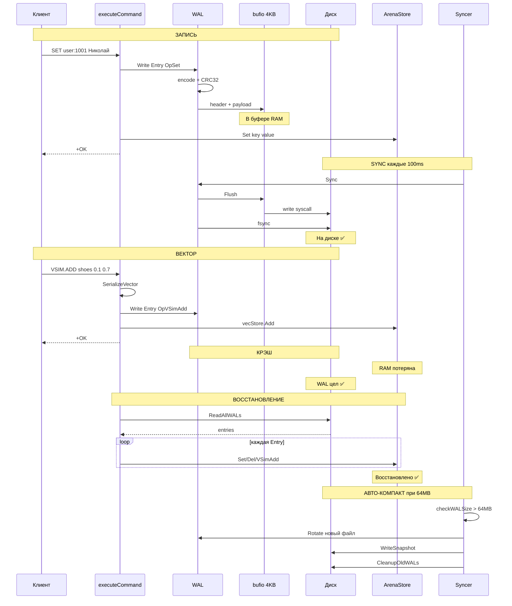

# WAL (Write-Ahead Log) — Полный Разбор Каждого Шага

> [!NOTE]
> Этот документ описывает ВСЁ: от момента, когда клиент набирает `SET key value`, до того, как эти данные переживают крэш сервера и восстанавливаются при перезагрузке. Включая вектора, TTL, снэпшоты и компактизацию.

---

## Оглавление

1. [Зачем WAL?](#1-зачем-wal)
2. [Фаза 0: Старт сервера — создание WAL](#2-фаза-0-старт-сервера)
3. [Фаза 1: Запись операции — от SET до диска](#3-фаза-1-запись-операции)
4. [Фаза 2: Бинарный формат — что лежит на диске](#4-фаза-2-бинарный-формат)
5. [Фаза 3: Syncer — когда буфер реально попадает на диск](#5-фаза-3-syncer)
6. [Фаза 4: Все 5 типов операций](#6-фаза-4-все-5-типов-операций)
7. [Фаза 5: Крэш и восстановление](#7-фаза-5-крэш-и-восстановление)
8. [Фаза 6: Ротация и Snapshot](#8-фаза-6-ротация-и-snapshot)
9. [Фаза 7: Авто-компактизация](#9-фаза-7-авто-компактизация)
10. [Полная Sequence Diagram](#10-полная-sequence-diagram)

---

## 1. Зачем WAL?

Наши данные живут **в памяти** (ArenaStore). Память — это RAM. RAM теряет всё при выключении.

**Проблема:**
```
T=0:   SET user:1001 "Николай"  → ArenaStore (в RAM)    ✅ Работает
T=1:   SET user:1002 "Алматы"   → ArenaStore (в RAM)    ✅ Работает
T=2:   ⚡ СЕРВЕР УПАЛ (kill -9, отключили свет)
T=3:   Рестарт → RAM пуста → ВСЕ ДАННЫЕ ПОТЕРЯНЫ        ❌
```

**Решение — WAL (Write-Ahead Log):**

```
T=0:   SET user:1001 "Николай"
       Шаг 1: Записать в WAL-файл на ДИСКЕ     ← СНАЧАЛА на диск!
       Шаг 2: Записать в ArenaStore в ПАМЯТИ    ← Потом в память
       
T=2:   ⚡ СЕРВЕР УПАЛ
T=3:   Рестарт → Читаем WAL-файл → Повторяем все операции → ДАННЫЕ ВОССТАНОВЛЕНЫ ✅
```

> [!IMPORTANT]
> **Write-AHEAD** = «запись ЗАРАНЕЕ». Сначала на диск, потом в память. Если крэш произойдёт между шагами 1 и 2 — при рестарте данные восстановятся из файла. Если крэш произойдёт ДО шага 1 — клиент вообще не получил `+OK`, значит данные не были подтверждены.

---

## 2. Фаза 0: Старт сервера

### Шаг 0.1: Создание ArenaStore

[main.go:43](https://github.com/Nikolay1994Kaz/storage_in_memory/blob/master/kvstore/cmd/kvstore/main.go#L43):
```go
s := store.NewArenaStore()
```

ArenaStore — пустой. Никаких данных.

### Шаг 0.2: Создание TTL Manager

[main.go:48-49](https://github.com/Nikolay1994Kaz/storage_in_memory/blob/master/kvstore/cmd/kvstore/main.go#L48-L49):
```go
ttl := store.NewTTLManager(s)
```
Создаёт пустую `map[string]time.Time` и запускает горутину `activeExpiry()` (каждые 100ms чистит просроченные ключи).

### Шаг 0.3: Восстановление из WAL (ПОДРОБНО в Фазе 5)

[main.go:52-55](https://github.com/Nikolay1994Kaz/storage_in_memory/blob/master/kvstore/cmd/kvstore/main.go#L52-L55):
```go
entries, err := wal.ReadAllWALs(dataDir)
```
Читает ВСЕ WAL-файлы и snapshot. При первом запуске — файлов нет, entries пуст.

### Шаг 0.4: Создание VectorStore

[main.go:58](https://github.com/Nikolay1994Kaz/storage_in_memory/blob/master/kvstore/cmd/kvstore/main.go#L58):
```go
vecStore := vector.NewVectorStore(vector.EuclideanDistance)
```
Пустой HNSW-граф для векторного поиска.

### Шаг 0.5: Проигрывание восстановленных записей

[main.go:62-94](https://github.com/Nikolay1994Kaz/storage_in_memory/blob/master/kvstore/cmd/kvstore/main.go#L62-L94):
```go
for _, entry := range entries {
    switch entry.Op {
    case wal.OpSet:      s.Set(entry.Key, entry.Value)
    case wal.OpDel:      s.Del(entry.Key)
    case wal.OpExpire:   ttl.Set(entry.Key, remaining)
    case wal.OpPersist:  ttl.Remove(entry.Key)
    case wal.OpVSimAdd:  vecStore.Add(entry.Key, vec)
    }
}
```

### Шаг 0.6: Открытие НОВОГО WAL-файла

[main.go:101-105](https://github.com/Nikolay1994Kaz/storage_in_memory/blob/master/kvstore/cmd/kvstore/main.go#L101-L105):
```go
walPath := filepath.Join(dataDir, fmt.Sprintf("wal_%s.log", time.Now().Format("20060102_150405")))
// → "data/wal_20260419_144800.log"

w, err := wal.Open(walPath)
```

**`wal.Open()`** — [wal.go:41-52](https://github.com/Nikolay1994Kaz/storage_in_memory/blob/master/kvstore/internal/wal/wal.go#L41-L52):

```go
func Open(path string) (*WAL, error) {
    dir := filepath.Dir(path)          // "data"
    file, err := os.OpenFile(path,
        os.O_CREATE|os.O_RDWR|os.O_APPEND,  // Создать если нет + дописывать в конец
        0644,                                  // Права: rw-r--r--
    )
    return &WAL{
        file:   file,                      // *os.File — файловый дескриптор
        writer: bufio.NewWriter(file),     // Буферизованный писатель (4KB буфер)
        dir:    dir,
    }
}
```

> [!TIP]
> **`bufio.NewWriter`** — это буфер в 4096 байт (4KB) в памяти. Когда мы пишем в WAL, данные сначала попадают в этот буфер, и только когда буфер заполнится (или мы вызовем `Flush()`) — данные реально запишутся в файл. Зачем? Каждый `write()` системный вызов — это ~1-5 микросекунд. Если писать по 30 байт за раз, 90% времени уйдёт на системные вызовы. С буфером — один `write()` на 4KB.

### Шаг 0.7: Запуск Syncer

[main.go:109](https://github.com/Nikolay1994Kaz/storage_in_memory/blob/master/kvstore/cmd/kvstore/main.go#L109):
```go
syncer := wal.NewSyncer(w, 100*time.Millisecond, dataDir, s.ForEach)
```

Syncer — горутина, которая каждые 100ms делает `Flush() + fsync()`. Подробно в Фазе 3.

### Состояние после старта:

```
┌─── ПАМЯТЬ ────────────────────────────────────────────┐
│                                                        │
│  ArenaStore (пустой или восстановленный из WAL)        │
│  TTLManager (expires map + activeExpiry горутина)       │
│  VectorStore (пустой или восстановленный из WAL)       │
│                                                        │
└────────────────────────────────────────────────────────┘

┌─── ДИСК ──────────────────────────────────────────────┐
│                                                        │
│  data/                                                 │
│  ├── snapshot.wal          (если был compact ранее)    │
│  ├── wal_20260418_120000.log  (старые, уже прочитаны) │
│  └── wal_20260419_144800.log  (ТЕКУЩИЙ, новый, пустой)│
│                                                        │
└────────────────────────────────────────────────────────┘

┌─── ГОРУТИНЫ ──────────────────────────────────────────┐
│  Syncer.run()         каждые 100ms → Flush+Sync       │
│  TTLManager.activeExpiry()  каждые 100ms → чистка     │
└────────────────────────────────────────────────────────┘
```

---

## 3. Фаза 1: Запись операции — от SET до диска

### Клиент: `SET user:1001 "Николай"`

Путь данных через весь стек:

```
Клиент
  │
  ▼
TCP → epoll → handleConn → executeCommand
  │
  ▼
case "SET":                          ← main.go:330
  │
  ├─ 1. КЛАСТЕР: cl.CheckKey(key)   ← мой ли слот? (если кластер)
  │
  ├─ 2. WAL: w.Write(Entry{         ← СНАЧАЛА НА ДИСК!
  │         Op: OpSet,
  │         Key: "user:1001",
  │         Value: []byte("Николай")
  │     })
  │
  ├─ 3. MEMORY: s.Set(key, value)   ← Потом в ArenaStore
  │
  ├─ 4. REPLICATION: cl.Repl.ForwardWrite(...)  ← Репликам
  │
  ├─ 5. WASM: triggers.Fire(OnSet, key)         ← Триггеры
  │
  └─ 6. return +OK                  ← Клиенту
```

> [!IMPORTANT]
> Порядок критически важен: **WAL → Store → Response**. Если крэш между WAL и Store — при рестарте WAL восстановит данные. Если крэш до WAL — клиент не получил `+OK`, значит операция «не произошла».

### Шаг 1.1: `w.Write()` — запись в WAL

[wal.go:56-83](https://github.com/Nikolay1994Kaz/storage_in_memory/blob/master/kvstore/internal/wal/wal.go#L56-L83):

```go
func (w *WAL) Write(entry Entry) error {
    w.mu.Lock()           // ← Один писатель за раз!
    defer w.mu.Unlock()
    
    // 1. Кодируем Entry в байты
    payload := encodeEntry(entry)
    // payload = [0x01][0x00 0x00 0x00 0x09]"user:1001"[UTF-8 bytes]
    //            ^Op    ^KeyLen (9)          ^Key        ^Value
    
    // 2. Считаем контрольную сумму
    checksum := crc32.ChecksumIEEE(payload)
    
    // 3. Формируем заголовок (8 байт на СТЕКЕ — zero-alloc!)
    var header [8]byte
    binary.LittleEndian.PutUint32(header[0:4], checksum)             // CRC32
    binary.LittleEndian.PutUint32(header[4:8], uint32(len(payload))) // длина
    
    // 4. Пишем заголовок в буфер
    w.writer.Write(header[:])    // → bufio буфер (НЕ на диск!)
    
    // 5. Пишем payload в буфер
    w.writer.Write(payload)      // → bufio буфер (НЕ на диск!)
    
    return nil
}
```

> [!WARNING]
> После `Write()` данные в **буфере bufio** (4KB в RAM), а НЕ на диске! Они попадут на диск когда: (1) буфер заполнится, или (2) Syncer вызовет `Flush()`, или (3) сервер штатно завершится (`defer w.Close()`). Если `kill -9` прямо сейчас — последние ~100ms записей могут потеряться.

### Шаг 1.2: `encodeEntry()` — кодирование в байты

[wal.go:157-177](https://github.com/Nikolay1994Kaz/storage_in_memory/blob/master/kvstore/internal/wal/wal.go#L157-L177):

```go
func encodeEntry(e Entry) []byte {
    keyBytes := []byte(e.Key)                    // "user:1001" → [117 115 101 114 ...]
    size := 1 + 4 + len(keyBytes) + len(e.Value) // 1 (Op) + 4 (KeyLen) + 9 (key) + 14 (val)
    buf := make([]byte, size)                     // = 28 байт
    
    offset := 0
    buf[offset] = e.Op             // buf[0] = 0x01 (OpSet)
    offset++                       // offset = 1
    
    binary.LittleEndian.PutUint32(buf[offset:], uint32(len(keyBytes)))
    // buf[1..4] = [0x09, 0x00, 0x00, 0x00]  — длина ключа = 9
    offset += 4                    // offset = 5
    
    copy(buf[offset:], keyBytes)   // buf[5..13] = "user:1001"
    offset += len(keyBytes)        // offset = 14
    
    copy(buf[offset:], e.Value)    // buf[14..27] = "Николай" (UTF-8)
    
    return buf
}
```

---

## 4. Фаза 2: Бинарный формат — что лежит на диске

### Формат одной записи:

```
┌──────────────────────────────────────────────────────────────┐
│                      ОДНА ЗАПИСЬ В WAL                        │
├──────────┬──────────┬──────┬──────────┬──────────┬───────────┤
│ CRC32    │ TotalLen │ Op   │ KeyLen   │ Key      │ Value     │
│ 4 байта  │ 4 байта  │ 1 б  │ 4 байта  │ N байт   │ M байт   │
├──────────┼──────────┼──────┼──────────┼──────────┼───────────┤
│ A3B4C5D6 │ 1C000000 │ 01   │ 09000000 │ user:    │ Николай   │
│          │ (=28)    │(SET) │ (=9)     │ 1001     │ (UTF-8)   │
└──────────┴──────────┴──────┴──────────┴──────────┴───────────┘
 ◄─header─►  ◄────────────── payload (28 байт) ──────────────►
```

### Все числа — Little-Endian!

```
Число 28 (десятичное) = 0x0000001C

Big-Endian:    [00] [00] [00] [1C]  — старший байт первый
Little-Endian: [1C] [00] [00] [00]  — младший байт первый ← МЫ ИСПОЛЬЗУЕМ

Почему Little-Endian? x86/AMD64 процессоры — Little-Endian.
binary.LittleEndian = нативный порядок = быстрее (нет перестановки байтов).
```

### Несколько записей подряд в файле:

```
WAL-файл:
┌─────────────────────┬─────────────────────┬─────────┐
│ CRC│Len│Op│KL│Key│V │ CRC│Len│Op│KL│Key│V │  ...    │
│     ЗАПИСЬ 1        │     ЗАПИСЬ 2        │         │
└─────────────────────┴─────────────────────┴─────────┘
```

Записи **склеены** — между ними нет разделителей. Длина (`TotalLen`) позволяет точно знать где начинается следующая запись.

### Зачем CRC32?

```
Сценарий: свет погас посередине записи

WAL-файл:
┌──────────────────────┬───────────────────┐
│ ЗАПИСЬ 1 (целая) ✅  │ ЗАПИСЬ 2 (обрезан │
│ CRC совпадает        │ CRC НЕ совпадает! │
└──────────────────────┴───────────────────┘

При чтении:
  Запись 1: CRC32(payload) == stored_crc → ✅ берём
  Запись 2: CRC32(payload) != stored_crc → ❌ break, отбрасываем
  
Результат: потерялась только одна частично записанная операция.
Все предыдущие данные в безопасности.
```

[wal.go:212-214](https://github.com/Nikolay1994Kaz/storage_in_memory/blob/master/kvstore/internal/wal/wal.go#L212-L214):
```go
if crc32.ChecksumIEEE(payload) != checksum {
    break  // Битая запись → прекращаем чтение
}
```

---

## 5. Фаза 3: Syncer — когда буфер реально попадает на диск

### Проблема: bufio буфер НЕ на диске

```
w.Write(entry)  →  bufio buffer (4KB RAM)  →  ???  →  Диск

Кто скажет "пора записать на диск"?  →  SYNCER!
```

### Syncer — структура

[syncer.go:14-21](https://github.com/Nikolay1994Kaz/storage_in_memory/blob/master/kvstore/internal/wal/syncer.go#L14-L21):

```go
type Syncer struct {
    wal        *WAL              // ссылка на WAL
    interval   time.Duration     // 100ms
    stop       chan struct{}     // сигнал остановки
    dir        string            // "data"
    iterate    func(fn func(key string, value []byte))  // → s.ForEach
    compacting atomic.Bool       // идёт ли компактизация?
}
```

### Syncer.run() — тикер

[syncer.go:35-55](https://github.com/Nikolay1994Kaz/storage_in_memory/blob/master/kvstore/internal/wal/syncer.go#L35-L55):

```go
func (s *Syncer) run() {
    ticker := time.NewTicker(s.interval)  // каждые 100ms
    
    for {
        select {
        case <-ticker.C:
            // 1. Сбросить буфер на диск
            s.wal.Sync()
            
            // 2. Проверить размер WAL (если не идёт компактизация)
            if !s.compacting.Load() {
                s.checkWALSize()
            }
            
        case <-s.stop:
            s.wal.Sync()  // Последний flush при остановке
            return
        }
    }
}
```

### WAL.Sync() — Flush + fsync

[wal.go:86-94](https://github.com/Nikolay1994Kaz/storage_in_memory/blob/master/kvstore/internal/wal/wal.go#L86-L94):

```go
func (w *WAL) Sync() error {
    w.mu.Lock()
    defer w.mu.Unlock()
    
    // Шаг 1: bufio.Writer → os.File (ядро ОС)
    w.writer.Flush()
    
    // Шаг 2: os.File → физический диск (fsync системный вызов)
    return w.file.Sync()
}
```

> [!IMPORTANT]
> **`Flush()` и `Sync()` — две разные вещи!**
> 
> `Flush()` = из буфера bufio → в буфер ядра ОС (page cache)
> 
> `file.Sync()` (fsync) = из буфера ядра → на **физический диск**
> 
> Без `file.Sync()` ОС может держать данные в своём кеше до 30 секунд. Если ОС крэшнется — данные потеряются. `fsync` гарантирует: данные на пластинах HDD / flash-ячейках SSD.

### Визуализация пути данных:

```
SET user:1001 "Николай"
      │
      ▼
┌─ w.Write() ──────────────────────────────────────────┐
│  encodeEntry() → payload (28 байт)                   │
│  CRC32(payload) → checksum                           │
│  header(8 байт) + payload → bufio.Writer.buf         │
│  ┌──────────────────────────────────────────┐        │
│  │ bufio.Writer buffer (4096 байт в RAM)    │        │
│  │ [████████████░░░░░░░░░░░░░░░░░░░░░░░░░]  │        │
│  │  ^36 байт записано    ^4060 свободно     │        │
│  └──────────────────────────────────────────┘        │
└──────────────────────────────────────────────────────┘
     Данные ещё НЕ на диске!!!
     
     ⏳ 0-100ms (ждём тик Syncer)
     
┌─ Syncer.run() tick ──────────────────────────────────┐
│  w.Sync():                                            │
│    1. writer.Flush() → syscall write(fd, buf, 36)    │
│       ┌────────────────────────────────┐             │
│       │ Page Cache ядра ОС (в RAM)     │             │
│       │ [████████████]                  │             │
│       └────────────────────────────────┘             │
│                                                       │
│    2. file.Sync() → syscall fsync(fd)                │
│       ┌────────────────────────────────┐             │
│       │ SSD/HDD (ФИЗИЧЕСКИЙ ДИСК)      │             │
│       │ [████████████]                  │             │
│       └────────────────────────────────┘             │
│       Теперь данные ТОЧНО на диске! ✅                │
└──────────────────────────────────────────────────────┘
```

### Окно потери данных: 0-100ms

```
SET в T=0ms     → в буфере
SET в T=50ms    → в буфере
SET в T=90ms    → в буфере
Syncer tick T=100ms → Flush+Sync → ВСЕ ТРИ на диске ✅

SET в T=110ms   → в буфере
⚡ КРЭШ в T=150ms → SET из T=110ms ПОТЕРЯН ❌
                     (три предыдущих SET в безопасности ✅)
```

> [!TIP]
> **100ms** — это компромисс. Redis по умолчанию делает `fsync` раз в **1 секунду** (`appendfsync everysec`). Мы делаем в 10 раз чаще — более надёжно, но чуть медленнее.

---

## 6. Фаза 4: Все 5 типов операций

[wal.go:17-23](https://github.com/Nikolay1994Kaz/storage_in_memory/blob/master/kvstore/internal/wal/wal.go#L17-L23):

```go
const (
    OpSet     byte = 1   // SET key value
    OpDel     byte = 2   // DEL key
    OpExpire  byte = 3   // EXPIRE key seconds
    OpPersist byte = 4   // PERSIST key
    OpVSimAdd byte = 5   // VSIM.ADD key vector
)
```

### Операция 1: OpSet (байт = 0x01)

Когда: Клиент → `SET user:1001 "Николай"`

[main.go:343-346](https://github.com/Nikolay1994Kaz/storage_in_memory/blob/master/kvstore/cmd/kvstore/main.go#L343-L346):
```go
w.Write(wal.Entry{Op: wal.OpSet, Key: "user:1001", Value: []byte("Николай")})
s.Set("user:1001", []byte("Николай"))
```

```
На диске: [CRC][Len][0x01][KeyLen=9]["user:1001"]["Николай"]
                      ^^^^
                      OpSet
```

### Операция 2: OpDel (байт = 0x02)

Когда: Клиент → `DEL user:1001`

[main.go:411-415](https://github.com/Nikolay1994Kaz/storage_in_memory/blob/master/kvstore/cmd/kvstore/main.go#L411-L415):
```go
w.Write(wal.Entry{Op: wal.OpDel, Key: "user:1001"})
s.Del("user:1001")
ttl.OnDelete("user:1001")
```

```
На диске: [CRC][Len][0x02][KeyLen=9]["user:1001"]
                      ^^^^                        Value пустой!
                      OpDel
```

> [!NOTE]
> DEL записывается в WAL! Зачем? Потому что при восстановлении WAL проигрывается **по порядку**. Если сначала был SET, а потом DEL — нужно оба воспроизвести, иначе при перезагрузке ключ «воскреснет».

### Операция 3: OpExpire (байт = 0x03)

Когда: Клиент → `SET key value EX 60` или `EXPIRE key 60`

[main.go:356-368](https://github.com/Nikolay1994Kaz/storage_in_memory/blob/master/kvstore/cmd/kvstore/main.go#L356-L368):
```go
dur := time.Duration(seconds) * time.Second         // 60 секунд
expiresAt := time.Now().Add(dur)                     // абсолютное время смерти
var buf [8]byte                                       // 8 байт на СТЕКЕ (zero-alloc!)
binary.BigEndian.PutUint64(buf[:], uint64(expiresAt.UnixNano()))

w.Write(wal.Entry{Op: wal.OpExpire, Key: key, Value: buf[:]})
ttl.Set(key, dur)
```

```
На диске: [CRC][Len][0x03][KeyLen]["user:1001"][8 байт: абсолютное время]
                      ^^^^                      ^^^^^^^^^^^^^^^^^^^^^^^^
                      OpExpire                  Value = unix nano timestamp
```

> [!IMPORTANT]
> **Абсолютное время, а не относительное!** Мы записываем «умереть в 14:50:00», а не «умереть через 60 секунд». Почему? Если сервер упал и перезагрузился через 2 минуты, при восстановлении:
> - Абсолютное: `expiresAt = 14:50:00`, сейчас `14:52:00` → `remaining = -2min` → ключ уже мёртв → удаляем ✅
> - Относительное: `ttl = 60s` → заново ставим 60 секунд → ключ «воскрес» на лишнюю минуту ❌

### Операция 4: OpPersist (байт = 0x04)

Когда: Клиент → `PERSIST key` (убрать TTL)

[main.go:486-488](https://github.com/Nikolay1994Kaz/storage_in_memory/blob/master/kvstore/cmd/kvstore/main.go#L486-L488):
```go
w.Write(wal.Entry{Op: wal.OpPersist, Key: args[0].Str})
```

```
На диске: [CRC][Len][0x04][KeyLen]["user:1001"]
                      ^^^^                        Value пустой!
                      OpPersist
```

### Операция 5: OpVSimAdd (байт = 0x05) — ВЕКТОРА!

Когда: Клиент → `VSIM.ADD product:shoes 0.1 0.7 0.3 0.9`

[main.go:643-661](https://github.com/Nikolay1994Kaz/storage_in_memory/blob/master/kvstore/cmd/kvstore/main.go#L643-L661):
```go
// 1. Парсим float'ы из строк
vec := make([]float32, len(args)-1)
for i := 1; i < len(args); i++ {
    f, _ := strconv.ParseFloat(args[i].Str, 32)
    vec[i-1] = float32(f)  // vec = [0.1, 0.7, 0.3, 0.9]
}

// 2. Сериализуем вектор в байты
walValue := vector.SerializeVector(vec)

// 3. WAL: СНАЧАЛА на диск!
w.Write(wal.Entry{Op: wal.OpVSimAdd, Key: "product:shoes", Value: walValue})

// 4. Потом в HNSW-граф
vecStore.Add("product:shoes", vec)
```

### Сериализация вектора

[store.go:122-128](https://github.com/Nikolay1994Kaz/storage_in_memory/blob/master/kvstore/vector/store.go#L122-L128):
```go
func SerializeVector(vec []float32) []byte {
    buf := make([]byte, len(vec)*4)      // 4 float32 x 4 байта = 16 байт
    for i, v := range vec {
        binary.LittleEndian.PutUint32(buf[i*4:], math.Float32bits(v))
    }
    return buf
}
```

**Как float32 превращается в байты:**
```
vec = [0.1, 0.7, 0.3, 0.9]

float32(0.1) → math.Float32bits → 0x3DCCCCCD → bytes: [CD CC CC 3D]
float32(0.7) → math.Float32bits → 0x3F333333 → bytes: [33 33 33 3F]
float32(0.3) → math.Float32bits → 0x3E99999A → bytes: [9A 99 99 3E]
float32(0.9) → math.Float32bits → 0x3F666666 → bytes: [66 66 66 3F]

walValue = [CD CC CC 3D 33 33 33 3F 9A 99 99 3E 66 66 66 3F]
            ^^^^^^^^^^^^  ^^^^^^^^^^^^  ^^^^^^^^^^^^  ^^^^^^^^^^^^
            0.1           0.7           0.3           0.9
```

> [!TIP]
> `math.Float32bits()` — это НЕ преобразование. Это **реинтерпретация**: те же 4 байта в памяти, но Go теперь считает их uint32 вместо float32. Ни единого вычисления, один такт CPU.

```
На диске: [CRC][Len][0x05][KeyLen=13]["product:shoes"][CD CC CC 3D 33 33 33 3F ...]
                      ^^^^                              ^^^^^^^^^^^^^^^^^^^^^^^^
                      OpVSimAdd                         Value = 4 float32 по 4 байта
```

### Полная таблица форматов на диске:

| Op | Байт | Key | Value | Пример |
|----|------|-----|-------|--------|
| SET | 0x01 | `"user:1001"` | `"Николай"` (UTF-8) | Обычные данные |
| DEL | 0x02 | `"user:1001"` | *(пусто)* | Удаление |
| EXPIRE | 0x03 | `"user:1001"` | 8 байт (unix nano) | Время смерти |
| PERSIST | 0x04 | `"user:1001"` | *(пусто)* | Убрать TTL |
| VSIM.ADD | 0x05 | `"product:shoes"` | N×4 байт (float32[]) | Вектор |

---

## 7. Фаза 5: Крэш и восстановление

### Сценарий: сервер упал и перезагрузился

```
БЫЛО В ЖИЗНИ СЕРВЕРА:
  SET user:1001 "Николай"      → WAL + ArenaStore
  SET user:1002 "Алматы"       → WAL + ArenaStore
  VSIM.ADD shoes 0.1 0.7 0.3   → WAL + VectorStore
  SET user:1003 "Астана"       → WAL + ArenaStore
  EXPIRE user:1001 300         → WAL + TTL (5 минут)
  DEL user:1002                → WAL + ArenaStore
  ⚡ КРЭШ!

   RAM = потеряна (всё пусто)
   ДИСК = data/wal_20260419.log (6 записей) ✅
```

### Шаг 5.1: ReadAllWALs — читаем все файлы

[wal.go:255-279](https://github.com/Nikolay1994Kaz/storage_in_memory/blob/master/kvstore/internal/wal/wal.go#L255-L279):

```go
func ReadAllWALs(dir string) ([]Entry, error) {
    // 1. Сначала snapshot (самое старое состояние, полный дамп)
    snapshotPath := filepath.Join(dir, "snapshot.wal")
    entries, _ := ReadEntries(snapshotPath)
    allEntries = append(allEntries, entries...)
    
    // 2. Потом все WAL-файлы ПО ПОРЯДКУ (от старых к новым)
    matches, _ := filepath.Glob(filepath.Join(dir, "wal_*.log"))
    sort.Strings(matches)
    // ["data/wal_20260418_120000.log", "data/wal_20260419_144800.log"]
    //  ← более старый                  ← более новый
    
    for _, path := range matches {
        entries, _ := ReadEntries(path)
        allEntries = append(allEntries, entries...)
    }
    
    return allEntries  // ВСЕ записи из ВСЕХ файлов, по порядку
}
```

> [!IMPORTANT]
> Порядок файлов критичен! `sort.Strings` работает потому что имена файлов содержат дату: `wal_20260418_120000` < `wal_20260419_144800`. Лексикографический порядок совпадает с хронологическим. Это не случайность — это **design decision**.

### Шаг 5.2: ReadEntries — чтение одного файла

[wal.go:180-224](https://github.com/Nikolay1994Kaz/storage_in_memory/blob/master/kvstore/internal/wal/wal.go#L180-L224):

```go
func ReadEntries(path string) ([]Entry, error) {
    file, _ := os.Open(path)
    reader := bufio.NewReader(file)
    
    for {
        // 1. Читаем CRC32 (4 байта)
        binary.Read(reader, binary.LittleEndian, &checksum)
        // EOF? → break (конец файла)
        
        // 2. Читаем длину payload (4 байта)
        binary.Read(reader, binary.LittleEndian, &length)
        
        // 3. Читаем payload (length байт)
        payload := make([]byte, length)
        io.ReadFull(reader, payload)
        
        // 4. ПРОВЕРЯЕМ CRC!
        if crc32.ChecksumIEEE(payload) != checksum {
            break  // Битая запись → стоп (всё что после — не доверяем)
        }
        
        // 5. Декодируем
        entry, _ := decodeEntry(payload)
        entries = append(entries, entry)
    }
    
    return entries
}
```

### Шаг 5.3: Проигрывание записей

[main.go:62-94](https://github.com/Nikolay1994Kaz/storage_in_memory/blob/master/kvstore/cmd/kvstore/main.go#L62-L94):

```go
for _, entry := range entries {
    switch entry.Op {
    
    case wal.OpSet:    // ← SET user:1001 "Николай"
        s.Set(entry.Key, entry.Value)
        
    case wal.OpDel:    // ← DEL user:1002
        s.Del(entry.Key)
        ttl.OnDelete(entry.Key)    // убрать TTL если был
        
    case wal.OpExpire: // ← EXPIRE user:1001 300
        if len(entry.Value) == 8 {
            expiresAt := time.Unix(0, int64(binary.BigEndian.Uint64(entry.Value)))
            remaining := time.Until(expiresAt)
            if remaining > 0 {
                ttl.Set(entry.Key, remaining)  // ещё жив → ставим TTL
            } else {
                s.Del(entry.Key)               // уже умер → удаляем
                ttl.OnDelete(entry.Key)
            }
        }
        
    case wal.OpPersist: // ← PERSIST key
        ttl.Remove(entry.Key)
        
    case wal.OpVSimAdd: // ← VSIM.ADD shoes 0.1 0.7 0.3
        vec := vector.DeserializeVector(entry.Value)
        // [CD CC CC 3D 33 33 33 3F ...] → [0.1, 0.7, 0.3]
        vecStore.Add(entry.Key, vec)
    }
}
```

### Визуализация восстановления:

```
WAL-файл на диске:
┌──────────────────────────────────────────────────────────────┐
│ Op=SET  Key="user:1001"  Value="Николай"       ← запись 1   │
│ Op=SET  Key="user:1002"  Value="Алматы"        ← запись 2   │
│ Op=VSIM Key="shoes"      Value=[0.1,0.7,0.3]  ← запись 3   │
│ Op=SET  Key="user:1003"  Value="Астана"        ← запись 4   │
│ Op=EXP  Key="user:1001"  Value=14:55:00        ← запись 5   │
│ Op=DEL  Key="user:1002"                        ← запись 6   │
└──────────────────────────────────────────────────────────────┘

Проигрывание:                        Состояние после:

Запись 1: SET user:1001 Николай  →  Store: {user:1001: "Николай"}
Запись 2: SET user:1002 Алматы   →  Store: {user:1001, user:1002}
Запись 3: VSIM shoes [0.1,..]   →  VecStore: {shoes: [0.1,0.7,0.3]}
Запись 4: SET user:1003 Астана   →  Store: {1001, 1002, 1003}
Запись 5: EXP user:1001 14:55   →  TTL: {user:1001 → 14:55:00}
                                    (сейчас 14:52 → remaining=3min)
Запись 6: DEL user:1002          →  Store: {1001, 1003}  ← 1002 удалён!

ИТОГО: Store = {user:1001 (TTL 3min), user:1003}
       VecStore = {shoes}
       Точно как было до крэша! ✅
```

### Десериализация вектора

[store.go:130-138](https://github.com/Nikolay1994Kaz/storage_in_memory/blob/master/kvstore/vector/store.go#L130-L138):

```go
func DeserializeVector(data []byte) []float32 {
    n := len(data) / 4              // 12 байт / 4 = 3 float'а
    vec := make([]float32, n)
    for i := 0; i < n; i++ {
        bits := binary.LittleEndian.Uint32(data[i*4:])
        vec[i] = math.Float32frombits(bits)
        // [CD CC CC 3D] → uint32(0x3DCCCCCD) → float32(0.1)
    }
    return vec
}
```

---

## 8. Фаза 6: Ротация и Snapshot

### Проблема: WAL растёт бесконечно

```
День 1: SET 10,000 ключей          → WAL = 500 KB
День 2: SET 10,000 + DEL 5,000     → WAL = 1.2 MB
День 3: SET 10,000 + DEL 5,000     → WAL = 2.0 MB
...
День 100: WAL = 150 MB             ← но реально в Store только 10K ключей!
```

WAL содержит ВСЮ ИСТОРИЮ. Восстановление 150 MB при старте = 10 секунд.

### Решение: Snapshot + Ротация + Очистка

```
1. ROTATE:   Переключить WAL на новый файл (мгновенно!)
2. SNAPSHOT: Записать ТЕКУЩЕЕ состояние Store в snapshot.wal
3. CLEANUP:  Удалить старые WAL-файлы

Было:                              Стало:
data/                              data/
├── wal_001.log (50 MB)            ├── snapshot.wal (500 KB) ← актуальные
├── wal_002.log (40 MB)            └── wal_003.log (пустой)
└── wal_003.log (пустой)           
     Всего: 90 MB                       Всего: 500 KB!
```

### Шаг 6.1: WAL.Rotate() — атомарное переключение

[wal.go:104-137](https://github.com/Nikolay1994Kaz/storage_in_memory/blob/master/kvstore/internal/wal/wal.go#L104-L137):

```go
func (w *WAL) Rotate(newPath string) (oldPath string, err error) {
    // ТЯЖЁЛУЮ работу делаем ДО блокировки!
    newFile, _ := os.OpenFile(newPath, os.O_CREATE|os.O_RDWR|os.O_APPEND, 0644)
    
    w.mu.Lock()
    // ─── Критическая секция (наносекунды!) ───
    
    w.writer.Flush()         // Сбросить буфер старого файла
    w.file.Sync()            // fsync старого файла
    
    oldPath = w.file.Name()  // Запомнить путь к старому
    w.file.Close()           // Закрыть старый
    
    w.file = newFile                      // Переключить!
    w.writer = bufio.NewWriter(newFile)   // Новый буфер!
    
    // ─── Конец критической секции ───
    w.mu.Unlock()
    
    return oldPath, nil
}
```

> [!TIP]
> **Создание файла — ДО блокировки.** `os.OpenFile` — системный вызов, может занять миллисекунды. Если бы мы создавали файл под локом, все горутины ждали бы. Создаём заранее → лок на наносекунды → переключаем указатели → готово!

### Шаг 6.2: WriteSnapshot — полный дамп Store

[snapshot.go:24-69](https://github.com/Nikolay1994Kaz/storage_in_memory/blob/master/kvstore/internal/wal/snapshot.go#L24-L69):

```go
func (sw *SnapshotWriter) WriteSnapshot(iterate) error {
    // 1. Пишем во ВРЕМЕННЫЙ файл
    tmpPath := "data/snapshot.wal.tmp"
    w, _ := Open(tmpPath)
    
    // 2. Обходим ВСЕ ключи в Store
    iterate(func(key string, value []byte) {
        w.Write(Entry{Op: OpSet, Key: key, Value: value})
    })
    
    // 3. Sync — убеждаемся что данные на диске
    w.Sync()
    w.Close()
    
    // 4. АТОМАРНАЯ ЗАМЕНА: tmp → snapshot.wal
    os.Rename(tmpPath, "data/snapshot.wal")
}
```

> [!IMPORTANT]
> **Почему через tmp-файл?** Если крэш во время записи snapshot, `snapshot.wal.tmp` будет битым, но **старый** `snapshot.wal` останется нетронутым! `os.Rename` — атомарная операция ядра ОС: либо файл полностью переименован, либо нет.

### Шаг 6.3: BackgroundCompact — полный цикл

[snapshot.go:76-98](https://github.com/Nikolay1994Kaz/storage_in_memory/blob/master/kvstore/internal/wal/snapshot.go#L76-L98):

```go
func BackgroundCompact(w *WAL, dir string, iterate) {
    // 1. ROTATE: мгновенно переключаем WAL
    newWALPath = "data/wal_20260419_145000.log"
    oldPath, _ := w.Rotate(newWALPath)
    
    // 2. SNAPSHOT: в отдельной горутине
    go func() {
        sw := NewSnapshotWriter(dir)
        sw.WriteSnapshot(iterate)
        
        // 3. CLEANUP: удаляем старые
        CleanupOldWALs(dir, newWALPath)
    }()
}
```

### Визуализация компактизации:

```
     БЫЛО                    ПОСЛЕ ROTATE          ПОСЛЕ SNAPSHOT
     ════                    ════════════           ══════════════

data/                        data/                  data/
├─ wal_001.log               ├─ wal_001.log         ├─ snapshot.wal
│  SET a=1                   │  (закрыт)            │  SET a=1
│  SET b=2                   │                      │  SET c=3
│  DEL a                     ├─ wal_002.log         │  (только актуальные!)
│  SET c=3                   │  (новые записи)      │
│  SET b=5                   │                      ├─ wal_002.log (новый)
│  DEL b                     │                      │
│  (60 MB мусора)            │                      wal_001.log ← УДАЛЁН!

Размер: 60 MB                60 MB + пустой          500 KB!
```

---

## 9. Фаза 7: Авто-компактизация

### Syncer.checkWALSize() — когда WAL слишком большой

[syncer.go:57-75](https://github.com/Nikolay1994Kaz/storage_in_memory/blob/master/kvstore/internal/wal/syncer.go#L57-L75):

```go
const MaxWALSize = 64 * 1024 * 1024  // 64 MB

func (s *Syncer) checkWALSize() {
    path := s.wal.Path()
    info, _ := os.Stat(path)
    
    if info.Size() > MaxWALSize {
        log.Printf("WAL size %.1f MB > 64 MB — auto-compact")
        
        s.compacting.Store(true)   // atomic: не начинай вторую!
        go func() {
            BackgroundCompact(s.wal, s.dir, s.iterate)
            s.compacting.Store(false)  // готово
        }()
    }
}
```

> [!NOTE]
> **`atomic.Bool`** для `compacting` — не mutex, а атомарная переменная. Syncer.run() и горутина BackgroundCompact работают в разных горутинах. `atomic.Bool` гарантирует: запись из одной горутины мгновенно видна в другой без гонки данных.

### Полный цикл жизни WAL:

```
Тик 1:    WAL = 100 KB        → Flush+Sync, checkSize: OK
Тик 2:    WAL = 200 KB        → Flush+Sync, checkSize: OK
...тысячи тиков...
Тик N:    WAL = 65 MB         → Flush+Sync, checkSize: > 64 MB!
          compacting = true
          go BackgroundCompact()
            ├─ Rotate → новый файл
            ├─ Snapshot → snapshot.wal
            ├─ Cleanup → удалить старые
            └─ compacting = false
Тик N+1:  WAL = 50 KB (новый) → Flush+Sync, skip check
Тик N+2:  WAL = 80 KB         → Flush+Sync, checkSize: OK
...цикл повторяется...
```

---

## 10. Полная Sequence Diagram



---

## Ключевые Структуры — Сводка

| Структура | Тип | Где | Назначение |
|-----------|-----|-----|-----------|
| `WAL.file` | `*os.File` | wal.go | Файловый дескриптор текущего WAL |
| `WAL.writer` | `*bufio.Writer` | wal.go | 4KB буфер перед файлом |
| `WAL.mu` | `sync.Mutex` | wal.go | Один писатель за раз |
| `Entry.Op` | `byte` | wal.go | Тип операции (1-5) |
| `Entry.Key` | `string` | wal.go | Ключ |
| `Entry.Value` | `[]byte` | wal.go | Значение / timestamp / вектор |
| `Syncer.compacting` | `atomic.Bool` | syncer.go | Идёт ли компактизация |

---

## Горутины WAL-подсистемы

| # | Горутина | Файл | Тикер | Задача |
|---|---------|------|-------|--------|
| 1 | `Syncer.run()` | syncer.go | 100ms | Flush + fsync + checkSize |
| 2 | `BackgroundCompact` | snapshot.go | По требованию | Rotate + Snapshot + Cleanup |
| 3 | `TTL.activeExpiry` | ttl.go | 100ms | Random sampling удаление |

---

## Мнемоника WAL

```
📝 wal.go       = ПИСАТЕЛЬ   (Write, Read, Rotate, бинарный формат)
⏱️ syncer.go    = БУДИЛЬНИК  (каждые 100ms → Flush+Sync, проверка размера)
📸 snapshot.go  = ФОТОГРАФ   (снимок Store, атомарная замена, cleanup)
```

**Порядок операций (ВСЕГДА!):**
```
1. WAL.Write()    ← сначала на диск (в буфер)
2. Store.Set()    ← потом в память
3. return +OK     ← потом клиенту
```

**При восстановлении:**
```
1. ReadAllWALs()  ← snapshot → wal_001 → wal_002 → ...
2. for entry      ← проиграть все записи по порядку
3. Открыть новый WAL ← новые записи пишутся сюда
```

**Формула записи на диске:**
```
[CRC32 4B][Length 4B][Op 1B][KeyLen 4B][Key NB][Value MB]
 ← header →         ← ───────── payload ──────────── →
```
